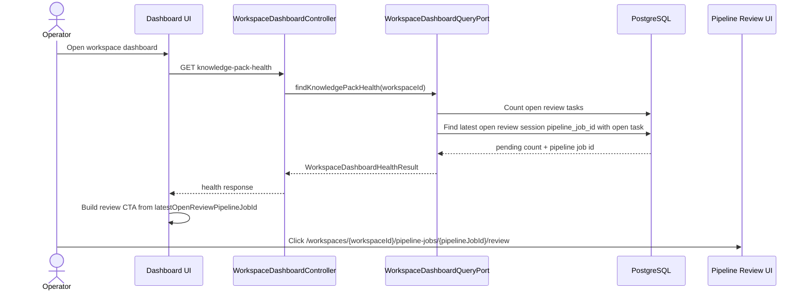

# Issue 776: 검토 대기 pipeline job 진입점 노출

## Goal

대시보드와 운영 화면에서 열린 review task가 남아 있는 review session의 pipeline job 리뷰 화면으로 이동할 수 있게 한다.

## Problem

workspace dashboard health API는 `pendingReviewCount`만 반환하고 열린 review session의 `pipelineJobId`를 반환하지 않는다. 프론트엔드는 `lastKnowledgePackGeneration.pipelineJobId`가 있을 때만 리뷰 CTA를 만들기 때문에, `INGESTION` job처럼 최신 도메인팩 생성 job이 아닌 pipeline job이 `WAITING_HUMAN_FEEDBACK` 상태로 검토를 기다리면 대시보드에서 리뷰 화면 진입점을 잃는다.

## Scope

- `GET /api/v1/workspaces/{workspaceId}/dashboard/knowledge-pack-health` 응답에 열린 review task가 남아 있는 review session의 최신 pipeline job id를 nullable 값으로 포함한다.
- 대시보드 건강도 CTA는 `pendingReviewCount > 0`이고 최신 열린 review pipeline job id가 있으면 `lastKnowledgePackGeneration` 유무와 무관하게 리뷰 화면 링크를 표시한다.
- Admin Airflow 운영 목록은 `WAITING_DOMAIN_CONFIRMATION`, `WAITING_HUMAN_FEEDBACK` 상태 job에 리뷰 화면 링크를 표시한다.
- 업로드 완료 후 자동 pipeline 상태 패널에서 review waiting 상태 job의 리뷰 CTA가 유지되는지 회귀 테스트로 확인한다.

## Non-goals

- review checkpoint API의 태스크 조회/승인 로직은 변경하지 않는다.
- pipeline job 상태 전이, Airflow DAG, review task 생성 로직은 변경하지 않는다.
- 신규 DB 컬럼이나 Liquibase migration은 추가하지 않는다.
- `DOMAIN_PACK_GENERATION` 전용 최신 job 조회 규칙은 바꾸지 않는다.

## Affected Areas

| Area | Path | Purpose |
| --- | --- | --- |
| Backend workspace application | `backend/src/main/java/com/init/workspace/application/WorkspaceDashboardHealthResult.java` | dashboard health 응답 계약 |
| Backend workspace infrastructure | `backend/src/main/java/com/init/workspace/infrastructure/persistence/JdbcWorkspaceDashboardQueryAdapter.java` | open task가 있는 열린 review session 기반 최신 pipeline job id 조회 |
| Frontend dashboard API | `frontend/src/features/workspace-dashboard-health/api/workspaceDashboardHealthApi.ts` | dashboard health response type |
| Frontend dashboard model | `frontend/src/features/workspace-dashboard-health/model/buildWorkspaceDashboardHealthView.ts` | review CTA URL 결정 |
| Frontend admin page | `frontend/src/pages/admin/ui/AdminPipelineJobsPage.tsx` | waiting job review link 표시 |
| Frontend upload flow | `frontend/src/features/log-upload/ui/LogUploadForm.tsx`, `frontend/src/features/log-upload/ui/PipelineJobStatusPanel.tsx` | 기존 review waiting CTA 유지 확인 |

## Sequence Diagram



## REST API

### Endpoint

| Method | Path | Description |
| --- | --- | --- |
| GET | `/api/v1/workspaces/{workspaceId}/dashboard/knowledge-pack-health` | workspace dashboard health 조회 |

### Response Diff

```json
{
  "activeKnowledgePack": null,
  "lastLogUpload": null,
  "lastKnowledgePackGeneration": null,
  "pendingReviewCount": 12,
  "latestOpenReviewPipelineJobId": 42
}
```

- `latestOpenReviewPipelineJobId`는 `review.review_session.status = 'OPEN'`, `pipeline_job_id`가 있고 연결된 `review.review_task.status = 'OPEN'`이 하나 이상 있는 session 중 가장 최근 `opened_at`, `id` 기준 pipeline job id다.
- 열린 review task가 남은 session이 없거나 pipeline job에 연결되지 않은 review만 있으면 `null`이다.
- 기존 `pendingReviewCount`는 열린 review task 수를 유지한다.

## Frontend Behavior

### Dashboard Health

- `pendingReviewCount > 0`이고 `latestOpenReviewPipelineJobId`가 있으면 리뷰 CTA를 표시한다.
- `latestOpenReviewPipelineJobId`가 없고 `lastKnowledgePackGeneration`이 review waiting 상태이면 기존처럼 `lastKnowledgePackGeneration.pipelineJobId`로 리뷰 CTA를 표시한다.
- 두 값이 모두 없으면 경고와 검토 대기 metric은 유지하되 깨진 링크는 만들지 않는다.

### Admin Pipeline Jobs

- `WAITING_DOMAIN_CONFIRMATION`, `WAITING_HUMAN_FEEDBACK` job은 Action column에 리뷰 화면 링크를 표시한다.
- `FAILED` job의 기존 retry 액션은 유지한다.
- 그 외 상태는 기존처럼 액션 없음으로 표시한다.

### Upload Completion Panel

- 자동 ingestion pipeline job이 `WAITING_DOMAIN_CONFIRMATION` 또는 `WAITING_HUMAN_FEEDBACK` 상태이면 기존 review path와 "검토 화면으로 이동" CTA가 유지되어야 한다.

## Acceptance Criteria

- dashboard health API 응답에 최신 열린 review pipeline job id가 포함된다.
- dashboard에서 open review task가 있고 최신 열린 review pipeline job id가 있으면 `lastKnowledgePackGeneration`이 없어도 리뷰 CTA가 표시된다.
- `INGESTION` job으로 생성된 review waiting 상태도 dashboard CTA가 `/workspaces/{workspaceId}/pipeline-jobs/{pipelineJobId}/review`로 연결된다.
- Admin Pipeline Jobs 화면에서 `WAITING_DOMAIN_CONFIRMATION`, `WAITING_HUMAN_FEEDBACK` job의 review link를 열 수 있다.
- 직접 URL, dashboard CTA, admin CTA가 같은 pipeline review page route를 사용한다.
- 업로드 완료 상태 패널에서 review waiting 상태 job의 CTA가 "검토 화면으로 이동"으로 표시된다.

## Validation Plan

- Backend focused tests:
  - `./gradlew test --tests com.init.workspace.presentation.WorkspaceDashboardControllerTest --tests com.init.workspace.application.GetWorkspaceDashboardHealthUseCaseTest`
- Frontend focused tests:
  - `pnpm --dir frontend test -- workspace-dashboard-health AdminPipelineJobsPage LogUploadForm`
- Static checks:
  - 변경된 프론트엔드 import가 FSD 방향을 위반하지 않는지 확인한다.
  - API 응답 타입과 backend record 생성자 호출부를 함께 점검한다.

## Open Questions

- 없음. issue body의 prod 근거와 기존 review route로 필요한 동작을 확정할 수 있다.
