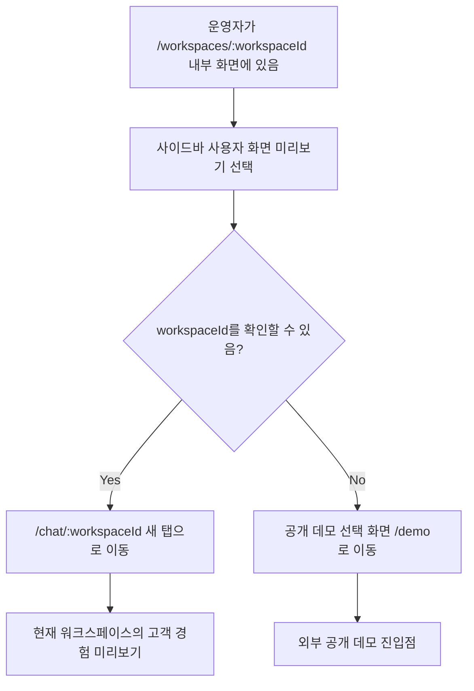

# Frontend Spec: 사용자 화면 미리보기 워크스페이스 컨텍스트 유지

## Goal

워크스페이스 내부 사이드바의 사용자 화면 미리보기 링크가 전역 데모 선택 화면이 아니라 현재 워크스페이스 기준 사용자 채팅 화면으로 이동하게 한다.

## User Flow Chart



## Design Diff

### As-is vs To-be

| 영역 | As-is | To-be | 변경 내용 |
| --- | --- | --- | --- |
| 사이드바 미리보기 CTA | 항상 `/demo`로 이동 | `/workspaces/:workspaceId` 내부에서는 `/chat/:workspaceId`로 이동 | 운영자가 작업 중인 워크스페이스 맥락을 유지 |
| 전역 데모 선택 화면 | 내부 워크스페이스 CTA에서도 사용 | 공개 데모 진입점 또는 workspaceId 부재 시 fallback으로만 사용 | 내부 운영 플로우와 공개 데모 플로우 분리 |
| 새 탭 안내 | 일반 외부 링크 아이콘 설명 | 현재 워크스페이스 미리보기 또는 공개 데모 fallback 새 탭 동작을 설명 | 링크 목적과 새 탭 동작을 더 명확히 표시 |

## Component Tree

```text
Sidebar
├─ TOP_NAV_ITEMS
│  └─ 사용자 화면 미리보기
└─ SidebarLink
   ├─ Icon
   ├─ label
   └─ new-tab indicator
```

## API Integration

API 호출이나 generated client 변경은 없다. 이 변경은 프론트엔드 라우팅 링크 생성만 다룬다.

## Data Flow

```text
OstoneShell
└─ resolvedBasePath: /workspaces/:workspaceId
   └─ Sidebar
      └─ preview route helper
         ├─ workspaceId 있음: buildUserChatPath(workspaceId)
         └─ workspaceId 없음: /demo
```

## 수정 대상 파일

| 파일 | 변경 유형 | 설명 |
| --- | --- | --- |
| `frontend/src/shared/ui/ostone/chrome/Sidebar.tsx` | modify | 미리보기 CTA의 workspaceId 기반 href와 새 탭 안내 라벨 변경 |
| `frontend/src/shared/ui/ostone/chrome/Sidebar.test.tsx` | modify | 사이드바 링크가 현재 workspace 기준 경로를 사용하는지 검증 |
| `frontend/src/shared/lib/demoRoutes.ts` | modify | 공개 데모 선택 경로 fallback을 명시적으로 공유 |
| `frontend/src/shared/lib/userChatRoutes.ts` | modify | workspace basePath에서 사용자 채팅 경로를 계산하는 helper 제공 |

## State Management

추가 클라이언트 상태나 서버 상태는 없다. `basePath` prop에서 workspaceId를 파생해 링크 경로만 계산한다.

## Tests

### Test Strategy

| 구분 | 방법 | 도구 | 비고 |
| --- | --- | --- | --- |
| 단위/컴포넌트 테스트 | Sidebar 렌더링 결과의 href, target, aria-label 확인 | Vitest + React Testing Library | 기존 `Sidebar.test.tsx` 갱신 |
| 라우트 helper 테스트 | basePath별 preview 경로 계산 확인 | Vitest | helper가 encoded workspaceId를 유지하는지 확인 |

### Test Scenarios

| # | 시나리오 | 사전 조건 | 기대 결과 |
| --- | --- | --- | --- |
| 1 | 워크스페이스 내부 미리보기 | `basePath="/workspaces/7"` | 링크 href가 `/chat/7`이고 새 탭으로 열린다 |
| 2 | workspaceId 없는 fallback | `basePath="/workspaces"` | 링크 href가 공개 데모 선택 화면 `/demo`이다 |
| 3 | 새 탭 안내 라벨 | workspaceId가 있는 미리보기 링크 렌더링 | 아이콘 aria-label이 현재 워크스페이스 미리보기 새 탭 동작을 설명한다 |
| 4 | fallback 새 탭 안내 라벨 | workspaceId가 없는 미리보기 링크 렌더링 | 아이콘 aria-label이 공개 데모 선택 화면 새 탭 동작을 설명한다 |

## Non-goals

- `/demo` 공개 데모 선택 화면과 `/demo/chat/:workspaceId` 공개 데모 채팅 플로우는 변경하지 않는다.
- 인증 사용자 채팅 화면의 WebSocket/API 동작은 변경하지 않는다.
- 백엔드 API, OpenAPI generated client, DB schema는 변경하지 않는다.

## Open Questions

- 없음. 이슈 본문과 기존 라우트 구조로 범위를 확정할 수 있다.
