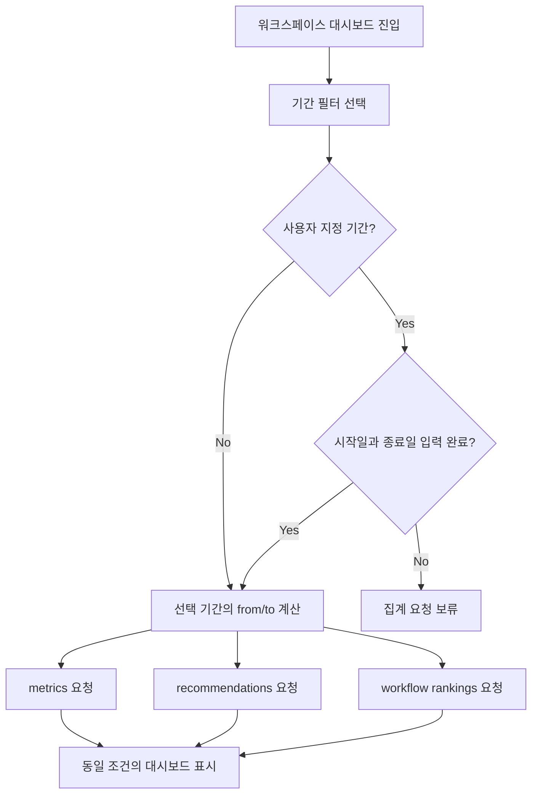

# Frontend Spec: 대시보드 집계 필터 요청 반영

## Goal

대시보드에서 사용자가 조작할 수 있는 필터와 실제 집계 API 요청 조건을 일치시켜, 표시된 운영 조건과 metrics, recommendations, workflow rankings 데이터가 서로 어긋나지 않게 한다.

## User Flow Chart



## Design Diff

### As-is vs To-be

| 영역 | As-is | To-be | 변경 내용 |
| --- | --- | --- | --- |
| 기간 필터 | 기간 조건이 집계 요청에 전달됨 | 유지 | `from`, `to`를 세 집계 요청에 동일하게 전달한다. |
| 운영 지식팩 버전 필터 | UI에 노출되지만 집계 API가 지원하지 않음 | 숨김 | 백엔드와 generated OpenAPI가 지원하지 않는 필터를 조작 가능한 UI에서 제거한다. |
| Channel 필터 | UI에 노출되지만 집계 API가 지원하지 않음 | 숨김 | 백엔드와 generated OpenAPI가 지원하지 않는 필터를 조작 가능한 UI에서 제거한다. |
| Workflow Status 필터 | UI에 노출되지만 집계 API가 지원하지 않음 | 숨김 | 백엔드와 generated OpenAPI가 지원하지 않는 필터를 조작 가능한 UI에서 제거한다. |
| 테스트 | 일부 테스트가 unsupported 필터 선택 후에도 기간 요청만 검증함 | 지원 필터 기준 검증 | 보이는 필터가 실제 요청 URL에 반영되는지 검증한다. |

## Component Tree

```text
WorkspaceDashboardPage
├─ DashboardFilters
│  ├─ 기간 segmented buttons
│  └─ 사용자 지정 시작일/종료일 input
├─ FilterSummary
├─ ActionRecommendationsPanel
├─ DashboardMetricsGrid
├─ AutomationCoveragePanel
├─ KnowledgePackHealthPanel
└─ HotpathWorkflowRankingPanel
```

## API Integration

### Endpoints

| Method | Path | 지원 query | 비고 |
| --- | --- | --- | --- |
| GET | `/api/v1/workspaces/{workspaceId}/consultation/metrics` | `from`, `to` | generated `GetMetricsParams`도 `from`, `to`만 노출한다. |
| GET | `/api/v1/workspaces/{workspaceId}/dashboard/action-recommendations` | `from`, `to` | generated `GetActionRecommendationsParams`도 `from`, `to`만 노출한다. |
| GET | `/api/v1/workspaces/{workspaceId}/dashboard/workflow-rankings` | `from`, `to` | generated `GetWorkflowRankingsParams`도 `from`, `to`만 노출한다. |

### Query Key / Request Pattern

대시보드 페이지는 `buildMetricDateRange(filters)`로 계산한 동일 `from`, `to` 객체를 아래 호출에 전달한다.

```typescript
consultationApi.getMetrics(workspaceId, metricDateRange);
fetchWorkspaceDashboardActionRecommendations(workspaceId, metricDateRange);
consultationApi.getWorkflowRankings(workspaceId, metricDateRange);
```

## Data Flow

```text
DashboardFilters(period/custom dates)
  -> buildMetricDateRange
  -> metrics / action recommendations / workflow rankings
  -> panels render same operating period
```

## 수정 대상 파일

| 파일 | 변경 유형 | 설명 |
| --- | --- | --- |
| `frontend/src/pages/workspace/ui/WorkspaceDashboardPage.tsx` | update | 지원되는 기간 필터만 노출하고 summary를 실제 요청 조건과 일치시킨다. |
| `frontend/src/pages/workspace/ui/workspace-dashboard-page.module.css` | update | 필터 레이아웃이 기간 전용 UI에 맞게 안정적으로 보이도록 조정한다. |
| `frontend/src/features/consultation/api/consultationApi.ts` | update | metrics, workflow rankings, bottleneck analysis read를 generated endpoint wrapper 경유로 유지한다. |
| `frontend/src/features/workspace-dashboard-health/api/workspaceDashboardHealthApi.ts` | update | dashboard health, action recommendations read를 generated endpoint wrapper 경유로 유지한다. |
| `frontend/scripts/manual-api-call-allowlist.json` | update | generated endpoint 전환으로 더 이상 필요하지 않은 dashboard manual API allowlist를 제거한다. |
| `frontend/src/pages/workspace/ui/WorkspaceDashboardPage.test.tsx` | update | 노출 필터와 세 집계 요청 파라미터를 검증한다. |
| `frontend/e2e/workspace-core.spec.ts` | update | 대시보드 E2E가 지원 기간 필터와 unsupported 필터 비노출을 검증하도록 맞춘다. |
| `frontend/src/features/consultation/api/consultationApi.test.ts` | existing verification | metrics, workflow rankings URL query 검증을 유지한다. |
| `frontend/src/features/workspace-dashboard-health/api/workspaceDashboardHealthApi.test.ts` | existing verification | recommendations URL query 검증을 유지한다. |

## State Management

대시보드 필터 상태는 페이지 내부 `useState`로 유지한다. 서버 상태 캐시 구조는 새로 도입하지 않는다. 사용자 지정 기간에서 `from`, `to`가 모두 입력되지 않은 경우 기존처럼 집계 요청을 보류한다.

## Tests

### Test Strategy

| 구분 | 방법 | 도구 | 비고 |
| --- | --- | --- | --- |
| 단위/통합 테스트 | 대시보드 페이지 mock API 호출 검증 | Vitest + Testing Library | 기간 변경 시 세 집계 호출이 같은 params를 받는지 확인한다. |
| API wrapper 테스트 | request URL query 검증 | Vitest | `from`, `to`가 실제 URL query로 직렬화되는지 확인한다. |
| E2E 테스트 | 대시보드 필터 조작 및 API request 관찰 | Playwright | 지원 기간 필터만 조작 가능하고 세 집계 URL이 같은 기간 조건으로 요청되는지 확인한다. |
| 정적 검사 | frontend lint/type/build 범위 | `pnpm --dir frontend test`, `pnpm --dir frontend exec eslint`, `pnpm --dir frontend build` | 변경 범위에 맞는 실행 가능한 명령을 선택한다. |

### Acceptance Criteria

- 지원되는 기간 필터는 `from`, `to` query parameter로 세 집계 요청에 전달된다.
- 백엔드가 아직 지원하지 않는 운영 지식팩 버전, Channel, Workflow Status 필터는 조작 가능한 UI에서 노출하지 않는다.
- 기간 변경 시 metrics, recommendations, workflow rankings가 동일 조건으로 갱신된다.
- 테스트에서 필터별 요청 URL 또는 API 호출 params를 검증한다.

## Non-goals

- 백엔드에 운영 지식팩 버전, Channel, Workflow Status 집계 필터를 새로 추가하지 않는다.
- generated OpenAPI 파일을 직접 수정하지 않는다.
- 대시보드 집계 로직이나 응답 스키마를 변경하지 않는다.

## Open Questions

- 운영 지식팩 버전, Channel, Workflow Status를 실제 집계 조건으로 지원할 백엔드 API 확장은 별도 이슈에서 다룬다.
