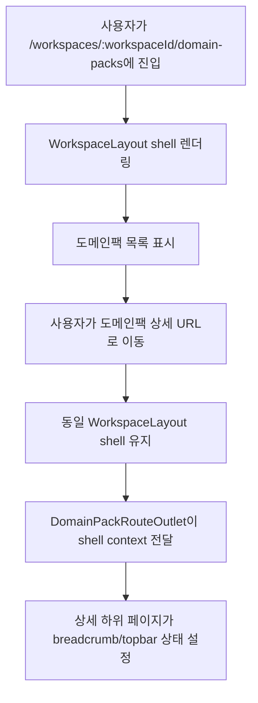

# Frontend Spec: 도메인팩 상세 화면이 워크스페이스 shell을 공유한다

## Goal

도메인팩 상세 화면을 워크스페이스 내부 라우트로 편입하여 `WorkspaceLayout`이 sidebar, topbar, breadcrumb, workspace context를 일관되게 소유한다.

## User Flow Chart



## Design Diff

| 영역              | As-is                                                                  | To-be                                              | 변경 내용                                             |
| ----------------- | ---------------------------------------------------------------------- | -------------------------------------------------- | ----------------------------------------------------- |
| 라우트 소유권     | `/workspaces/:workspaceId/domain-packs/:packId`가 별도 top-level route | `/workspaces/:workspaceId`의 child route           | 상세 URL은 유지하되 `WorkspaceLayout` 아래에서 렌더링 |
| shell 렌더링      | 도메인팩 상세 페이지가 `OstoneShell`을 직접 렌더링                     | 상세 페이지가 `ShellContext`로 topbar 상태 설정    | 중복 shell 생성 제거                                  |
| breadcrumb/topbar | 각 상세 페이지가 shell props로 직접 전달                               | workspace shell context에 전달                     | workspace 내부 화면과 동일한 topbar 책임 구조 사용    |
| sidebar active    | 상세 페이지별 shell active prop에 의존                                 | `WorkspaceLayout`의 pathname 기반 active 계산 사용 | domain-pack 상세도 workspace sidebar active 동작 공유 |

## Component Tree

```text
App
└─ Route /workspaces/:workspaceId
   └─ WorkspaceLayout
      ├─ OstoneShell
      └─ Outlet context={ShellContext}
         ├─ DomainPackListPage
         └─ DomainPackRouteOutlet
            └─ Outlet context={ShellContext}
               ├─ DomainPackSummaryPage
               ├─ IntentDraftReadPage
               ├─ PolicyDraftReadPage
               ├─ RiskDraftReadPage
               ├─ SlotDraftReadPage
               ├─ PackWorkflowListPage
               ├─ WorkflowDraftReadPage
               └─ WorkflowGraphViewerPage
```

## API Integration

이 변경은 프론트엔드 라우팅과 layout 책임만 조정한다. 신규 API, generated client, query key 변경은 없다.

## Data Flow

```text
WorkspaceLayout
  └─ ShellContext
      ├─ setCrumbs(Crumb[])
      ├─ setTopbarRight(ReactNode | undefined)
      └─ workspace

DomainPack detail pages
  ├─ route params/search params 해석
  ├─ 기존 pack/version/workflow 조회 유지
  └─ useEffect로 breadcrumb/topbar 상태 등록 및 unmount cleanup
```

## 수정 대상 파일

| 파일                                                                 | 변경 유형 | 설명                                                                           |
| -------------------------------------------------------------------- | --------- | ------------------------------------------------------------------------------ |
| `frontend/src/app/App.tsx`                                           | update    | 도메인팩 상세 route를 workspace route 하위로 이동                              |
| `frontend/src/shared/ui/ostone/chrome/ShellContext.ts`               | update    | link-aware breadcrumb를 전달할 수 있도록 crumb type 확장                       |
| `frontend/src/pages/workspace/ui/WorkspaceLayout.tsx`                | update    | `Crumb[]` 상태와 도메인팩 상세 active 계산 유지                                |
| `frontend/src/pages/domain-pack/ui/DomainPackRouteOutlet.tsx`        | update    | workspace shell context를 상세 하위 route에 전달                               |
| `frontend/src/pages/domain-pack/ui/DomainPackShellState.tsx`         | new       | 상세 페이지가 `ShellContext`에 breadcrumb/topbar state를 등록하는 공통 wrapper |
| `frontend/src/pages/domain-pack/ui/DomainPackSummaryPage.tsx`        | update    | 직접 shell 렌더링 제거, shell context 사용                                     |
| `frontend/src/pages/domain-pack/ui/IntentDraftReadPage.tsx`          | update    | 직접 shell 렌더링 제거, shell context 사용                                     |
| `frontend/src/pages/domain-pack/ui/PolicyDraftReadPage.tsx`          | update    | 직접 shell 렌더링 제거, shell context 사용                                     |
| `frontend/src/pages/domain-pack/ui/RiskDraftReadPage.tsx`            | update    | 직접 shell 렌더링 제거, shell context 사용                                     |
| `frontend/src/pages/domain-pack/ui/SlotDraftReadPage.tsx`            | update    | 직접 shell 렌더링 제거, shell context 사용                                     |
| `frontend/src/pages/domain-pack/ui/PackWorkflowListPage.tsx`         | update    | 직접 shell 렌더링 제거, shell context 사용                                     |
| `frontend/src/pages/domain-pack/ui/WorkflowDraftReadPage.tsx`        | update    | 직접 shell 렌더링 제거, shell context 사용                                     |
| `frontend/src/pages/domain-pack/ui/WorkflowGraphViewerPage.tsx`      | update    | 직접 shell 렌더링 제거, shell context 사용                                     |
| `frontend/src/app/App.test.tsx`                                      | update    | 상세 URL이 workspace shell을 공유하는 routing regression 추가                  |
| `frontend/src/pages/domain-pack/ui/DomainPackRouteOutlet.test.tsx`   | update    | outlet이 workspace shell context를 하위 route에 전달하는지 확인                |
| `frontend/src/pages/domain-pack/ui/DomainPackSummaryPage.test.tsx`   | update    | summary page의 breadcrumb shell context 등록 확인                              |
| `frontend/src/pages/domain-pack/ui/IntentDraftReadPage.test.tsx`     | update    | intent detail page의 shell context host 기준 동작 확인                         |
| `frontend/src/pages/domain-pack/ui/PolicyDraftReadPage.test.tsx`     | update    | policy detail page의 shell context host 기준 동작 확인                         |
| `frontend/src/pages/domain-pack/ui/RiskDraftReadPage.test.tsx`       | update    | risk detail page의 shell context host 기준 동작 확인                           |
| `frontend/src/pages/domain-pack/ui/SlotDraftReadPage.test.tsx`       | update    | slot detail page의 shell context host 기준 동작 확인                           |
| `frontend/src/pages/domain-pack/ui/WorkflowDraftReadPage.test.tsx`   | update    | workflow detail page의 breadcrumb shell context 등록 확인                      |
| `frontend/src/pages/domain-pack/ui/WorkflowGraphViewerPage.test.tsx` | update    | graph viewer page의 shell context 등록 확인                                    |
| `frontend/src/pages/domain-pack/ui/PackWorkflowListPage.test.tsx`    | update    | workflow list page의 shell context 등록 확인                                   |

## State Management

- `WorkspaceLayout`은 기존처럼 `topbarRight`와 `crumbs`를 local state로 보관한다.
- 도메인팩 상세 페이지는 route params와 조회 결과로 만든 breadcrumb/topbar right node를 `ShellContext`에 등록한다.
- 상세 페이지 unmount 시 `setCrumbs([])`와 `setTopbarRight(undefined)`로 workspace 기본 상태 복귀를 보장한다.

## Tests

### Test Strategy

| 구분                    | 방법                           | 도구                           | 비고                                                       |
| ----------------------- | ------------------------------ | ------------------------------ | ---------------------------------------------------------- |
| 라우팅 regression       | 실제 `App` route 렌더링        | Vitest + React Testing Library | 상세 URL이 workspace shell/sidebar를 공유하는지 확인       |
| 상세 페이지 단위 테스트 | `MemoryRouter` + shell context | Vitest + React Testing Library | 기존 상세 동작 유지 및 breadcrumb/topbar context 등록 확인 |
| 정적 검증               | frontend focused test/build    | pnpm scripts                   | 변경 범위에 맞춰 frontend 검증                             |

### Acceptance Criteria

| #   | 기준                                                      | 기대 결과                                                            |
| --- | --------------------------------------------------------- | -------------------------------------------------------------------- |
| 1   | `/workspaces/:workspaceId/domain-packs/:packId` 상세 진입 | `WorkspaceLayout` 하위에서 상세 화면 렌더링                          |
| 2   | 상세 하위 페이지 렌더링                                   | 상세 페이지가 직접 `OstoneShell`을 만들지 않고 `ShellContext`를 사용 |
| 3   | sidebar active                                            | 도메인팩 상세 및 하위 섹션에서 sidebar의 도메인팩 항목이 active      |
| 4   | breadcrumb/topbar                                         | workspace 내부 화면과 같은 topbar에서 breadcrumb와 우측 액션 표시    |
| 5   | URL 유지                                                  | 기존 상세 및 하위 URL 경로 유지                                      |
| 6   | 라우팅 테스트                                             | 상세 경로의 shell 공유를 검증하는 테스트 추가                        |

### Non-goals

- 도메인팩 상세 데이터 조회 API나 generated client 변경은 하지 않는다.
- 도메인팩 상세 UI의 시각 디자인, 편집 플로우, 검토/배포 동작은 변경하지 않는다.
- workspace shell 자체의 visual redesign은 하지 않는다.

### Open Questions

- 없음. 이슈 본문과 확인된 기존 경로 기준으로 구현 범위를 확정한다.
