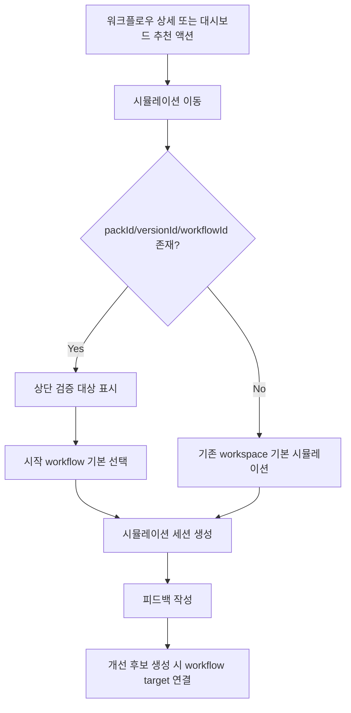

# Frontend Spec: 시뮬레이션 검증 대상 워크플로우 맥락 유지

## Goal

시뮬레이션 화면이 URL query 또는 route state로 전달된 `packId`, `versionId`, `workflowId`를 검증 대상 맥락으로 유지하고, 피드백과 개선 후보 생성 흐름에서 대상 워크플로우를 명확히 연결한다.

## User Flow Chart



## Design Diff

### As-is vs To-be

| 영역 | As-is | To-be | 변경 내용 |
|------|-------|-------|----------|
| 시뮬레이션 진입 | `feedbackStatus`, `candidateStatus` 중심 query만 처리 | `packId`, `versionId`, `workflowId` query와 route state를 함께 처리 | 검증 대상 워크플로우를 URL/state에서 해석 |
| 상단 맥락 | 페이지 제목과 선택 workflow만 표시 | pack/version/workflow 대상 요약 표시 | 대상이 있으면 상단에 검증 대상, 코드, 버전 정보를 노출 |
| workflow 상세 진입 | 상세 화면에서 시뮬레이션 직접 진입 없음 | 현재 workflow 맥락을 가진 시뮬레이션 링크 제공 | 상세 검증 흐름 연결 |
| 대시보드 추천 액션 | backend 제공 `targetPath`를 그대로 링크 | workflow 상세 추천은 시뮬레이션 URL로 맥락을 함께 전달 | 추천에서 검증 맥락 보존 |
| 개선 후보 생성 | feedback id만으로 후보 생성 | 선택/매칭 workflow 정보를 target payload로 전달 | 후보가 workflow 개선으로 연결되도록 target 정보 포함 |
| 기본 흐름 | workspace 시뮬레이션은 자동 매칭 가능 | 대상 맥락이 없어도 기존 자동 매칭 유지 | 기존 진입/생성/피드백 플로우 보존 |

## Component Tree

```text
WorkspaceSimulationPage
├─ PageHeader
│    └─ VerificationTargetBanner
├─ CreateSimulationPanel
│    └─ StartWorkflowSelect
├─ SessionPane
├─ ChatPane
└─ StatePane
     ├─ RuntimeState
     ├─ FeedbackPanel
     └─ ImprovementCandidatePanel

WorkflowDraftReadPage
└─ HeaderActions
     └─ SimulationLink

WorkspaceDashboardPage
└─ ActionRecommendationsPanel
     └─ ActionRecommendationCard
```

## API Integration

### Endpoints

| Method | Path | Description |
|--------|------|-------------|
| POST | `/api/v1/workspaces/:workspaceId/simulation/sessions` | 선택 workflow 기반 시뮬레이션 세션 생성 |
| POST | `/api/v1/workspaces/:workspaceId/simulation/improvement-candidates/from-feedback/:feedbackId` | feedback에서 개선 후보 생성, workflow target payload 전달 |

### Existing Contract Use

- `frontend/src/features/simulation/api/simulationApi.ts`의 `CreateSimulationSessionPayload.workflowDefinitionId`를 유지한다.
- `CreateSimulationImprovementCandidatePayload.targetElementType`, `targetElementId`, `targetElementKey`, `beforeSummary`, `afterSummary`를 사용해 workflow 후보 맥락을 전달한다.
- generated API 변경 또는 backend schema 변경은 포함하지 않는다.

## Data Flow

```text
WorkflowDraftReadPage
  -> buildWorkspaceSimulationPath(wsId, { packId, versionId, workflowId })
  -> WorkspaceSimulationPage query/state parsing
  -> useListAllWorkspaceWorkflows entries lookup
  -> selected verification target banner + default workflow select
  -> createSession(workflowDefinitionId)
  -> createImprovementCandidate(feedbackId, workflow target payload)
```

## 수정 대상 파일

| 파일 | 변경 유형 | 설명 |
|------|----------|------|
| `frontend/src/shared/lib/demoRoutes.ts` | modify | 시뮬레이션 경로에 검증 대상 query builder 추가 |
| `frontend/src/shared/lib/demoRoutes.test.ts` | modify | query 생성 회귀 테스트 |
| `frontend/src/pages/workspace/ui/WorkspaceSimulationPage.tsx` | modify | query/state 해석, 대상 배너, 기본 workflow 선택, 후보 target payload |
| `frontend/src/pages/workspace/ui/simulation/workspace-simulation-page.module.css` | modify | 대상 배너와 반응형 스타일 |
| `frontend/src/pages/workspace/ui/WorkspaceSimulationPage.test.tsx` | modify | URL query 기반 맥락 표시와 후보 payload 테스트 |
| `frontend/src/pages/domain-pack/ui/WorkflowDraftReadPage.tsx` | modify | workflow 상세에서 시뮬레이션 링크 추가 |
| `frontend/src/pages/domain-pack/ui/WorkflowDraftReadPage.test.tsx` | modify | 상세 링크 href 테스트 |
| `frontend/src/pages/workspace/ui/WorkspaceDashboardPage.tsx` | modify | workflow 추천 링크를 시뮬레이션 맥락 URL로 보강 |
| `frontend/src/pages/workspace/ui/WorkspaceDashboardPage.test.tsx` | modify | 추천 액션 href 테스트 |

## State Management

### URL/Route State

- Query: `packId`, `versionId`, `workflowId`
- Route state: `{ simulationTarget: { packId, versionId, workflowId } }`
- 둘 다 있으면 query를 우선한다. query는 새로고침과 공유 URL에 남기기 위함이다.

### Client State

- 기존 `workflowDefinitionId` state는 유지한다.
- 검증 대상 workflow가 현재 workspace workflow 목록에서 확인되면 `workflowDefinitionId` 기본값으로 동기화한다.
- 사용자가 직접 workflow select를 변경한 경우 해당 선택을 우선한다.

## Tests

### Test Strategy

| 구분 | 방법 | 도구 | 비고 |
|------|------|------|------|
| 유틸 테스트 | path builder query 검증 | Vitest | `demoRoutes.test.ts` |
| 페이지 테스트 | URL query 기반 대상 표시와 세션 생성 payload | RTL + Vitest | `WorkspaceSimulationPage.test.tsx` |
| 페이지 테스트 | workflow 상세 시뮬레이션 링크 | RTL + Vitest | `WorkflowDraftReadPage.test.tsx` |
| 페이지 테스트 | 대시보드 추천 액션 링크 | RTL + Vitest | `WorkspaceDashboardPage.test.tsx` |

### Happy Path

| # | 시나리오 | 사전 조건 | 조작 | 기대 결과 |
|---|---------|---------|------|----------|
| 1 | 상세에서 시뮬레이션 이동 | workflow 상세 URL에 `versionId` 존재 | 검증 버튼 확인 | `/simulation?packId=...&versionId=...&workflowId=...` 링크 표시 |
| 2 | query 대상 표시 | workflow 목록에서 target workflow 조회 가능 | 시뮬레이션 진입 | 상단에 pack/version/workflow 대상 표시, 시작 workflow 기본 선택 |
| 3 | route state 대상 표시 | 상세 화면 Link state로 target 전달 | 시뮬레이션 진입 | query가 없어도 상단 대상과 시작 workflow 기본 선택 |
| 4 | 개선 후보 생성 | target workflow가 선택됨 | 피드백에서 후보 생성 클릭 | `targetElementType: "WORKFLOW"`, workflow id/key가 payload에 포함 |

### Error & Edge Cases

| # | 시나리오 | 조작 | 기대 결과 |
|---|---------|------|----------|
| 1 | 대상 query 없음 | `/simulation` 진입 | 기존 자동 매칭 기본 흐름 유지 |
| 2 | target workflow를 목록에서 찾지 못함 | 알 수 없는 `workflowId` query | 대상 id를 표시하되 workflow select는 자동 매칭 유지 |
| 3 | user가 workflow select 변경 | query target과 다른 workflow 선택 | 사용자가 선택한 workflow로 세션 생성 |
| 4 | user가 자동 매칭 선택 | query target 기본값을 자동 매칭으로 변경 | target workflow를 payload에 강제하지 않음 |

## Non-goals

- backend API 또는 DB schema 변경은 하지 않는다.
- generated OpenAPI client 재생성은 하지 않는다.
- 기존 세션 목록을 target별로 서버 필터링하지 않는다.
- 대시보드 추천 액션 backend 응답 구조를 변경하지 않는다.

## Implementation Quality Brief

- 기존 패턴: `buildWorkspaceSimulationPath`, `useListAllWorkspaceWorkflows`, `CreateSimulationSessionPayload.workflowDefinitionId`, `CreateSimulationImprovementCandidatePayload`를 재사용한다.
- 최소 diff: URL builder와 세 페이지의 링크/표시/전달 로직만 변경한다.
- 위험 표면: FSD import 방향, 기존 자동 매칭 유지, query 변경 시 사용자 선택 덮어쓰기, 후보 payload가 backend 허용 필드와 맞는지 여부, 모바일 레이아웃 overflow.
- 검증 명령: 관련 Vitest 파일과 frontend lint/type/build 범위에서 가능한 명령을 실행한다.

## Self-review Passes

### Pass 1: Issue Fidelity

- Acceptance Criteria의 `packId`, `versionId`, `workflowId` 수신, 상단 표시, 상세/대시보드 진입 보존, 후보 workflow 연결, 무맥락 기본 흐름 보존을 모두 spec에 매핑했다.
- 이슈에 없는 backend/schema 변경은 non-goal로 제한했다.
- 대시보드 추천 액션의 target 정보가 backend에서 항상 충분하지 않을 수 있으므로, 확인 가능한 workflow detail path에서만 simulation target query를 보강하는 것으로 범위를 명확히 했다.

### Pass 2: Ostone Compliance

- Frontend 템플릿을 사용했고 파일명은 `.agent/specs/784.md`다.
- final branch는 `feature/784-simulation-workflow-context`다.
- 참조한 production/test 파일 경로는 repository에서 존재를 확인했다.
- FSD 방향은 pages -> features/entities/shared, shared 내부 유틸만 유지한다.

### Pass 3: Regression Review

- query target 자동 선택 후 사용자가 `자동 매칭`으로 되돌리는 경우 target workflow id를 session 생성 payload에 강제하지 않도록 했다.
- route state만 전달된 진입도 별도 테스트로 고정했다.
- workflow id만 fallback으로 찾은 경우 pack/version까지 확인된 것으로 표시하지 않도록 banner badge를 보수적으로 유지했다.
