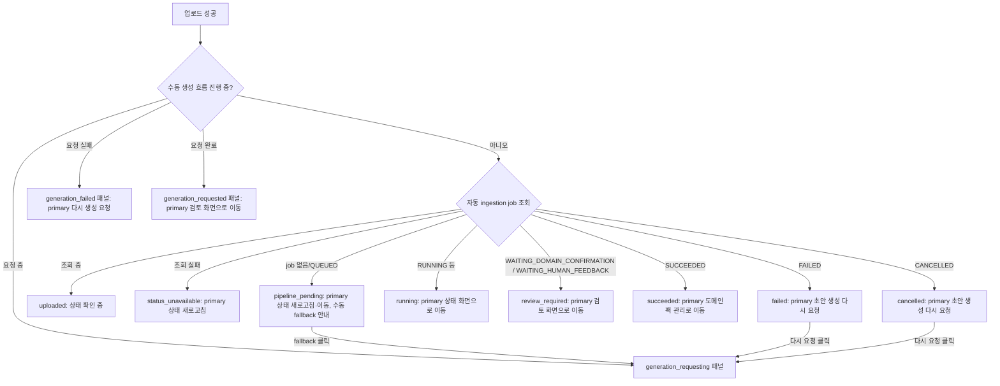

# Frontend Spec: 업로드 후 파이프라인 진행 상태와 CTA를 일관되게 표시한다

## Goal

상담 로그 업로드 성공 이후 화면을 단일 view state 기반으로 정리하여, 사용자가 기다려야 하는지, 검토해야 하는지, 생성 요청을 다시 보내야 하는지를 상태별 하나의 primary CTA로 바로 이해하게 한다.

## Problem

- 업로드 성공 후 자동 ingestion job 패널, 수동 생성 fallback 패널, 생성 요청 진행/실패/완료 패널이 한 화면에 동시에 섞여 보일 수 있다.
- `PipelineJobStatusPanel`은 최대 3개의 버튼을 렌더링하고, `reviewPath` 유무에 따라 "상태 새로고침" 버튼의 primary/secondary variant가 뒤바뀌어 상태별 primary CTA가 고정되지 않는다.
- `CANCELLED` 상태 문구는 "다시 업로드하거나 생성 요청을 다시 보낼 수 있습니다"라고 안내하지만, 수동 생성 요청 버튼은 job이 아예 없을 때만 노출되어 문구와 실제 가능한 행동이 어긋난다.
- 자동 파이프라인 패널과 수동 생성 fallback 패널이 별도 블록으로 나란히 렌더링되어 두 흐름의 관계(자동이 기본, 수동은 예외 복구 경로)가 드러나지 않는다.

## User Flow Chart



## Design Diff

| 영역 | As-is | To-be | 변경 내용 |
| ---- | ----- | ----- | --------- |
| 상태 모델 | 업로드 상태, 생성 요청 상태, job 조회 상태가 각각 조건부 렌더링으로 분기 | `derivePipelineJobViewState`가 job 조회 결과를 단일 view state로 환원하고, 수동 생성 흐름이 활성화되면 자동 파이프라인 패널 대신 생성 패널만 렌더링 | 한 시점에 패널 하나만 표시 |
| primary CTA | `reviewPath` 유무로 새로고침 버튼 variant가 뒤바뀜 | 상태별 primary CTA 1개 고정, 나머지는 secondary/ghost | CTA 일관성 |
| 수동 fallback | job이 없을 때만 별도 패널로 노출 | `pipeline_pending`(job 없음)·`failed`·`cancelled` 상태 안에서 복구 경로로 노출, 자동/수동 관계 문구 명시 | 문구와 행동 일치 |
| 실패/취소 복구 | 문구만 있고 생성 재요청 버튼 없음 | "도메인팩 초안 생성 다시 요청" 버튼 제공 | 실패 복구 경로 제공 |

## View State 정의

`frontend/src/features/log-upload/model/useLatestDatasetPipelineJob.ts`에 pure 함수로 추가한다.

| view state | 조건 (jobType=INGESTION 최신 job 기준) | primary CTA | 보조 액션 |
| ---------- | -------------------------------------- | ----------- | --------- |
| `uploaded` | 조회 isLoading | 없음 (자동 확인 진행 안내) | 없음 |
| `status_unavailable` | 조회 isError | 상태 새로고침 | 다른 파일 업로드 |
| `pipeline_pending` | job 없음 또는 status `QUEUED` | job 있으면 상태 화면으로 이동, 없으면 상태 새로고침 | job 없으면 도메인팩 초안 생성 시작(fallback), 다른 파일 업로드 |
| `running` | status `RUNNING`, `WAITING_INTENT_CALLBACK`, `WAITING_WORKFLOW_CALLBACK`, 미지정 상태 | 상태 화면으로 이동 | 상태 새로고침, 다른 파일 업로드 |
| `review_required` | status `WAITING_DOMAIN_CONFIRMATION`, `WAITING_HUMAN_FEEDBACK` | 검토 화면으로 이동 | 상태 새로고침, 다른 파일 업로드 |
| `succeeded` | status `SUCCEEDED` | 도메인팩 관리로 이동 | 상태 화면으로 이동, 다른 파일 업로드 |
| `failed` | status `FAILED` | 도메인팩 초안 생성 다시 요청 | 상태 화면으로 이동, 다른 파일 업로드 |
| `cancelled` | status `CANCELLED` | 도메인팩 초안 생성 다시 요청 | 상태 화면으로 이동, 다른 파일 업로드 |

상태 값 출처: `backend/src/main/java/com/init/pipelinejob/domain/model/PipelineJob.java`의 STATUS 상수.

수동 생성 흐름이 idle이 아니면 (`triggering`/`error`/`success` 또는 mutation pending) 위 표 대신 기존 생성 패널 3종 중 하나만 렌더링한다.

| 생성 흐름 상태 | primary CTA | 보조 액션 |
| -------------- | ----------- | --------- |
| `generation_requesting` | 없음 (대기 안내) | 다른 파일 업로드 (pending 중 disabled) |
| `generation_failed` | 다시 생성 요청 | 다른 파일 업로드 |
| `generation_requested` | 검토 화면으로 이동 (pipelineJobId 없으면 도메인팩 관리로 이동) | 도메인팩 관리로 이동, 다른 파일 업로드 |

## Component Tree

```text
LogUploadForm
├─ onboardingStatus (변경 없음)
├─ FileUploader (변경 없음)
├─ filePreview (변경 없음)
└─ afterUpload (status === "success")
   ├─ uploadSummary (변경 없음)
   └─ 단일 패널 (한 시점에 하나만)
      ├─ 생성 흐름 활성 시: generation_requesting | generation_failed | generation_requested
      └─ 생성 흐름 idle 시: PipelineJobStatusPanel
         └─ view state별 statusLabel + 안내 문구 + primary CTA 1개 + 보조 액션
```

## API Integration

신규 API, generated client, query key 변경 없음. 기존 `useLatestDatasetPipelineJob` (polling 포함)과 `useTriggerDomainPackGeneration`을 그대로 사용한다.

## 수정 대상 파일

| 파일 | 변경 유형 | 설명 |
| ---- | --------- | ---- |
| `frontend/src/features/log-upload/model/useLatestDatasetPipelineJob.ts` | update | `PipelineJobViewState` 타입과 `derivePipelineJobViewState` pure 함수 추가 |
| `frontend/src/features/log-upload/ui/PipelineJobStatusPanel.tsx` | update | view state 기반 단일 패널 렌더링, 상태별 primary CTA 1개 고정, 수동 fallback 복구 액션 통합 |
| `frontend/src/features/log-upload/ui/LogUploadForm.tsx` | update | 생성 흐름 활성 시 자동 파이프라인 패널 숨김, 별도 수동 fallback 블록 제거, 생성 콜백을 패널에 전달 |
| `frontend/src/features/log-upload/model/useLatestDatasetPipelineJob.test.tsx` | update | `derivePipelineJobViewState` 상태 매핑 테스트 추가 |
| `frontend/src/features/log-upload/ui/PipelineJobStatusPanel.test.tsx` | new | view state별 렌더링·primary CTA·fallback 액션 테스트 |
| `frontend/src/features/log-upload/ui/LogUploadForm.test.tsx` | update | 단일 패널 배타 렌더링, 실패/취소 복구 CTA, 기존 시나리오 회귀 유지 |

## State Management

- `LogUploadForm`의 기존 local state(`status`, `uploadedDataset`, `generationStatus`)와 중복 클릭 가드는 유지한다.
- `derivePipelineJobViewState(queryState, job)`는 부수효과 없는 pure 함수로 두고, polling 판단(`shouldPollPipelineJob`)과 같은 파일에서 관리한다.
- `PipelineJobStatusPanel`은 `onStartGeneration`, `canStartGeneration`, `isGenerationPending` props를 추가로 받아 fallback/복구 CTA를 렌더링한다.

## Tests

### Test Strategy

| 구분 | 방법 | 도구 | 비고 |
| ---- | ---- | ---- | ---- |
| view state 매핑 | pure 함수 단위 테스트 | Vitest | 상태 9종(생성 3종 포함) 분기 |
| 패널 렌더링 | 컴포넌트 테스트 | Vitest + React Testing Library | 상태별 문구·primary CTA 1개·fallback 노출 |
| 폼 통합 | 기존 테스트 갱신 + 추가 | Vitest + React Testing Library | 패널 배타 렌더링, 복구 흐름 |
| 정적 검증 | lint/test/build | pnpm scripts | frontend 범위 |

### Acceptance Criteria

| # | 기준 | 기대 결과 |
| - | ---- | --------- |
| 1 | 업로드 후 화면 상태 | `uploaded`/`pipeline_pending`/`review_required`/`running`/`succeeded`/`failed`/`cancelled`/`status_unavailable` view state로 환원 |
| 2 | primary CTA | 사용자 행동이 가능한 모든 view state에서 primary variant 버튼이 정확히 1개. 진행 중 상태(`uploaded`, `generation_requesting`)는 primary CTA 없이 대기 안내만 표시 |
| 3 | 자동/수동 관계 | `pipeline_pending`(job 없음)·`failed`·`cancelled` 문구에 자동 파이프라인 대비 수동 요청의 역할이 명시되고 같은 패널에서 실행 가능 |
| 4 | 문구-행동 일치 | 실패/취소/검토 대기/성공 문구가 해당 패널의 실제 버튼과 일치 |
| 5 | 배타 렌더링 | 자동 파이프라인 패널과 생성 흐름 패널이 동시에 보이지 않음 |
| 6 | 테스트 | view state별 렌더링 테스트 추가, 기존 시나리오 회귀 없음 |

### Non-goals

- `useLatestDatasetPipelineJob`의 polling 주기·query key·API 계약 변경은 하지 않는다.
- 업로드 자격(무료 온보딩/구독/쿨다운) 차단 로직과 문구는 변경하지 않는다.
- 파이프라인 상세/검토 화면 자체의 동작 변경은 하지 않는다.
- 신규 CSS 디자인 도입 없이 기존 `log-upload-form.module.css` 클래스를 재사용한다.

### Open Questions

- 없음. 이슈 본문, 기존 코드의 상태 상수, CTA 단일 출처(`shared/lib/ctaLabels.ts`) 기준으로 범위를 확정한다.
