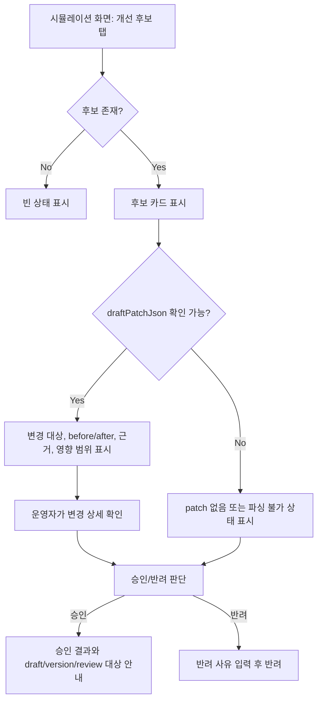

# Frontend FSD Spec: 시뮬레이션 개선 후보 draft patch 검토

## Goal

시뮬레이션 개선 후보를 승인하기 전에 운영자가 `draftPatchJson` 기반 변경 내용, 근거, 영향 범위를 확인하고 승인 이후 이어질 검토/재검증 대상을 이해할 수 있게 한다.

## User Flow Chart



## Design Diff

### As-is vs To-be

| 영역 | As-is | To-be | 변경 내용 |
|------|-------|-------|----------|
| 개선 후보 카드 | 후보 유형, 대상, before/after summary, evidence summary 표시 | `draftPatchJson`을 파싱한 변경 상세를 별도 검토 블록으로 표시 | 승인 전 실제 patch 내용을 더 직접 확인 |
| patch 예외 상태 | 빈 `{}` 또는 파싱 실패에 대한 별도 안내 없음 | patch 없음/파싱 불가 상태를 카드 안에서 명확히 표시 | 운영자가 데이터 불충분 상태를 인지 |
| 승인 액션 | `READY_FOR_REVIEW` 후보에서 바로 승인 가능 | 변경 상세 확인 상태와 연결해 승인 버튼 상태를 결정 | 승인 전 검토 흐름 강화 |
| 승인 후 안내 | 성공 토스트와 목록 새로고침 중심 | 적용 version, review session/task, 재검증 방향을 화면/토스트로 안내 | 다음 행동을 명확히 제공 |

## Component Tree

```text
WorkspaceSimulationPage
└─ Candidates side panel
   └─ Candidate card
      ├─ Candidate header/status
      ├─ Candidate before/after/evidence summary
      ├─ CandidatePatchReview
      │  ├─ Parsed patch detail
      │  ├─ Missing/invalid patch state
      │  └─ Review confirmation control
      ├─ Review request action
      ├─ Approve/reject form
      └─ Decision/approval guidance
```

## API Integration

### Endpoints

| Method | Path | Description |
|--------|------|-------------|
| GET | `/api/v1/workspaces/{workspaceId}/simulation/improvement-candidates` | 개선 후보 목록과 `draftPatchJson` 조회 |
| POST | `/api/v1/workspaces/{workspaceId}/simulation/improvement-candidates/{candidateId}/approve` | 개선 후보 승인 |
| POST | `/api/v1/workspaces/{workspaceId}/simulation/improvement-candidates/{candidateId}/reject` | 개선 후보 반려 |
| PATCH | `/api/v1/workspaces/{workspaceId}/simulation/improvement-candidates/{candidateId}/status` | 리뷰 요청 상태 전환 |

`frontend/src/features/simulation/api/simulationApi.ts`는 현재 해당 시뮬레이션 API 래퍼와 응답 타입을 보유한다. Generated endpoint도 존재하지만, 이 이슈는 승인 전 검토 UI에 집중하고 API 래퍼 마이그레이션은 범위에 포함하지 않는다.

## Data Flow

```text
WorkspaceSimulationPage
  -> simulationApi.listImprovementCandidates()
  -> SimulationImprovementCandidate.draftPatchJson
  -> CandidatePatchReview parser
  -> 검토 가능/불가 상태 표시
  -> 승인 확인 상태
  -> simulationApi.approveImprovementCandidate()
  -> 적용 version/review target 안내
```

## 수정 대상 파일

| 파일 | 변경 유형 | 설명 |
|------|----------|------|
| `frontend/src/pages/workspace/ui/WorkspaceSimulationPage.tsx` | modify | 후보 카드의 patch 검토 UI, 확인 상태, 승인 후 안내 추가 |
| `frontend/src/pages/workspace/ui/simulation/workspace-simulation-page.module.css` | modify | patch 검토 블록과 안내 상태 스타일 추가 |
| `frontend/src/pages/workspace/ui/WorkspaceSimulationPage.test.tsx` | modify | patch 표시, patch 오류 상태, 승인 전 확인 흐름 테스트 추가 |

## State Management

- 서버 상태는 기존 `simulationApi.listImprovementCandidates`와 local state인 `candidateItems`를 유지한다.
- 승인 전 확인 상태는 페이지 내 local state로 관리한다.
- 승인 성공 후 안내 문구는 local state로 보관해 개선 후보 패널 상단에 표시한다.
- 새 전역 상태, query key, store는 만들지 않는다.

## Tests

### Test Strategy

| 구분 | 방법 | 도구 | 비고 |
|------|------|------|------|
| 컴포넌트/통합 테스트 | 후보 목록 mock 후 UI와 mutation 호출 검증 | Vitest + React Testing Library | 기존 `WorkspaceSimulationPage.test.tsx` 확장 |
| 정적 검증 | 타입/빌드 검사 | `pnpm --dir frontend test ...`, 필요 시 `pnpm run ci:frontend` | 범위에 맞게 좁은 테스트 우선 |

### Test Scenarios

| # | 시나리오 | 기대 결과 |
|---|---------|----------|
| 1 | 유효한 `draftPatchJson`을 가진 READY_FOR_REVIEW 후보 | 변경 대상, before/after, 근거, 영향 범위가 표시되고 확인 전 승인 버튼이 비활성화된다 |
| 2 | 운영자가 변경 상세를 확인 | 승인 버튼이 활성화되고 승인 API가 호출된다 |
| 3 | `draftPatchJson`이 비어 있음 | patch 정보 없음 상태가 표시되고 승인할 수 없다 |
| 4 | `draftPatchJson` 파싱 실패 | 파싱 불가 상태와 원문 일부가 표시되고 승인할 수 없다 |
| 5 | 승인 성공 | 적용 version/review session/task 또는 재검증 안내가 표시된다 |

## Non-goals

- Backend patch schema 또는 승인 API 동작은 변경하지 않는다.
- Domain Pack draft/version 상세 화면으로의 신규 라우팅은 검증된 라우트 요구가 없으므로 추가하지 않는다.
- Generated API 재생성 또는 `simulationApi` 전체 마이그레이션은 이 이슈의 직접 요구가 아니므로 포함하지 않는다.

## Open Questions

- 승인 후 이동할 전용 review/detail route가 확정되어 있지 않다. 이번 범위에서는 확인 가능한 ID와 재검증 안내를 화면에 표시한다.
