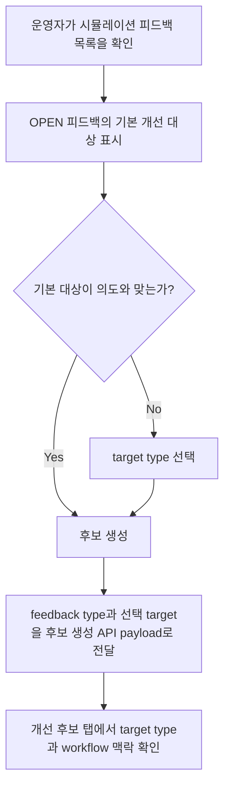

# Frontend FSD Spec: 시뮬레이션 피드백 개선 대상 세분화

> Issue: #805 `시뮬레이션 피드백을 intent/slot/policy/risk/workflow 단위로 세분화해 개선 후보 타깃을 정한다`
> Dominant Area: Frontend
> Branch: `feature/805-simulation-feedback-targets`

---

## Goal

시뮬레이션 피드백에서 개선 후보를 만들기 전에 운영자가 feedback type별 기본 Domain Pack 구성요소 target을 확인하고, 필요한 경우 지원되는 target type으로 수정할 수 있게 한다.

---

## User Flow Chart



---

## Design Diff

### As-is vs To-be

| 영역 | As-is | To-be | 변경 내용 |
|------|-------|-------|----------|
| 개선 후보 target | UI가 모든 피드백을 `WORKFLOW` target payload로 생성 | feedback type별 기본 target type을 표시하고 생성 payload에 반영 | intent/slot/policy/risk/workflow/response 단위로 대상 세분화 |
| 운영자 확인 | 후보 버튼만 제공 | 후보 생성 전 target type과 현재 element 확인/수정 UI 제공 | 후보 생성 의도를 운영자가 검토 가능 |
| workflow 맥락 | 후보 target 자체가 workflow로 고정 | workflow target이 아닐 때도 workflow context를 설명으로 유지 | 기존 시뮬레이션 맥락 보존 |
| 지원 제한 | 세부 element 미식별 상태가 보이지 않음 | ID/key가 없는 target은 제한 문구로 표시 | 후속 API/element picker 필요성을 명확히 노출 |

---

## Component Tree

```text
WorkspaceSimulationPage
├─ FeedbackPanel
│    └─ WorkspaceFeedbackList
│         └─ FeedbackItem
│              ├─ TargetTypeSelect
│              ├─ TargetElementSummary
│              └─ CreateCandidateButton
└─ ImprovementCandidatePanel
     └─ CandidateTargetSummary
```

---

## API Integration

### Existing Endpoints

| Method | Path | Description |
|--------|------|-------------|
| POST | `/api/v1/workspaces/:workspaceId/simulation/improvement-candidates/from-feedback/:feedbackId` | feedback 기반 개선 후보 생성 |

### Contract Use

- `frontend/src/features/simulation/api/simulationApi.ts`의 `CreateSimulationImprovementCandidatePayload.targetElementType`, `targetElementId`, `targetElementKey`, `beforeSummary`, `afterSummary`를 사용한다.
- `backend/src/main/java/com/init/workflowruntime/application/SimulationImprovementCandidateService.java`는 target type 누락 시 feedback type 기반 target을 이미 추론한다. 이번 변경은 UI에서 해당 의도를 노출하고, 사용자가 선택한 target type을 명시적으로 전달한다.
- generated OpenAPI 재생성, backend schema 변경, 신규 endpoint 추가는 포함하지 않는다.

---

## Data Flow

```text
SimulationFeedback.feedbackType
  -> inferDefaultCandidateTarget(feedbackType)
  -> operator sees/changes targetElementType
  -> createImprovementCandidate(feedbackId, target payload)
  -> candidate list displays targetElementType/id/key
```

---

## 수정 대상 파일

| 파일 | 변경 유형 | 설명 |
|------|----------|------|
| `frontend/src/pages/workspace/ui/WorkspaceSimulationPage.tsx` | modify | feedback type별 기본 target 추론, target select, 제한 표시, 후보 payload 생성 |
| `frontend/src/pages/workspace/ui/simulation/workspace-simulation-page.module.css` | modify | feedback row 내부 target 확인/수정 UI 스타일 |
| `frontend/src/pages/workspace/ui/WorkspaceSimulationPage.test.tsx` | modify | target type 기본값, 수정, workflow 맥락 유지 회귀 테스트 |

---

## State Management

- `candidateTargetSelections: Record<number, SimulationImprovementCandidateTargetType>`를 feedback id 기준 local state로 둔다.
- feedback이 새로 로드되면 별도 초기화 없이 각 row 렌더링 시 feedback type 기반 기본값을 fallback으로 사용한다.
- 선택 target이 `WORKFLOW`이면 현재 선택/매칭/검증 workflow의 id와 key를 payload에 포함한다.
- 선택 target이 `WORKFLOW`가 아니면 `targetElementType`만 payload에 포함하고, exact element id/key 미확인은 제한 안내로 표시한다.

---

## Tests

### Test Strategy

| 구분 | 방법 | 도구 | 비고 |
|------|------|------|------|
| 페이지 테스트 | feedback type별 target 표시와 payload 검증 | RTL + Vitest | `WorkspaceSimulationPage.test.tsx` |
| 페이지 테스트 | target type 수정 후 후보 생성 payload 검증 | RTL + Vitest | 지원되는 select 옵션 회귀 |
| 페이지 테스트 | workflow target 선택 시 기존 workflow context payload 유지 | RTL + Vitest | #784 회귀 방지 |

### Happy Path

| # | 시나리오 | 사전 조건 | 조작 | 기대 결과 |
|---|---------|---------|------|----------|
| 1 | slot 피드백 기본 대상 확인 | `MISSING_SLOT_QUESTION` OPEN 피드백 존재 | 피드백 탭 진입 | 기본 대상이 `SLOT`으로 표시되고 제한 문구가 보인다 |
| 2 | target type 수정 | OPEN 피드백 존재 | target type을 `POLICY`로 변경 후 후보 생성 | payload `targetElementType`이 `POLICY`다 |
| 3 | workflow target 유지 | matched workflow 존재 | target type을 `WORKFLOW`로 변경 후 후보 생성 | workflow id/key와 before/after summary가 payload에 포함된다 |

### Error & Edge Cases

| # | 시나리오 | 조작 | 기대 결과 |
|---|---------|------|----------|
| 1 | exact element id/key 미지원 | `INTENT`, `SLOT`, `POLICY`, `RISK_RULE`, `HANDOFF`, `RESPONSE` target 표시 | 제한 문구로 현재 후보는 type까지만 지정됨을 알린다 |
| 2 | workflow context 없음 | `WORKFLOW` target 선택 후 후보 생성 | id/key 없이 `targetElementType: "WORKFLOW"`만 전달되고 생성 실패 토스트는 기존대로 처리 |
| 3 | 후보 생성 중 | 후보 버튼 클릭 | 해당 feedback row 버튼이 disabled 상태를 유지한다 |

### 반응형 & 접근성

| # | 확인 항목 | 기대 결과 |
|---|---------|----------|
| 1 | 키보드 조작 | target type select와 후보 버튼이 Tab 순서에 포함된다 |
| 2 | 스크린 리더 | target type select는 feedback id별 명확한 `aria-label`을 가진다 |
| 3 | 모바일 폭 | target 확인/수정 영역이 줄바꿈되고 텍스트가 영역 밖으로 넘치지 않는다 |

---

## Non-goals

- intent/slot/policy/risk/workflow 실제 element picker를 새로 만들지 않는다.
- backend 후보 생성 API, DB schema, generated OpenAPI를 변경하지 않는다.
- Domain Pack mutation 또는 review task 적용 로직을 변경하지 않는다.
- 후보를 feedback당 1개로 제한하는 기존 backend 정책을 변경하지 않는다.

---

## Implementation Quality Brief

- 확인한 기존 패턴: `WorkspaceSimulationPage`의 feedback/candidate tab 구조, `candidateWorkflowTarget` payload 생성, `simulationApi.createImprovementCandidate` payload contract, backend `SimulationImprovementCandidateService`의 feedback type 기반 target 추론.
- 최소 diff: simulation page 내부 helper/state/UI와 해당 CSS/test만 변경한다.
- 위험 표면: #784 workflow context 회귀, target type select 접근성, exact element 미지원 안내 누락, 후보 생성 실패/refresh 실패 기존 처리 유지, FSD import 방향.
- 검증 계획: 관련 Vitest 파일을 우선 실행하고, 가능하면 frontend type/build 또는 CI frontend 명령으로 확장한다.

---

## Self-review Passes

### Pass 1: Issue Fidelity

- feedback type별 기본 개선 대상 구분, 후보 생성 전 target 확인/수정, unsupported exact element 제한 표시, 기존 workflow context 유지 요구사항을 spec에 매핑했다.
- issue에 없는 backend/API 확장은 non-goal로 제한했다.
- backend가 target type을 이미 지원한다는 확인 결과를 API Integration에 반영했다.

### Pass 2: Ostone Compliance

- Frontend 템플릿을 기준으로 작성했고 파일명은 `.agent/specs/805.md`다.
- final branch는 enhancement 규칙에 따라 `feature/805-simulation-feedback-targets`다.
- 참조한 production/test/style/backend 파일 경로는 repository에서 존재를 확인했다.
- FSD 방향은 pages가 features/entities/shared를 사용하는 기존 구조 안에 머문다.
