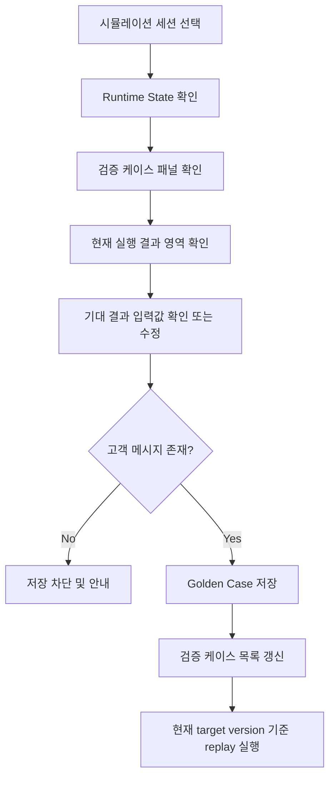

# Frontend FSD Spec: Golden Case 기대 동작 명시 개선

## Goal

Golden Case 생성 화면에서 현재 시뮬레이션 실행 결과와 운영자가 의도한 기대 결과를 분리해 보여주고, 저장 전 intent/workflow/action 중심 기대값을 명시적으로 확인하거나 수정할 수 있게 한다.

## User Flow Chart



## Design Diff

### As-is vs To-be

| 영역 | As-is | To-be | 변경 내용 |
|------|-------|-------|----------|
| Golden Case 생성 | 현재 runtime matched 결과를 payload 기본값으로 바로 사용 | 현재 실행 결과와 기대 결과 입력 영역을 분리 | 잘못된 현재 실행 결과가 무심코 기준값으로 저장되는 위험을 낮춘다 |
| 기대값 편집 | 이름, 기대 action, replay version 중심 | expected intent/workflow/state/action/required slots를 확인 및 수정 | 운영자가 intent/workflow/action 수준의 기대 동작을 저장 전 확인한다 |
| replay version | matched workflow version 문자열을 입력 | 시뮬레이션 target version을 우선 기본값으로 사용하고 없으면 현재 matched version 사용 | 대시보드/추천에서 진입한 검증 대상 버전 맥락을 유지한다 |
| 저장 조건 | 고객 메시지 존재 여부만 검사 | 고객 메시지와 필수 기대값 확인 | intent/workflow/action 기대값이 비어 있으면 저장을 막는다 |

## Scope

- `WorkspaceSimulationPage`의 Golden Case 생성 UI와 저장 payload 구성만 변경한다.
- 현재 API 계약에 존재하는 기대값 필드인 intent, workflow, current state, action type, slot values를 운영자가 확인 및 수정할 수 있게 한다.
- replay version 기본값은 현재 시뮬레이션 target version을 우선하고, target version이 없을 때 현재 matched workflow의 domain pack version을 사용한다.

## Non-goals

- Backend Golden Case 저장/재생 계약을 변경하지 않는다.
- `expected response`의 정확한 문구를 별도 필드로 저장하지 않는다. 현재 확인된 `CreateSimulationGoldenCasePayload`에는 응답 본문 기대값 필드가 없으므로, 이번 PR에서는 `expectedActionType`으로 응답/행동 종류를 검증하는 범위에 머문다.
- Golden Case 목록/상세 API의 pagination, replay 결과 비교 로직, Domain Pack runtime 실행 로직은 변경하지 않는다.

## Component Tree

```text
WorkspaceSimulationPage
├─ Runtime State tab
│  ├─ stateList
│  ├─ slotPanel
│  └─ goldenCasePanel
│     ├─ currentSnapshot summary
│     ├─ expectedResult fields
│     │  ├─ name input
│     │  ├─ expected intent input
│     │  ├─ expected workflow input
│     │  ├─ expected state input
│     │  ├─ expected action select
│     │  └─ required slots textarea
│     ├─ replay version input
│     └─ saved golden case list
```

## API Integration

### Endpoints

| Method | Path | Description |
|--------|------|-------------|
| GET | `/api/v1/workspaces/{workspaceId}/simulation/golden-cases` | Golden Case 목록 조회 |
| POST | `/api/v1/workspaces/{workspaceId}/simulation/sessions/{sessionId}/golden-cases` | 현재 세션 입력 메시지와 기대 결과로 Golden Case 생성 |
| POST | `/api/v1/workspaces/{workspaceId}/simulation/golden-cases/{goldenCaseId}/replays` | 선택된 domain pack version으로 Golden Case replay |

### Data Contract

- `CreateSimulationGoldenCasePayload`는 이미 `expectedIntentCode`, `expectedWorkflowCode`, `expectedCurrentState`, `expectedActionType`, `expectedSlotValues`를 지원한다.
- 이번 변경은 `frontend/src/features/simulation/api/simulationApi.ts`의 endpoint 계약을 바꾸지 않고, `frontend/src/pages/workspace/ui/WorkspaceSimulationPage.tsx`에서 저장 payload를 운영자가 확인한 기대값으로 구성한다.

## Data Flow

```text
SimulationSessionDetail
  ├─ matchedWorkflow, slotValues
  │   └─ 현재 실행 결과 영역 표시
  ├─ simulationTarget.versionId
  │   └─ replayVersionId 기본값 우선 주입
  └─ expected form state
      └─ createGoldenCase payload
```

## 수정 대상 파일

| 파일 | 변경 유형 | 설명 |
|------|----------|------|
| `frontend/src/pages/workspace/ui/WorkspaceSimulationPage.tsx` | update | Golden Case 생성 폼에 현재/기대 결과 분리, 기대값 편집, target version 기본값 적용 |
| `frontend/src/pages/workspace/ui/simulation/workspace-simulation-page.module.css` | update | Golden Case current/expected 영역과 slot JSON 입력 레이아웃 추가 |
| `frontend/src/pages/workspace/ui/WorkspaceSimulationPage.test.tsx` | update | 기대값 수정 payload와 target version replay 기본값 검증 |

## State Management

### Server State

- 기존 `simulationApi.listGoldenCases`, `simulationApi.createGoldenCase`, `simulationApi.replayGoldenCase` 호출 흐름을 유지한다.
- Golden Case 저장 성공 후 기존처럼 목록을 다시 조회한다.

### Client State

- 현재 runtime snapshot은 `detail.matchedWorkflow`, `detail.slotValues`에서 읽기 전용으로 표시한다.
- 기대 결과는 별도 local state로 관리하고, 세션 상세가 바뀌면 현재 snapshot을 제안값으로 다시 초기화한다.
- `replayVersionId`는 `simulationTarget.versionId`가 있으면 이를 우선 사용하고, 없으면 `detail.matchedWorkflow.domainPackVersionId`를 사용한다.

## Tests

### Test Strategy

| 구분 | 방법 | 도구 | 비고 |
|------|------|------|------|
| 컴포넌트 테스트 | Golden Case 생성 폼 조작과 API payload 검증 | Vitest + React Testing Library | 기존 `WorkspaceSimulationPage.test.tsx` 확장 |
| 정적 검증 | TypeScript/format/build 확인 | frontend package scripts | 실행 가능한 범위에서 수행 |

### Test Scenarios

#### Happy Path

| # | 시나리오 | 사전 조건 | 조작 | 기대 결과 |
|---|---------|---------|------|----------|
| 1 | 현재 실행 결과와 기대 결과 분리 표시 | matched workflow와 slot 값이 있는 세션 | 시뮬레이션 페이지 진입 | 현재 결과 summary와 기대값 입력 폼이 모두 표시된다 |
| 2 | 기대값 수정 후 Golden Case 저장 | 고객 메시지 1개 이상 | intent/workflow/state/action/slot 기대값 수정 후 등록 | createGoldenCase payload가 수정한 기대값을 사용한다 |
| 3 | target version 기본 replay | query 또는 route state에 versionId 존재 | replay 실행 | replay payload가 target version을 domainPackVersionId로 사용한다 |

#### Error & Edge Cases

| # | 시나리오 | 조작 | 기대 결과 |
|---|---------|------|----------|
| 1 | 고객 메시지 없음 | 등록 클릭 | 기존 안내 토스트로 저장을 차단한다 |
| 2 | 필수 기대값 비어 있음 | intent/workflow/action 중 하나를 비운 뒤 등록 | 저장을 차단하고 기대값 확인 안내를 표시한다 |
| 3 | required slots JSON 오류 | 잘못된 JSON 입력 후 등록 | 저장을 차단하고 JSON 형식 안내를 표시한다 |

#### 반응형 & 접근성

| # | 확인 항목 | 기대 결과 |
|---|---------|----------|
| 1 | 좁은 우측 패널 | current/expected 영역이 세로로 쌓이고 텍스트가 넘치지 않는다 |
| 2 | 입력 라벨 | intent/workflow/state/action/slot/replay version 입력은 label 또는 aria-label로 접근 가능하다 |
| 3 | 버튼 상태 | 생성 중 또는 세션 미선택 상태에서 등록 버튼이 disabled 된다 |

## Open Questions

- exact expected response text 저장은 별도 backend/API 필드가 필요하므로, 후속 이슈에서 계약 확장을 판단한다.
