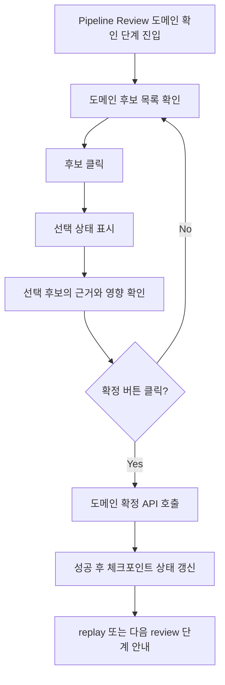

# Pipeline Review 도메인 확정 선택-검토-확정 UX

## Goal

Pipeline Review의 도메인 확인 단계에서 후보 클릭을 즉시 확정 mutation이 아닌 선택 상태로 처리하고, 사용자가 선택 근거와 후속 영향을 검토한 뒤 별도 확정 액션으로 replay 흐름을 시작할 수 있게 한다.

## User Flow Chart



## Design Diff

### As-is vs To-be

| 영역         | As-is                                    | To-be                                                    | 변경 내용                          |
| ------------ | ---------------------------------------- | -------------------------------------------------------- | ---------------------------------- |
| 후보 클릭    | 후보 버튼 클릭 즉시 도메인 확정 API 호출 | 후보 버튼 클릭은 선택 상태만 변경                        | 사용자의 실수성 확정을 방지        |
| 확정 액션    | 후보 버튼 자체가 확정 액션               | 별도 확정 버튼으로 mutation 실행                         | 선택과 확정 액션을 시각적으로 분리 |
| 선택 검토    | 후보 카드 내부 정보만 확인               | 선택 후보의 근거, 영향, 후속 흐름을 별도 영역에서 확인   | 확정 전 의사결정 맥락 제공         |
| 확정 후 안내 | 확정 성공 후 query invalidate에 의존     | 확정 버튼과 안내 문구에서 replay/다음 review 진행을 명시 | 후속 단계 기대치를 명확화          |

## Component Tree

```text
PipelineReviewPage
└─ PipelineReviewCheckpointCard
   ├─ domain candidate button list
   ├─ selected domain review panel
   └─ confirm domain button
```

## API Integration

### Endpoints

| Method | Path                                                                                                   | Description                          |
| ------ | ------------------------------------------------------------------------------------------------------ | ------------------------------------ |
| GET    | `/api/v1/workspaces/{workspaceId}/pipeline-jobs/{pipelineJobId}/review-checkpoint`                     | 현재 Pipeline Review 체크포인트 조회 |
| POST   | `/api/v1/workspaces/{workspaceId}/pipeline-jobs/{pipelineJobId}/review-checkpoint/domain-confirmation` | 선택한 review task 기반 도메인 확정  |

기존 generated endpoint wrapper인 `frontend/src/features/pipeline-review/api/pipelineReviewApi.ts`의 `usePipelineReviewCheckpoint`, `useConfirmPipelineDomain`을 계속 사용한다. API 계약 변경이나 generated 파일 수정은 이 이슈의 범위가 아니다.

## Data Flow

```text
PipelineReviewCheckpointCard
├─ usePipelineReviewCheckpoint(workspaceId, pipelineJobId)
├─ local domain candidate selection state
└─ useConfirmPipelineDomain(workspaceId, pipelineJobId)
   └─ confirm button click -> mutate(selected review task id)
```

## 수정 대상 파일

| 파일                                                                               | 변경 유형 | 설명                                                                             |
| ---------------------------------------------------------------------------------- | --------- | -------------------------------------------------------------------------------- |
| `frontend/src/features/pipeline-review/ui/PipelineReviewCheckpointCard.tsx`        | modify    | 후보 클릭과 확정 mutation을 분리하고 선택 검토 패널을 표시                       |
| `frontend/src/features/pipeline-review/ui/PipelineReviewCheckpointCard.module.css` | modify    | 선택 상태, 검토 패널, 확정 버튼 스타일 추가                                      |
| `frontend/src/features/pipeline-review/ui/PipelineReviewCheckpointCard.test.tsx`   | modify    | 후보 클릭만으로 mutation이 호출되지 않고 별도 확정으로 호출되는 회귀 테스트 추가 |
| `frontend/src/pages/pipeline-review/ui/PipelineReviewPage.tsx`                     | inspect   | 페이지 맥락 문구와 카드 연결 상태 확인                                           |

## State Management

- 서버 상태는 기존 TanStack Query wrapper가 관리한다.
- 선택된 도메인 후보는 `PipelineReviewCheckpointCard` 내부 local state로만 유지한다.
- 후보 목록 또는 review kind가 바뀌면 현재 열린 후보 중 유효한 선택만 유지하고, 사라진 후보 선택은 해제한다.
- 확정 mutation pending 중에는 후보 선택과 확정 버튼을 disabled 처리한다.

## Scope

- Pipeline Review의 `DOMAIN_CONFIRMATION` UI만 변경한다.
- 후보 선택, 선택 후보 상세 검토, 확정 버튼, 확정 후 진행 안내를 포함한다.
- 기존 human feedback replay UI와 저장 draft 동작은 변경하지 않는다.

## Non-goals

- Backend API 계약 변경은 하지 않는다.
- Domain Pack 생성 로직이나 ML pipeline stage 동작은 변경하지 않는다.
- 확정 취소 API, 다중 후보 확정, 별도 모달 확인 흐름은 추가하지 않는다.

## Acceptance Criteria

| #   | 기준         | 기대 결과                                                                                            |
| --- | ------------ | ---------------------------------------------------------------------------------------------------- |
| 1   | 후보 클릭    | 도메인 확정 API가 호출되지 않고 해당 후보만 선택 상태가 된다.                                        |
| 2   | 선택 시각화  | 선택된 후보가 일반 후보와 구분되고 `aria-pressed`로 상태가 노출된다.                                 |
| 3   | 확정 전 검토 | 선택 후보의 이름, 설명, 신뢰도, evidence terms, 파이프라인 영향 안내를 확인할 수 있다.               |
| 4   | 확정 액션    | 선택된 후보가 있을 때만 확정 버튼으로 mutation을 실행한다.                                           |
| 5   | 확정 후 안내 | 확정 버튼 주변 안내 문구에서 replay 후 다음 review 또는 Domain Pack 초안 생성으로 이어짐을 설명한다. |

## Tests

### Test Strategy

| 구분                 | 방법                            | 도구                          | 비고                             |
| -------------------- | ------------------------------- | ----------------------------- | -------------------------------- |
| 컴포넌트 회귀 테스트 | 후보 클릭과 확정 버튼 동작 검증 | Vitest, React Testing Library | 기존 카드 테스트 확장            |
| 정적 검증            | 타입, 빌드, 프론트 CI           | pnpm scripts                  | 변경 범위가 frontend UI에 국한됨 |

### Test Scenarios

| #   | 시나리오     | 조작                        | 기대 결과                                                 |
| --- | ------------ | --------------------------- | --------------------------------------------------------- |
| 1   | 후보 선택    | 도메인 후보 클릭            | mutation 미호출, 선택 상태와 검토 패널 표시               |
| 2   | 도메인 확정  | 후보 선택 후 확정 버튼 클릭 | `useConfirmPipelineDomain().mutate`가 선택 task id로 호출 |
| 3   | 미선택 상태  | 아무 후보도 선택하지 않음   | 확정 버튼 disabled                                        |
| 4   | pending 상태 | 확정 mutation 진행 중       | 후보 버튼과 확정 버튼 disabled                            |

## Open Questions

- 확정 성공 이후 API가 반환하는 다음 상태는 서버 checkpoint 응답에 의해 결정되므로, 프론트엔드는 현재 이슈에서 별도 성공 완료 화면을 직접 만들지 않고 query invalidate 후 최신 상태를 표시한다.
