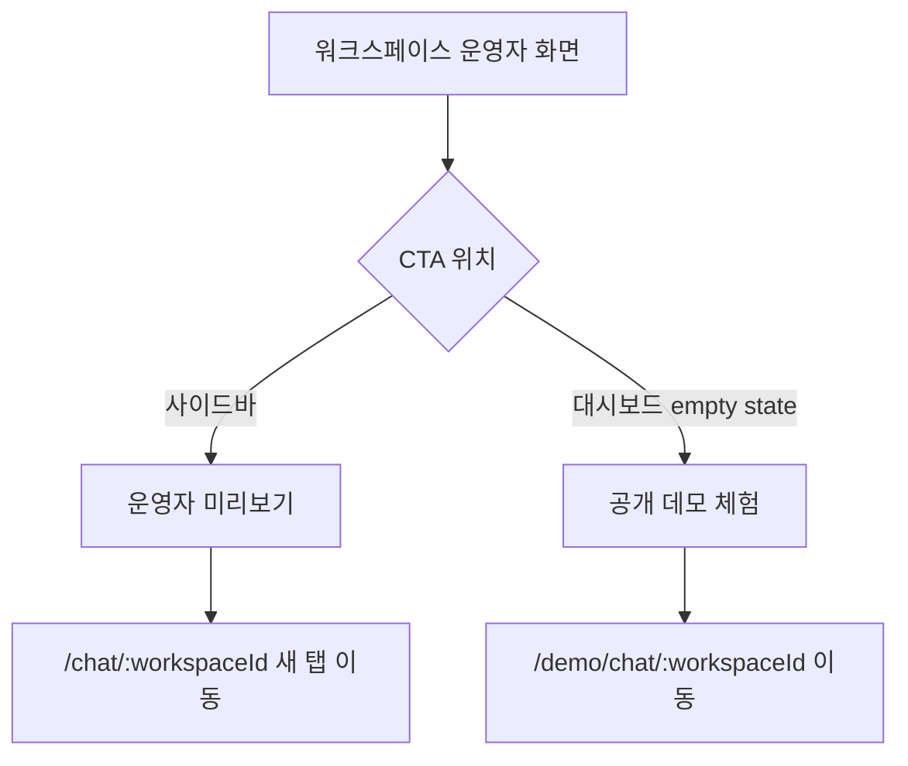

# Frontend Spec: 고객 화면 미리보기와 공개 데모 라벨 분리

## Goal

운영자용 워크스페이스 미리보기와 외부 공유 가능한 공개 데모 CTA의 라벨을 분리하여 사용자가 인증 상태와 사용 목적을 혼동하지 않게 한다.

## User Flow Chart



## Design Diff

### As-is vs To-be

| 영역 | As-is | To-be | 변경 내용 |
|------|-------|-------|----------|
| 사이드바 workspace preview | `사용자 화면 미리보기` | 운영자 검수/내부 확인 성격의 라벨 | `/chat/:workspaceId` 경로의 인증 기반 미리보기 목적을 드러낸다. |
| 대시보드 empty state public demo | `고객 화면 미리보기` | 외부 공유/비로그인 체험 성격의 라벨 | `/demo/chat/:workspaceId` 경로의 공개 데모 목적을 드러낸다. |
| 관련 새 탭 안내/브레드크럼 | preview/demo 용어 혼재 가능 | CTA와 동일한 용어 체계 | 같은 라벨이 서로 다른 경로 성격에 재사용되지 않게 한다. |

## Component Tree

```
OstoneShell
├─ Sidebar
│  └─ 운영자 미리보기 링크 (/chat/:workspaceId)
└─ Topbar
   └─ 운영자 미리보기 breadcrumb

WorkspaceDashboardPage
└─ DashboardStatePanel
   └─ 공개 데모 체험 CTA (/demo/chat/:workspaceId)
```

## API Integration

API 변경은 없다. 기존 프론트엔드 라우팅 의도와 경로는 유지한다.

| Route | Purpose |
|-------|---------|
| `/chat/:workspaceId` | 인증된 운영자가 현재 워크스페이스 고객 화면을 내부 검수한다. |
| `/demo/chat/:workspaceId` | 비로그인 또는 외부 공유용 공개 데모 채팅을 체험한다. |

## Data Flow

```
shared route/copy constants
├─ Sidebar / OstoneShell
│  └─ authenticated workspace preview label
└─ WorkspaceDashboardPage
   └─ public demo label
```

## 수정 대상 파일

| 파일 | 변경 유형 | 설명 |
|------|----------|------|
| `frontend/src/shared/lib/userChatRoutes.ts` | update | 인증 기반 workspace preview 라벨과 새 탭 안내 문구를 라우트 목적과 함께 관리한다. |
| `frontend/src/shared/lib/demoRoutes.ts` | update | public demo CTA 라벨과 새 탭 안내 문구를 라우트 목적과 함께 관리한다. |
| `frontend/src/shared/ui/ostone/chrome/Sidebar.tsx` | update | `/chat/:workspaceId` 사이드바 링크를 내부 검수용 라벨로 표시한다. |
| `frontend/src/widgets/ostone-shell/ui/OstoneShell.tsx` | update | chat 섹션 breadcrumb를 사이드바 라벨과 맞춘다. |
| `frontend/src/pages/workspace/ui/WorkspaceDashboardPage.tsx` | update | `/demo/chat/:workspaceId` empty state CTA를 공개 데모 성격으로 표시한다. |
| `frontend/src/shared/ui/ostone/chrome/Sidebar.test.tsx` | update | 사이드바 라벨과 경로 유지 여부를 검증한다. |
| `frontend/src/widgets/ostone-shell/ui/OstoneShell.test.tsx` | update | shell navigation 라벨을 검증한다. |
| `frontend/src/pages/workspace/ui/WorkspaceDashboardPage.test.tsx` | update | public demo CTA 라벨과 경로 유지 여부를 검증한다. |

## State Management

상태 관리 변경은 없다. 라벨 변경은 기존 라우트 빌더와 렌더링 흐름을 그대로 사용한다.

## Tests

### Test Strategy

| 구분 | 방법 | 도구 | 비고 |
|------|------|------|------|
| 컴포넌트 테스트 | 사이드바/쉘/대시보드 CTA 렌더링 검증 | Vitest + React Testing Library | 라벨과 href를 함께 확인한다. |
| 정적 검증 | 프론트엔드 타입/빌드 검증 | `pnpm run ci:frontend` | 가능하면 변경 후 실행한다. |

### Test Scenarios

#### Happy Path

| # | 시나리오 | 사전 조건 | 조작 | 기대 결과 |
|---|---------|---------|------|----------|
| 1 | 사이드바 workspace preview | `basePath=/workspaces/7` | 사이드바 렌더링 | CTA 라벨은 내부 검수용이고 href는 `/chat/7`이다. |
| 2 | 대시보드 public demo | workspace id `1` | empty state 렌더링 | CTA 라벨은 공개 데모용이고 href는 `/demo/chat/1`이다. |

#### Error & Edge Cases

| # | 시나리오 | 기대 결과 |
|---|---------|----------|
| 1 | 사이드바에서 workspaceId 추출 불가 | fallback `/demo` 링크는 공개 데모 선택 화면 안내를 유지한다. |
| 2 | 같은 화면에 preview/demo 라벨이 함께 존재 | 동일한 라벨이 서로 다른 경로 목적에 재사용되지 않는다. |

## Non-goals

- `/chat/:workspaceId` 또는 `/demo/chat/:workspaceId` 라우팅 구조를 변경하지 않는다.
- 인증/인가, API, 채팅 런타임 동작을 변경하지 않는다.
- 새로운 화면이나 공유 링크 생성 기능을 추가하지 않는다.

## Open Questions

- 없음. 이슈의 요구는 기존 라우팅 의도를 유지하면서 CTA 라벨과 설명을 분리하는 범위로 충분히 해석 가능하다.
