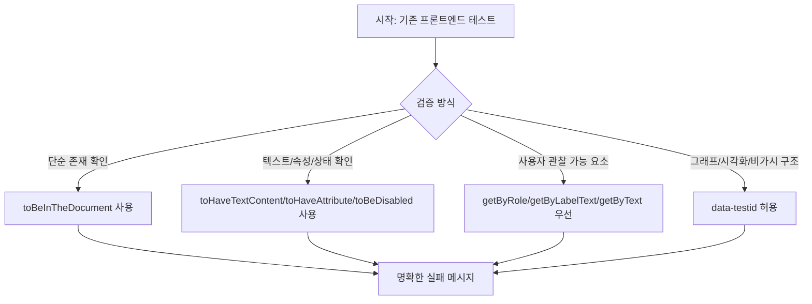

# Frontend Test Assertion 표현력 개선

## Goal

프론트엔드 주요 테스트의 단순 truthy/구조 기반 assertion을 React Testing Library와 jest-dom의 의도 중심 matcher로 바꿔 실패 메시지와 테스트 가독성을 개선한다.

## User Flow Chart



## Design Diff

### As-is vs To-be

| 영역 | As-is | To-be | 변경 내용 |
|------|-------|-------|----------|
| 존재 검증 | `toBeTruthy()` | `toBeInTheDocument()` | DOM 존재 의도를 matcher로 표현 |
| 텍스트 검증 | truthy 결과만 확인 | `toHaveTextContent()` 또는 `getByText` + 문서 존재 확인 | 실패 메시지에 기대 텍스트가 드러나도록 변경 |
| 상태/속성 검증 | truthy 또는 `dataset` 직접 비교 중심 | `toHaveAttribute`, `toBeDisabled`, `toHaveAccessibleName` 등 사용 | 검증 목적을 matcher 이름으로 표현 |
| DOM 선택 | `container.firstElementChild`, `document.querySelector` | 가능한 경우 role/label/text query 사용 | 구현 구조 결합도 완화 |
| 예외 영역 | 모든 `data-testid` 제거 시도 | 그래프, SVG, 시각화, mock wrapper처럼 접근 가능한 이름/역할이 부족한 요소는 유지 | 테스트 안정성과 접근성 기준의 균형 유지 |

## Component Tree

이번 이슈는 제품 UI 구조를 변경하지 않고 테스트 파일만 다룬다.

```
frontend/src
├─ entities
│  ├─ billing/ui/*test.tsx
│  └─ workflow/ui/nodes/*Node.test.tsx
├─ features
│  └─ consultation/ui/chat-history/MessageHistory.test.tsx
├─ pages
│  ├─ billing/ui/BillingPage.test.tsx
│  └─ consultation/ui/chat-history/ChatHistoryPage.test.tsx
└─ shared/ui/ostone/atoms/*test.tsx
```

## API Integration

### Endpoints

API 계약 변경은 없다. generated API client, query key, backend OpenAPI 산출물은 변경하지 않는다.

## Data Flow

제품 데이터 흐름은 변경하지 않는다. 테스트 렌더링 후 검증 경로만 다음 기준으로 정리한다.

```
render(Component)
  -> screen 기반 사용자 관찰 query 우선
  -> jest-dom matcher로 존재/텍스트/속성/상태 확인
  -> 접근성 query가 부적절한 그래프/시각화 요소만 test id 유지
```

## 수정 대상 파일

| 파일 | 변경 유형 | 설명 |
|------|----------|------|
| `.agent/specs/834.md` | new | 이슈 #834 프론트엔드 테스트 개선 스펙 |
| `frontend/src/entities/billing/ui/PaymentHistoryList.test.tsx` | update | 결제 내역 테스트의 단순 truthy assertion 개선 |
| `frontend/src/pages/billing/ui/BillingPage.test.tsx` | update | 빌링 페이지 주요 상태/화면 assertion 개선 |
| `frontend/src/features/consultation/ui/chat-history/MessageHistory.test.tsx` | update | 상담 메시지 이력 테스트의 존재/상태 matcher 개선 |
| `frontend/src/pages/consultation/ui/chat-history/ChatHistoryPage.test.tsx` | update | 상담 이력 페이지의 텍스트/상태 assertion 개선 |
| `frontend/src/entities/workflow/ui/nodes/ActionNode.test.tsx` | update | 워크플로우 노드 테스트의 container 중심 검증 완화 |
| `frontend/src/entities/workflow/ui/nodes/AnswerNode.test.tsx` | update | 워크플로우 노드 테스트의 container 중심 검증 완화 |
| `frontend/src/entities/workflow/ui/nodes/DecisionNode.test.tsx` | update | 워크플로우 노드 테스트의 container 중심 검증 완화 |
| `frontend/src/entities/workflow/ui/nodes/HandoffNode.test.tsx` | update | 워크플로우 노드 테스트의 container 중심 검증 완화 |
| `frontend/src/entities/workflow/ui/nodes/StartNode.test.tsx` | update | 워크플로우 노드 테스트의 container 중심 검증 완화 |
| `frontend/src/entities/workflow/ui/nodes/TerminalNode.test.tsx` | update | 워크플로우 노드 테스트의 container 중심 검증 완화 |
| `frontend/src/shared/ui/ostone/atoms/Avatar.test.tsx` | update | atom 테스트의 document query/truthy assertion 개선 |
| `frontend/src/shared/ui/ostone/atoms/Bar.test.tsx` | update | atom 테스트의 container/truthy assertion 개선 |
| `frontend/src/shared/ui/ostone/atoms/Dot.test.tsx` | update | atom 테스트의 document/container query 개선 |
| `frontend/src/shared/ui/ostone/atoms/Icon.test.tsx` | update | atom 테스트의 SVG 존재/속성 matcher 개선 |
| `frontend/src/shared/ui/ostone/atoms/Pill.test.tsx` | update | atom 테스트의 document/container query 개선 |
| `frontend/src/shared/ui/ostone/atoms/Spark.test.tsx` | update | atom 테스트의 SVG/shape 존재 matcher 개선 |

## State Management

상태 관리 변경은 없다. 테스트가 기존 mock props와 render 결과를 더 명확한 matcher로 검증하도록 바뀐다.

## Tests

### Test Strategy

| 구분 | 방법 | 도구 | 비고 |
|------|------|------|------|
| 정적 스캔 | 변경 대상 파일에서 `toBeTruthy`, `container`, `document.querySelector`, 부적절한 `getByTestId` 잔존 확인 | `rg` | 그래프/시각화 test id는 예외 |
| 컴포넌트 테스트 | 변경 대상 테스트 파일 실행 | Vitest / Vite+ | assertion 변경이 기존 동작을 보존하는지 확인 |
| 프론트엔드 품질 | 필요 시 frontend CI 명령 실행 | `pnpm --dir frontend test` 또는 관련 단일 테스트 실행 | 범위와 소요시간에 따라 좁은 명령 우선 |

### Test Environment & 사전 조건

| 항목 | 값 |
|------|---|
| 환경 | 로컬 checkout |
| 패키지 매니저 | `pnpm@10.33.0` |
| 테스트 러너 | Vite+ / Vitest |
| API Mock | 기존 테스트 mock 유지 |

### Test Scenarios

#### Happy Path

| # | 시나리오 | 사전 조건 | 기대 결과 |
|---|---------|---------|----------|
| 1 | 단순 존재 확인 교체 | `screen.getByText` 또는 `screen.getByRole`로 잡히는 요소 | `toBeInTheDocument()`가 존재 의도를 표현한다 |
| 2 | 상태/속성 확인 교체 | 버튼, 링크, data attribute 등 명시적 상태가 있는 요소 | `toBeDisabled`, `toHaveAttribute`, `toHaveTextContent` 등으로 상태가 드러난다 |
| 3 | 노드/atom 구조 검증 완화 | 접근성 query가 가능한 텍스트 또는 SVG title이 있는 요소 | container 구조보다 관찰 가능한 텍스트/속성 중심으로 검증한다 |

#### Error & Edge Cases

| # | 시나리오 | 기대 결과 |
|---|---------|----------|
| 1 | 그래프/시각화처럼 접근 가능한 이름이 없는 mock wrapper | `data-testid`를 유지하되 matcher를 명확히 사용한다 |
| 2 | null 렌더링을 검증하는 atom 테스트 | `container.firstChild` null 검증은 유지해 렌더링 부재를 명확히 표현한다 |
| 3 | 동일 텍스트가 여러 번 렌더링되는 화면 | `getAllByText`, role name, 또는 범위 제한을 사용해 모호한 assertion을 피한다 |

## Non-goals

- 모든 프론트엔드 테스트의 전체 assertion debt를 한 번에 제거하지 않는다.
- 제품 UI, 접근성 속성, CSS, API mock, generated API client는 이 이슈에서 변경하지 않는다.
- 그래프/시각화 등 접근성 query로 안정적으로 선택하기 어려운 요소의 `data-testid`를 강제로 제거하지 않는다.

## Acceptance Criteria

- 이슈 본문에서 예시로 든 주요 영역의 테스트에서 단순 존재 확인용 `toBeTruthy()`가 제거되거나 의도 중심 matcher로 대체된다.
- 변경 대상 테스트에서 `container.firstElementChild`와 `document.querySelector` 기반 검증은 가능한 경우 접근성 query, 텍스트 query, 또는 명시적 matcher로 대체된다.
- 남는 `data-testid` 사용은 그래프/시각화, mock shell, 동일 텍스트 다중 요소처럼 접근성 query가 부적절한 경우로 제한된다.
- 변경 대상 테스트 파일은 로컬에서 실행 가능하며 기존 제품 동작을 변경하지 않는다.

## Open Questions

- 없음. 이번 PR은 이슈 #834에 적힌 대표 영역을 중심으로 한 테스트 품질 개선으로 진행한다.
