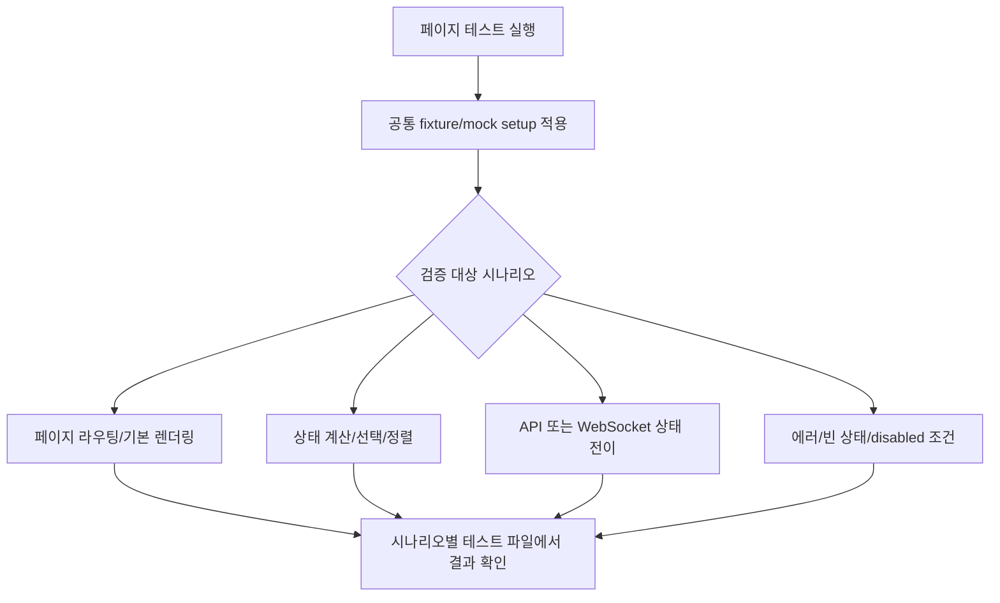

# Frontend FSD Spec: 대형 페이지 테스트 분리

## Goal

프론트엔드의 1,000줄 내외 대형 페이지 테스트를 시나리오별 하위 테스트와 공통 test helper로 분리해, 실패 원인과 Given 조건을 더 빠르게 파악할 수 있게 한다.

---

## User Flow Chart



---

## Design Diff

### As-is vs To-be

| 영역 | As-is | To-be | 변경 내용 |
| --- | --- | --- | --- |
| 페이지 테스트 구조 | 하나의 `.test.tsx` 파일에 fixture, mock, render helper, 모든 시나리오가 함께 존재 | 페이지별 test helper와 시나리오별 `.test.tsx` 파일로 분리 | 파일 크기와 검토 범위를 축소 |
| mock setup | 파일마다 긴 setup 블록이 테스트 의도 사이에 위치 | 공통 helper에서 기본 mock과 reset을 제공하고 테스트는 필요한 override만 선언 | Given 가독성 개선 |
| 페이지 테스트 책임 | 라우팅, API mock, WebSocket, optimistic UI, 상태 전이를 한 파일에서 직접 검증 | 페이지 통합 경계는 유지하되 상태/전이별 테스트 파일로 분류 | 실패 지점 탐색 비용 감소 |

---

## Component Tree

런타임 컴포넌트 트리는 변경하지 않는다. 테스트 파일만 다음 페이지 단위에서 재배치한다.

```
frontend/src/pages/
├─ consultation/ui/
│  ├─ ConsultationPage.test.tsx
│  └─ ConsultationPage.*.test.tsx / test helper
├─ workspace/ui/
│  ├─ WorkspaceSimulationPage.test.tsx
│  └─ WorkspaceSimulationPage.*.test.tsx / test helper
├─ user-chat/ui/
│  ├─ UserChatPage.test.tsx
│  └─ UserChatPage.*.test.tsx / test helper
└─ domain-pack/ui/
   ├─ DomainPackSummaryPage.test.tsx
   ├─ WorkflowDraftReadPage.test.tsx
   └─ DomainPackSummaryPage.*.test.tsx / WorkflowDraftReadPage.*.test.tsx / test helper
```

---

## API Integration

런타임 API 호출과 generated client는 변경하지 않는다. 테스트 mock만 기존 페이지 테스트의 API/WebSocket mock 동작을 보존한다.

---

## Data Flow

테스트 데이터 흐름은 다음 기준을 따른다.

```
test helper
├─ vi.mock 기본값
├─ fixture builder
├─ render helper
└─ reset helper
      ↓
scenario test
├─ Given: 필요한 mock override만 선언
├─ When: 사용자 행동 또는 이벤트 발생
└─ Then: 사용자에게 보이는 결과/API 호출 검증
```

---

## 수정 대상 파일

| 파일 | 변경 유형 | 설명 |
| --- | --- | --- |
| `frontend/src/pages/consultation/ui/ConsultationPage.test.tsx` | update | 핵심 페이지/라우팅 시나리오만 남기고 세부 상태 전이 테스트를 분리 |
| `frontend/src/pages/workspace/ui/WorkspaceSimulationPage.test.tsx` | update | 시뮬레이션 기본 흐름과 검증/개선 후보 흐름을 분리 |
| `frontend/src/pages/user-chat/ui/UserChatPage.test.tsx` | update | 진입/세션 생성, 전송, WebSocket, 에러 흐름을 분리 |
| `frontend/src/pages/domain-pack/ui/DomainPackSummaryPage.test.tsx` | update | 버전 선택/배포/초안 적용/에러 흐름을 분리 |
| `frontend/src/pages/domain-pack/ui/WorkflowDraftReadPage.test.tsx` | update | 기본 렌더링, 병목 분석, 편집/초안 충돌 흐름을 분리 |
| `frontend/src/pages/**/ui/*.test-helper.tsx` | new | 기존 mock setup, fixture, render helper를 페이지별로 공유 |

---

## State Management

프로덕션 state management는 변경하지 않는다. 테스트 helper는 각 테스트 전에 `vi.clearAllMocks()` 또는 명시적 mock reset을 수행해 테스트 간 상태 공유를 막는다.

---

## Tests

### Test Strategy

| 구분 | 방법 | 도구 | 비고 |
| --- | --- | --- | --- |
| 리팩터링 검증 | 분리된 페이지 테스트 전체 실행 | Vitest | 기존 동작 보존 확인 |
| 경계 검증 | `pnpm run ci:frontend` | Vite+ / Vitest coverage / build | 가능하면 최종 확인으로 실행 |
| 정적 검증 | 파일 크기와 import/FSD 확인 | `wc -l`, `pnpm run lint` 계열 | helper가 FSD 역방향 import를 만들지 않는지 확인 |

### Acceptance Criteria

- Issue에 명시된 1,000줄 이상 페이지 테스트 파일은 의미 있는 시나리오별 하위 테스트 단위로 분리된다.
- 페이지 테스트에서 반복되던 fixture, render helper, API/WebSocket mock setup은 페이지별 공통 helper로 이동한다.
- 각 시나리오 테스트는 Given override와 검증 의도가 파일명, `describe`, `it` 제목에서 드러난다.
- 런타임 컴포넌트, generated API 파일, 프로덕션 동작은 변경하지 않는다.
- 관련 frontend test 또는 `pnpm run ci:frontend`가 통과한다. 실행할 수 없는 경우 구체적 사유와 대체 검증을 남긴다.

### Non-goals

- 테스트 프레임워크, API mocking 라이브러리, 라우팅 구조를 새로 도입하지 않는다.
- 페이지 컴포넌트의 런타임 UI/UX, API 계약, WebSocket 계약은 변경하지 않는다.
- 모든 프론트엔드 테스트를 전역 test utility 체계로 재설계하지 않는다.

### Open Questions

- 없음. 이슈는 테스트 구조 개선을 요구하며 런타임 사용자 동작 변경은 요구하지 않는다.
