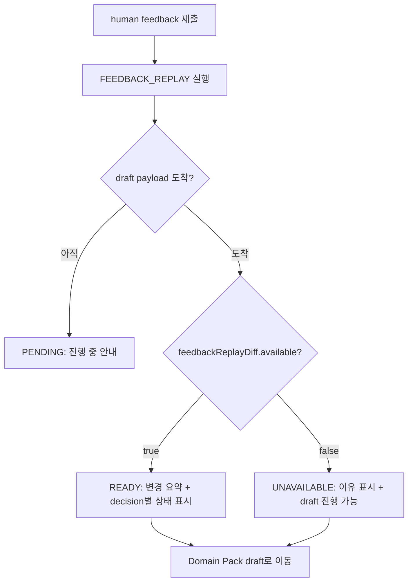

# 887 · feedback replay 전후 구조 diff를 review 화면에 표시

> Issue: feat(review) feedback replay 전후 구조 diff를 review 화면에 표시한다
> Area: ML(주) + 백엔드 + 프론트엔드 (mixed). 구조 diff 계산은 before/after candidate를 이미
> 보유한 ML `evaluation` stage에서 수행하고, 백엔드는 노출만, 프론트엔드는 표시·fallback을 담당한다.

---

## Goal

운영자가 human feedback을 제출한 뒤, 그 feedback이 intent/workflow 구조에 **무엇을 바꿨는지**를
review 화면의 "이번 피드백으로 바뀐 것" 섹션에서 확인할 수 있게 한다. 제출한 각 feedback decision이
`applied` / `partially_applied` / `ignored` 중 어떤 결과로 이어졌는지와 그 이유를 표시하고,
Domain Pack draft로 넘어가기 전 intent/workflow split·merge·label 변경 요약을 제공한다.

feedback replay가 실제로 개선을 만들었는지 신뢰하기 어렵고, feedback이 무시돼도 알 수 없는
traceability 공백을 메우는 운영자 신뢰 기반 UX 작업이다(KPI 대시보드 아님).

---

## Scope

- ML `draft_generation`: candidate.json에 `structureSnapshot`(intent/workflow membership·label +
  flow_splitting의 `workflowFeedback` 사본)을 임베드한다. before/after candidate가 자체적으로 비교
  가능해진다.
- ML `evaluation`: before(source) candidate와 after candidate의 `structureSnapshot` + feedback
  constraints를 비교해 `feedbackReplayDiff`(intent/workflow split·merge·label, decision별 적용 상태)를
  계산해 candidate에 첨부한다. replay가 아닌 run에서는 생략한다.
- 백엔드 `review`: 최신 draft payload artifact의 `feedbackReplayDiff`와 `FEEDBACK_CONSTRAINTS`를
  읽어 decision별 상태로 매핑하는 조회 endpoint를 추가한다. diff 없음/실패/비-feedback-replay를 구분한다.
- 프론트엔드 `pipeline-review`: review 화면에 "이번 피드백으로 바뀐 것" 섹션과 명확한 fallback UI를
  추가한다. 생성 클라이언트(orval) 재생성.

## Non-goals

- 신규 KPI/품질 대시보드. 본 작업은 단일 replay의 traceability에 한정한다.
- feedback 적용 알고리즘 자체 변경. workflow 적용/무시 판정은 기존 `WorkflowFeedbackReconciler`
  결과(`#892`)를 재사용한다.
- 자동 재-replay·롤백·추천. diff는 읽기 전용 표시다.
- 권한 모델 변경. 기존 OWNER/ADMIN/OPERATOR 검사를 그대로 사용한다.
- intent clustering 점수 로직 변경. intent decision 적용 여부는 **결과 membership**으로만 판정한다.

---

## Affected modules (verified paths)

### ML
- `ml/src/pipeline/stages/draft_generation/main.py` — candidate에 `structureSnapshot` 임베드.
- `ml/src/pipeline/stages/evaluation/main.py` — `feedbackReplayDiff` 계산·첨부(`_replay_lift_summary` 인접).
- `ml/src/pipeline/stages/evaluation/feedback_replay_diff.py` — 신규: diff 계산 로직(분리 모듈).
- `ml/src/pipeline/stages/publish_candidate/payloads.py` — domain-pack 콜백 본문에 `feedbackReplayDiff` 포함.
- `ml/tests/stages/test_evaluation_feedback_replay_diff.py` — 신규.
- `ml/tests/stages/test_publish_candidate_payloads*.py` / draft_generation 테스트 — payload·`structureSnapshot` 회귀.

### Backend (`com.init.review` + `com.init.pipelinejob`)
- `backend/src/main/java/com/init/pipelinejob/presentation/dto/PipelineDomainPackDraftCallbackRequest.java` —
  `feedbackReplayDiff`(JsonNode, optional) 필드 추가. callback controller가 `valueToTree(request)`로
  `requestBodyJson`을 재직렬화하므로 **DTO에 선언해야** artifact(`DOMAIN_PACK_DRAFT_PAYLOAD`)에 보존된다.
- `backend/src/main/java/com/init/review/presentation/PipelineReviewController.java` — diff 조회 endpoint.
- `backend/src/main/java/com/init/review/application/PipelineReviewReplayDiffUseCase.java` — 신규: artifact 조합·매핑.
- `backend/src/test/java/com/init/review/application/PipelineReviewReplayDiffUseCaseTest.java` — 신규.
- `backend/src/test/java/com/init/review/presentation/PipelineReviewControllerTest.java` — endpoint 테스트.
- `backend/src/test/java/.../PipelineIntentDraftCallbackControllerTest.java`(존재 시) — `feedbackReplayDiff` 보존 회귀.

> 참고: 백엔드 DB는 ML draft callback payload(`DOMAIN_PACK_DRAFT_PAYLOAD` 등)만 보유하고 intent/flow 중간
> 산출물은 S3에만 있으므로, diff는 **반드시 ML이 계산해 candidate에 담아 domain-pack 콜백으로 전달**해야 백엔드가
> 읽을 수 있다. 콜백 컨트롤러는 파싱된 DTO를 재직렬화해 `requestBodyJson`을 만들므로, 미선언 필드는 유실된다.

### Frontend (`features/pipeline-review`)
- `frontend/src/features/pipeline-review/api/pipelineReviewApi.ts` — `useReplayDiff` 훅·쿼리키.
- `frontend/src/features/pipeline-review/ui/PipelineReviewCheckpointCard.tsx` — 섹션 통합.
- `frontend/src/features/pipeline-review/ui/ReplayDiffSection.tsx` — 신규: diff 표시·fallback.
- `frontend/src/features/pipeline-review/ui/PipelineReviewCheckpointCard.module.css` — 스타일.
- `frontend/src/features/pipeline-review/ui/*.test.tsx` — 상태별 테스트.
- 재생성: `frontend/src/shared/api/generated/**`(orval), `.codegen-meta.json`.

---

## Data / API impact

### ML candidate.json `structureSnapshot` (신규, draft_generation 임베드)

before/after candidate를 자체 비교 가능하게 하는 최소 스냅샷. 없으면(구버전 source) diff는 `available=false`.

```json
"structureSnapshot": {
  "schemaVersion": "structure-snapshot.v1",
  "intents": [
    { "intentId": "intent-0", "intentLabel": "카드 분실", "memberConversationIds": ["c1", "c2"] }
  ],
  "workflows": [
    { "workflowId": "entrypoint-0", "workflowLabel": "분실 신고", "intentId": "intent-0",
      "memberConversationIds": ["c1"] }
  ],
  "workflowFeedback": {
    "applied":  [{ "sourceId": "c1", "targetId": "c2", "type": "same_workflow", "effect": "merged" }],
    "ignored":  [{ "sourceId": "c1", "targetId": "c9", "type": "separate_workflow",
                   "reason": "endpoints_in_different_clusters" }]
  }
}
```

### ML candidate.json `feedbackReplayDiff` (신규, evaluation 첨부)

`replayLiftSummary`와 동일하게 evaluation이 candidate에 추가한다. **feedback replay run에서만** 생성.

```json
"feedbackReplayDiff": {
  "schemaVersion": "feedback-replay-diff.v1",
  "available": true,
  "intent":   { "splitCount": 1, "mergeCount": 0,
                "labelChanges": [{ "id": "intent-0", "before": "카드", "after": "카드 분실" }] },
  "workflow": { "splitCount": 1, "mergeCount": 1, "labelChanges": [] },
  "decisions": [
    { "reviewTaskId": "10", "decisionId": "25", "scope": "workflow", "type": "same_workflow",
      "sourceId": "c1", "targetId": "c2", "status": "applied", "effect": "merged", "reason": null },
    { "reviewTaskId": "11", "decisionId": "26", "scope": "intent", "type": "must_link",
      "sourceId": "c3", "targetId": "c4", "status": "ignored", "reason": "intent_not_merged" }
  ],
  "summary": { "applied": 1, "partiallyApplied": 0, "ignored": 1, "total": 2 }
}
```

`available=false`이면 `reason`(`source_candidate_not_found`, `structure_snapshot_missing`,
`no_feedback_constraints`)만 채우고 나머지는 비운다.

#### decision 상태 판정 규칙

- **workflow** decision: after `workflowFeedback`에서 (sourceId,targetId,type)로 매칭.
  - `applied`: effect ∈ {`merged`, `split`, `already_same`, `already_separate`}.
  - `partially_applied`: `separate_workflow`가 적용(`split`/`already_separate`)됐지만 두 endpoint가
    서로 **다른 intent**로 갈린 경우 — 운영자의 "같은 intent·다른 workflow" 의도 중 workflow만 충족.
    `reason="workflow_separated_but_intent_differs"`.
  - `ignored`: `workflowFeedback.ignored`에 있으면 그 `reason` 사용.
- **intent** decision: after intent membership으로 판정(점수 로직 미사용).
  - `must_link`: 두 endpoint가 같은 intent면 `applied`, 아니면 `ignored`(`intent_not_merged`).
  - `cannot_link`: 다른 intent면 `applied`, 같으면 `ignored`(`intent_not_separated`).
  - endpoint conv id가 after membership에 없으면 `ignored`(`endpoint_not_in_candidate`).

#### split/merge·label 집계

- intent/workflow **split**: before 한 그룹의 member가 after 2개 이상 그룹으로 분리된 수.
- **merge**: before 2개 이상 그룹의 member가 after 한 그룹으로 합쳐진 수.
- **labelChanges**: 동일 id(또는 안정 membership 매칭)의 before≠after label.

### REST endpoint (신규)

```
GET /api/v1/workspaces/{workspaceId}/pipeline-jobs/{pipelineJobId}/review-checkpoint/replay-diff
```

응답 `ReplayDiffView`:

```json
{
  "available": true,
  "runMode": "FEEDBACK_REPLAY",
  "status": "READY",
  "intent":   { "splitCount": 1, "mergeCount": 0, "labelChanges": [ ... ] },
  "workflow": { "splitCount": 1, "mergeCount": 1, "labelChanges": [ ... ] },
  "decisions": [
    { "reviewTaskId": 10, "scope": "workflow", "decisionType": "same_workflow",
      "sourceId": "c1", "targetId": "c2", "status": "applied", "reason": null }
  ],
  "summary": { "applied": 1, "partiallyApplied": 0, "ignored": 1, "total": 2 }
}
```

`status` 값:
- `READY`: feedbackReplayDiff 존재·`available=true`.
- `UNAVAILABLE`: replay는 끝났으나 diff `available=false`(이유는 `reason`에 전달).
- `PENDING`: feedback replay가 진행 중이라 draft payload가 아직 없음.
- `NOT_APPLICABLE`: 해당 job이 feedback replay가 아님.

백엔드 매핑:
- 최신 `DOMAIN_PACK_DRAFT_PAYLOAD` artifact에서 `feedbackReplayDiff`를 읽는다.
- `FEEDBACK_CONSTRAINTS` artifact로 decision의 `reviewTaskId`/scope/decisionType을 보강한다(ML id는 문자열).
- 권한: 기존 `WorkspaceMembershipPort` OWNER/ADMIN/OPERATOR 검사 재사용.
- diff 조회 실패·없음을 draft 성공으로 오인하지 않도록 `status`로 명시 구분한다.

---

## User flow



---

## Acceptance criteria

1. 제출한 각 feedback decision이 어떤 결과(intent/workflow 적용)로 이어졌는지 화면에 표시된다.
2. decision별 상태가 `applied` / `partially_applied` / `ignored`로 구분된다.
3. `ignored` 또는 `partially_applied` 상태에는 이유(예: `endpoints_in_different_clusters`,
   `intent_not_merged`, `workflow_separated_but_intent_differs`)가 표시된다.
4. Domain Pack draft로 넘어가기 전 intent/workflow split·merge·label 변경 요약을 확인할 수 있다.
5. diff 조회 실패(`UNAVAILABLE`)·진행 중(`PENDING`) 시 draft 자체를 성공으로 오인하지 않고, 사유와 함께
   명확한 fallback UI를 제공한다.
6. feedback replay가 아닌 job(`NOT_APPLICABLE`)에서는 섹션을 노출하지 않는다.

---

## Validation

| 스택 | 명령 | 검증 대상 |
|---|---|---|
| ML | `pnpm run ci:ml` (또는 `pytest ml/tests/stages/test_evaluation_feedback_replay_diff.py`) | split/merge·label·decision 상태 판정, available=false 분기 |
| Backend | `pnpm run ci:backend` | artifact 조합·status 매핑·권한, diff 없음/실패 분기 |
| Frontend | `pnpm --dir frontend test`, `pnpm --dir frontend build` | READY/PENDING/UNAVAILABLE/NOT_APPLICABLE 표시, fallback, 접근성 |
| Codegen | `pnpm run codegen` | OpenAPI drift 없음, 생성 client에 replay-diff endpoint 반영 |

---

## Open questions

- `partially_applied`의 추가 케이스(예: 다중 endpoint decision)는 본 이슈에서 다루지 않는다. 현재 정의는
  `same_intent_separate_workflow` 의도가 부분 충족된 workflow decision에 한정한다.
- intent membership 안정 매칭(id 부재 시)은 memberConversationIds 교집합 최대 그룹으로 근사한다.
