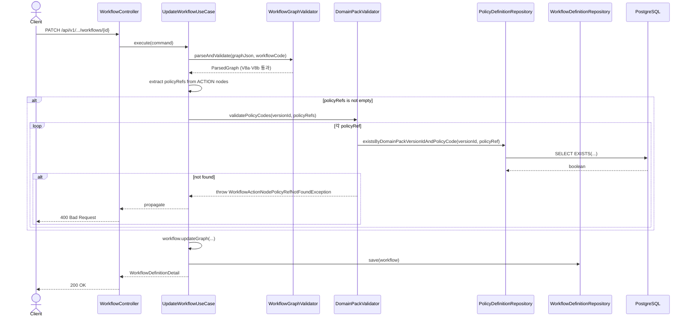

# [BE] #98 — UpdateWorkflowUseCase에 V8c 검증 추가

> **Scope**: ACTION 노드 `policyRef`가 같은 version의 `policyCode`에 실제로 존재하는지 DB 조회로 검증 (cross-entity).  
> **In scope**: `UpdateWorkflowUseCase` V8c 검증 추가. 관련 `DomainPackValidator` 메서드 추가, repository 메서드 추가, 예외 클래스 신규 생성, 테스트 추가.  
> **Out of scope**: `CreateDomainPackDraftUseCase` (spec 231 별도 이슈).

---

## Goal

`UpdateWorkflowUseCase.execute()`에서 V8c 규칙을 적용한다: ACTION 타입 노드의 `policyRef`가 같은 `domainPackVersionId`에 속한 `policyCode` 중 하나와 일치해야 한다. 불일치 시 `WORKFLOW_ACTION_NODE_POLICY_REF_NOT_FOUND` 에러를 반환한다.

---

## Sequence Diagram



---

## REST API

### Endpoint

기존 workflow 수정 엔드포인트를 그대로 사용한다. 새 엔드포인트 없음.

| Method | Path | Description |
|--------|------|-------------|
| PATCH | `/api/v1/workspaces/{workspaceId}/domain-packs/{packId}/versions/{versionId}/workflows/{workflowId}` | 워크플로우 graphJson 수정 (기존) |

### Request / Response 변경

추가 필드 없음. V8c 위반 시 아래 에러가 새로 발생한다.

**400 Bad Request — V8c 위반**

```json
{
  "code": "WORKFLOW_ACTION_NODE_POLICY_REF_NOT_FOUND",
  "message": "ACTION 타입 노드의 policyRef가 존재하지 않습니다. policyRef=<값>"
}
```

---

## Class Design

### 신규 파일

#### `WorkflowActionNodePolicyRefNotFoundException`

```
backend/src/main/java/com/init/domainpack/application/exception/WorkflowActionNodePolicyRefNotFoundException.java
```

```java
package com.init.domainpack.application.exception;

import com.init.shared.application.exception.BadRequestException;

public class WorkflowActionNodePolicyRefNotFoundException extends BadRequestException {
  public WorkflowActionNodePolicyRefNotFoundException(String policyRef) {
    super(
        "WORKFLOW_ACTION_NODE_POLICY_REF_NOT_FOUND",
        "ACTION 타입 노드의 policyRef가 존재하지 않습니다. policyRef=" + policyRef);
  }
}
```

### 수정 파일

#### `PolicyDefinitionRepository` — 메서드 추가

```
backend/src/main/java/com/init/domainpack/domain/repository/PolicyDefinitionRepository.java
```

```java
boolean existsByDomainPackVersionIdAndPolicyCode(Long domainPackVersionId, String policyCode);
```

참조 패턴: `IntentDefinitionRepository.existsByDomainPackVersionIdAndIntentCode(Long, String)`

#### `JpaPolicyDefinitionRepository` — 메서드 추가

```
backend/src/main/java/com/init/domainpack/infrastructure/persistence/JpaPolicyDefinitionRepository.java
```

Spring Data JPA 자동 파생 쿼리. 메서드 선언만 추가하면 된다.

```java
boolean existsByDomainPackVersionIdAndPolicyCode(Long domainPackVersionId, String policyCode);
```

#### `DomainPackValidator` — 의존성 + 메서드 추가

```
backend/src/main/java/com/init/domainpack/application/DomainPackValidator.java
```

```java
// 추가 필드
private final PolicyDefinitionRepository policyDefinitionRepository;

// 생성자에 파라미터 추가 (기존 4개 → 5개)
public DomainPackValidator(
    WorkspaceExistencePort workspaceExistencePort,
    WorkspaceMembershipPort workspaceMembershipPort,
    DomainPackRepository domainPackRepository,
    DomainPackVersionRepository domainPackVersionRepository,
    PolicyDefinitionRepository policyDefinitionRepository) {
    ...
    this.policyDefinitionRepository = policyDefinitionRepository;
}

// 신규 메서드
public void validatePolicyCodes(Long versionId, Set<String> policyCodes) {
    for (String policyCode : policyCodes) {
        if (!policyDefinitionRepository.existsByDomainPackVersionIdAndPolicyCode(versionId, policyCode)) {
            throw new WorkflowActionNodePolicyRefNotFoundException(policyCode);
        }
    }
}
```

#### `UpdateWorkflowUseCase` — V8c 호출 추가

```
backend/src/main/java/com/init/domainpack/application/UpdateWorkflowUseCase.java
```

`WorkflowGraphValidator.parseAndValidate()` 호출 직후에 아래를 추가한다.

```java
WorkflowGraphValidator.ParsedGraph parsed =
    WorkflowGraphValidator.parseAndValidate(command.graphJson(), workflow.getWorkflowCode());

// V8c: policyRef cross-entity 검증
Set<String> policyRefs = parsed.nodes().stream()
    .filter(n -> "ACTION".equals(n.type()))
    .map(WorkflowGraphValidator.GraphNode::policyRef)
    .collect(Collectors.toSet());
if (!policyRefs.isEmpty()) {
    validator.validatePolicyCodes(command.versionId(), policyRefs);
}
```

`GlobalExceptionHandler`는 기존 `BadRequestException` 핸들러(`@ExceptionHandler(BadRequestException.class)`)가 `WorkflowActionNodePolicyRefNotFoundException`을 처리하므로 수정 불필요.

---

## Tests

### 테스트 대상 파일

```
backend/src/test/java/com/init/domainpack/application/UpdateWorkflowUseCaseTest.java
```

기존 mock 3개(`DomainPackValidator`, `DomainPackVersionRepository`, `WorkflowDefinitionRepository`)를 그대로 사용한다.  
`DomainPackValidator`는 이미 mock 처리됐으므로 `PolicyDefinitionRepository` mock 추가 불필요.

### 신규 테스트 픽스처

ACTION 노드를 포함한 graphJson 픽스처를 추가한다.

```java
private static final String GRAPH_WITH_ACTION_NODE = """
    {
      "nodes": [
        {"id": "n1", "type": "START"},
        {"id": "n2", "type": "ACTION", "policyRef": "policy-1"},
        {"id": "n3", "type": "TERMINAL"}
      ],
      "edges": [
        {"id": "e1", "from": "n1", "to": "n2"},
        {"id": "e2", "from": "n2", "to": "n3"}
      ]
    }
    """;
```

### 신규 테스트 케이스

```java
@Test
@DisplayName("ACTION 노드 policyRef가 version에 존재하면 성공한다")
void execute_withValidPolicyRef_succeeds() {
    // given: validator.validatePolicyCodes()는 void이므로 기본 doNothing() 동작
    // (Mockito 기본값: void 메서드는 아무것도 안 함)
    // ... 기존 정상 경로 setup (version DRAFT, workflow 존재)
    given(command.graphJson()).willReturn(GRAPH_WITH_ACTION_NODE);

    // when
    WorkflowDefinitionDetail result = useCase.execute(command);

    // then
    assertThat(result).isNotNull();
    verify(validator).validatePolicyCodes(eq(COMMAND_VERSION_ID), eq(Set.of("policy-1")));
}

@Test
@DisplayName("ACTION 노드 policyRef가 version에 없으면 WorkflowActionNodePolicyRefNotFoundException을 던진다")
void execute_withNonExistentPolicyRef_throwsException() {
    // given
    doThrow(new WorkflowActionNodePolicyRefNotFoundException("policy-1"))
        .when(validator).validatePolicyCodes(anyLong(), anySet());
    given(command.graphJson()).willReturn(GRAPH_WITH_ACTION_NODE);
    // ... 기존 정상 경로 setup (version DRAFT, workflow 존재)

    // when & then
    assertThatThrownBy(() -> useCase.execute(command))
        .isInstanceOf(WorkflowActionNodePolicyRefNotFoundException.class)
        .satisfies(e -> {
            WorkflowActionNodePolicyRefNotFoundException typed =
                (WorkflowActionNodePolicyRefNotFoundException) e;
            assertThat(typed.getCode()).isEqualTo("WORKFLOW_ACTION_NODE_POLICY_REF_NOT_FOUND");
            assertThat(typed.getMessage()).contains("policy-1");
        });
}

@Test
@DisplayName("ACTION 노드가 없으면 validatePolicyCodes를 호출하지 않는다")
void execute_withNoActionNodes_doesNotCallValidatePolicyCodes() {
    // given: VALID_GRAPH (기존 픽스처 — START + TERMINAL만 포함)
    // ... 기존 정상 경로 setup

    // when
    useCase.execute(command);

    // then
    verify(validator, never()).validatePolicyCodes(anyLong(), anySet());
}
```

### `DomainPackValidatorTest` — fail-fast 테스트

fail-fast 동작은 `DomainPackValidator.validatePolicyCodes` 내부 반복에서 발생한다.  
`UpdateWorkflowUseCaseTest`에서는 validator가 mock이므로 검증 불가 → `DomainPackValidatorTest`에서 다룬다.

```java
@Test
@DisplayName("미존재 policyCode를 만나면 즉시 예외를 던지고 이후 코드는 조회하지 않는다")
void validatePolicyCodes_failsFastOnFirstMissing() {
    // given: LinkedHashSet으로 순서 보장 [p-1(valid) → p-2(missing) → p-3(valid)]
    given(policyDefinitionRepository.existsByDomainPackVersionIdAndPolicyCode(VERSION_ID, "p-1"))
        .willReturn(true);
    given(policyDefinitionRepository.existsByDomainPackVersionIdAndPolicyCode(VERSION_ID, "p-2"))
        .willReturn(false);
    given(policyDefinitionRepository.existsByDomainPackVersionIdAndPolicyCode(VERSION_ID, "p-3"))
        .willReturn(true);
    Set<String> codes = new LinkedHashSet<>(List.of("p-1", "p-2", "p-3"));

    // when & then
    assertThatThrownBy(() -> validator.validatePolicyCodes(VERSION_ID, codes))
        .isInstanceOf(WorkflowActionNodePolicyRefNotFoundException.class)
        .satisfies(e -> {
            WorkflowActionNodePolicyRefNotFoundException typed =
                (WorkflowActionNodePolicyRefNotFoundException) e;
            assertThat(typed.getCode()).isEqualTo("WORKFLOW_ACTION_NODE_POLICY_REF_NOT_FOUND");
            assertThat(typed.getMessage()).contains("p-2");
        });
    // p-2에서 예외 throw → p-3는 조회되지 않아야 함
    verify(policyDefinitionRepository, never())
        .existsByDomainPackVersionIdAndPolicyCode(VERSION_ID, "p-3");
}
```

### 테스트 체크리스트

| 테스트 위치 | 시나리오 | 검증 포인트 |
|------------|---------|------------|
| `UpdateWorkflowUseCaseTest` | ACTION 노드 policyRef 유효 → 성공 | `validatePolicyCodes` 1회 호출, 올바른 Set 전달 |
| `UpdateWorkflowUseCaseTest` | ACTION 노드 policyRef 미존재 → 예외 | `WorkflowActionNodePolicyRefNotFoundException`, 에러코드 `WORKFLOW_ACTION_NODE_POLICY_REF_NOT_FOUND` |
| `UpdateWorkflowUseCaseTest` | ACTION 노드 없음 → 성공 | `validatePolicyCodes` 미호출 |
| `DomainPackValidatorTest` | ACTION 노드 복수, 일부 무효 → fail-fast | 첫 번째 미존재 코드에서 예외, 이후 코드 미조회 |

---

## Database

N/A — 스키마 변경 없음. Liquibase 마이그레이션 불필요.

---

## Additional Notes

- `DomainPackValidator.validatePolicyCodes`는 fail-fast: 첫 번째 미존재 policyRef에서 즉시 예외 throw.
- `UpdateWorkflowUseCase`는 ACTION 노드가 없으면 `validatePolicyCodes`를 호출하지 않는다 (불필요 DB 쿼리 방지).
- `GlobalExceptionHandler` 수정 불필요 — `BadRequestException` 핸들러가 `WorkflowActionNodePolicyRefNotFoundException`을 400으로 처리.
- `DomainPackValidator` 생성자 파라미터 추가로 기존 Spring Bean 연결이 변경됨 — Spring Boot auto-wiring으로 자동 처리되나, 관련 `@Bean` 수동 설정이 있으면 확인 필요.
