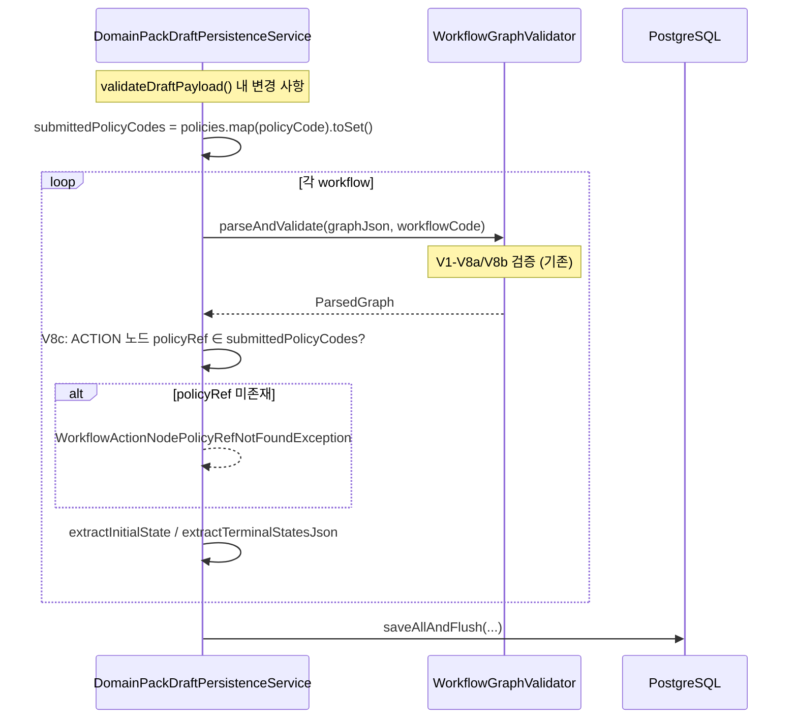

# [BE-99] CreateDomainPackDraftUseCase V8 검증 추가

> **Backlog**: spec 231 `CreateDomainPackDraftUseCase`에 V8 graphJson 검증을 적용하고 policyRef 매핑 전략을 확정한다
> **Bounded Context**: `domainpack`
> **Template**: `_TEMPLATE_BE.md`
> **Branch**: `spec/99`
> **Base spec**: `.agent/specs/231.md`

---

## Goal

`DomainPackDraftPersistenceService.validateDraftPayload()`에 V8c 인메모리 교차 검증을 추가하여, 초안 생성 시 workflow graphJson ACTION 노드의 `policyRef`가 동일 요청의 `policies` 목록 내 `policyCode`와 일치하는지 강제한다.

- **V8a·V8b** (`policyRef` 존재·형식): `WorkflowGraphValidator.parseAndValidate`에 이미 구현됨 (spec 3215 / issue #98 선행 작업). 추가 구현 불필요.
- **V8c** (`policyRef` cross-entity 존재 검증): 이 스펙의 직접 구현 대상. DB 조회 없이 제출된 `policies` 목록 기준 인메모리 검증.
- **policyRef 매핑 전략**: Option B 확정 — `node.id`와 `policyRef`는 독립 관리. ML pipeline `draft-generation` 단계에서 별도 매핑 정보를 통해 policyRef를 결정한다.

---

## Sequence Diagram



---

## REST API

신규 엔드포인트 없음. 기존 `POST /api/v1/workspaces/{workspaceId}/domain-packs/{packId}/versions/drafts` (spec 231)에 V8c 검증 추가.

### 추가 에러 응답

**400 Bad Request** — V8c 위반 (policyRef가 제출된 policies에 없음)

```json
{
  "code": "WORKFLOW_ACTION_NODE_POLICY_REF_NOT_FOUND",
  "message": "ACTION 타입 노드의 policyRef가 존재하지 않습니다. policyRef=missing_policy"
}
```

> V8a/V8b 에러 코드(`WORKFLOW_ACTION_NODE_POLICY_REF_MISSING`, `WORKFLOW_ACTION_NODE_POLICY_REF_INVALID_CHARS`)는 spec 3215 및 issue #98에서 이미 정의됨.

---

## Class Design

### 변경 파일

| 파일 | 변경 내용 |
|------|-----------|
| `DomainPackDraftPersistenceService.java` | `validateDraftPayload`에 V8c 인메모리 검증 추가; `validateAndNormalizeWorkflow`에 `submittedPolicyCodes` 파라미터 추가 |

### V8c 구현 (DomainPackDraftPersistenceService)

```java
// validateDraftPayload 내 V8c 추가
Set<String> submittedPolicyCodes = safeList(policies).stream()
    .map(CreateDomainPackDraftCommand.PolicyDraft::policyCode)
    .collect(Collectors.toSet());
return safeList(workflows).stream()
    .map(w -> validateAndNormalizeWorkflow(w, submittedPolicyCodes))
    .toList();

// validateAndNormalizeWorkflow 시그니처 변경
private CreateDomainPackDraftCommand.WorkflowDraft validateAndNormalizeWorkflow(
        CreateDomainPackDraftCommand.WorkflowDraft workflow,
        Set<String> submittedPolicyCodes) {
    WorkflowGraphValidator.ParsedGraph graph =
        WorkflowGraphValidator.parseAndValidate(workflow.graphJson(), workflow.workflowCode()); // V1-V8a/V8b
    // V8c
    graph.nodes().stream()
        .filter(n -> "ACTION".equals(n.type()))
        .map(WorkflowGraphValidator.GraphNode::policyRef)
        .filter(ref -> !submittedPolicyCodes.contains(ref))
        .findFirst()
        .ifPresent(ref -> { throw new WorkflowActionNodePolicyRefNotFoundException(ref); });
    return new CreateDomainPackDraftCommand.WorkflowDraft(
        workflow.workflowCode(), workflow.name(), workflow.description(), workflow.graphJson(),
        WorkflowGraphValidator.extractInitialState(graph),
        WorkflowGraphValidator.extractTerminalStatesJson(graph),
        workflow.evidenceJson(), workflow.metaJson());
}
```

> `WorkflowActionNodePolicyRefNotFoundException` 클래스는 이미 존재 (`backend/.../exception/WorkflowActionNodePolicyRefNotFoundException.java`).

### 신규 예외 클래스

없음. V8c에 필요한 `WorkflowActionNodePolicyRefNotFoundException`은 이미 구현됨.

### policyRef 매핑 전략 결정

- **확정**: Option B — `node.id`(그래프 내부 식별자)와 `policyRef`(policy 외부 참조)는 독립적으로 관리
- **근거**: spec 3215 방침("node.id와 policyRef는 독립 관리") 일관성 유지
- **영향**: ML pipeline `draft-generation` 단계 스펙 작성 시 node-to-policy 매핑 자료구조 명시 필요. BE spec 231에는 영향 없음.
- **세부 사항**: `.handoff/99/uncertainty-register-99.md` U1 참조

---

## Tests

### Unit Tests (CreateDomainPackDraftUseCaseTest 확장)

| 시나리오 | 예상 결과 |
|----------|-----------|
| V8a 위반: ACTION 노드 policyRef 없음 | `WorkflowActionNodePolicyRefMissingException` |
| V8b 위반: ACTION 노드 policyRef 유효하지 않은 문자 | `WorkflowActionNodePolicyRefInvalidCharsException` |
| V8c 위반: ACTION 노드 policyRef가 제출된 policies에 없음 | `WorkflowActionNodePolicyRefNotFoundException` |
| V8c 통과: policyRef가 제출된 policies의 policyCode와 일치 | 정상 저장 |
| `validCommand()` 픽스처 수정 | VALID_GRAPH_JSON의 `policyRef: "handle_policy"`와 일치하는 `PolicyDraft(policyCode="handle_policy")` 포함 필수 |

> V1-V7 테스트는 기존 유지. `commandWithGraphJson()` 헬퍼가 `List.of()` policies로 ACTION 노드 없는 그래프를 테스트할 때는 V8c 영향 없음.

### Controller Tests (CreateDomainPackDraftControllerTest 확장)

| 시나리오 | 예상 결과 |
|----------|-----------|
| V8a 위반 | `400 WORKFLOW_ACTION_NODE_POLICY_REF_MISSING` |
| V8b 위반 | `400 WORKFLOW_ACTION_NODE_POLICY_REF_INVALID_CHARS` |
| V8c 위반 | `400 WORKFLOW_ACTION_NODE_POLICY_REF_NOT_FOUND` |

---

## Database

변경 없음.

---

## Additional Notes

- V8c는 `UpdateWorkflowUseCase`의 `DomainPackValidator.validatePolicyCodes`(DB 조회)와 다르게, 신규 초안 생성 시 version이 DB에 아직 없으므로 **인메모리 검증**이어야 한다.
- `validateAndNormalizeWorkflow`의 `submittedPolicyCodes` 파라미터는 `validateDraftPayload` 호출 시점에 한 번만 빌드하고 모든 workflow 검증에 재사용한다.
- V8a/V8b 구현: `WorkflowGraphValidator.validateV8ActionPolicyRef` (spec 3215 / issue #98 완료).
- V8c 예외 발생 위치: workflow 단위 fail-fast. 첫 번째 미존재 policyRef에서 즉시 throw.
