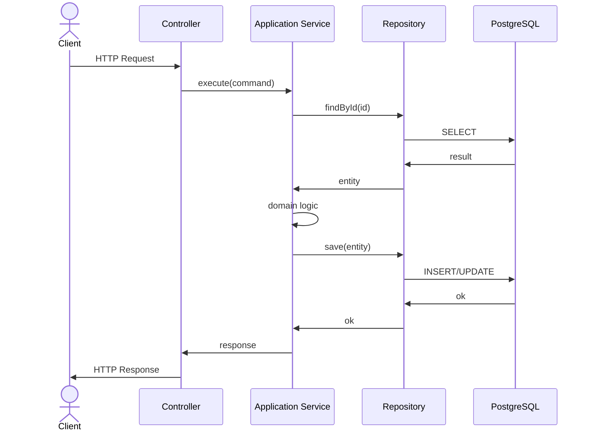
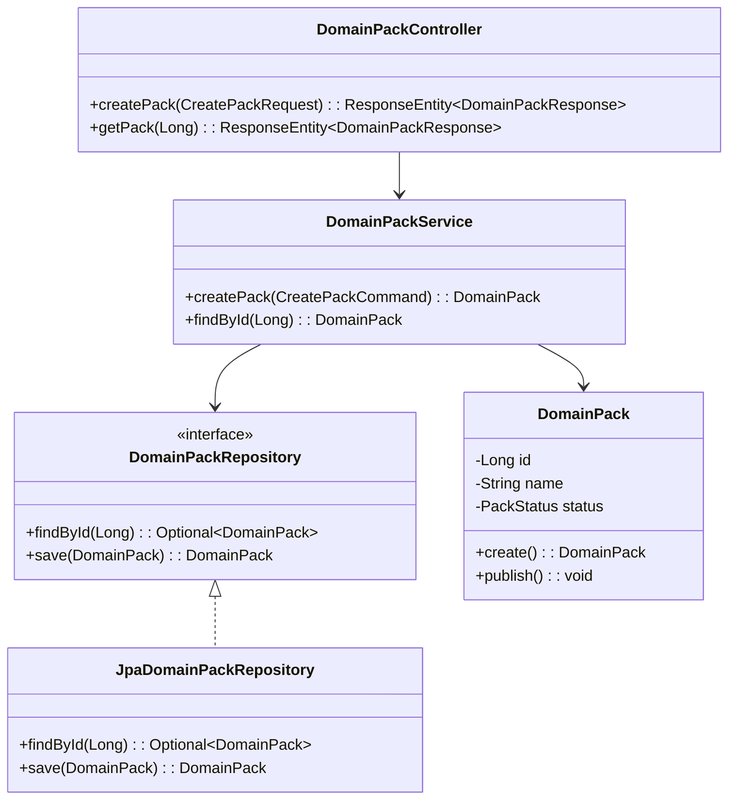

# Backend DDD Spec Template

> 이 템플릿은 Spring Boot 백엔드 기능을 설계할 때 사용한다. 
> 참고: GraphQL → REST, MongoDB → PostgreSQL로 변환됨

---

## Goal

이 기능의 목적과 해결하려는 문제를 한 문장으로 정의한다.

**예시**: Domain Pack을 버전 단위로 생성하고 조회하는 API를 제공한다.

---

## Sequence Diagram



---

## REST API

### Endpoint

| Method | Path | Description |
|--------|------|-------------|
| POST | /api/v1/{resource} | 리소스 생성 |
| GET | /api/v1/{resource}/{id} | 단건 조회 |
| GET | /api/v1/{resource} | 목록 조회 |
| PUT | /api/v1/{resource}/{id} | 전체 수정 |
| PATCH | /api/v1/{resource}/{id} | 부분 수정 |
| DELETE | /api/v1/{resource}/{id} | 삭제 |

### Request

**POST /api/v1/domain-packs**

```json
{
  "workspaceId": 1,
  "name": "CS Support Pack",
  "description": "고객 지원용 도메인 팩"
}
```

### Response

**200 OK**

```json
{
  "id": 123,
  "workspaceId": 1,
  "name": "CS Support Pack",
  "description": "고객 지원용 도메인 팩",
  "status": "DRAFT",
  "createdAt": "2025-04-03T10:00:00Z"
}
```

**400 Bad Request**

```json
{
  "error": "VALIDATION_ERROR",
  "message": "name is required",
  "field": "name"
}
```

**404 Not Found**

```json
{
  "error": "NOT_FOUND",
  "message": "Workspace not found: 999"
}
```

**500 Internal Server Error**

```json
{
  "error": "INTERNAL_ERROR",
  "message": "Unexpected error occurred"
}
```

---

## Class Design

### DDD Layered Structure



### Aggregate Design

```java
// Aggregate Root
@Entity
@Table(name = "domain_pack", schema = "pack")
public class DomainPack {
    @Id
    @GeneratedValue(strategy = GenerationType.IDENTITY)
    private Long id;
    
    @Column(name = "workspace_id", nullable = false)
    private Long workspaceId;
    
    @Embedded
    private PackName name;
    
    @Enumerated(EnumType.STRING)
    private PackStatus status;
    
    @Embedded
    private AuditInfo auditInfo;
    
    // Domain methods
    public static DomainPack create(CreatePackCommand command) {
        // factory method
    }
    
    public void publish() {
        // state transition
    }
}
```

### Value Object

```java
@Embeddable
public class PackName {
    private static final int MAX_LENGTH = 255;
    
    @Column(name = "name", nullable = false, length = MAX_LENGTH)
    private String value;
    
    private PackName(String value) {
        validate(value);
        this.value = value;
    }
    
    public static PackName of(String value) {
        return new PackName(value);
    }
    
    private void validate(String value) {
        if (StringUtils.isBlank(value)) {
            throw new IllegalArgumentException("Name cannot be blank");
        }
        if (value.length() > MAX_LENGTH) {
            throw new IllegalArgumentException("Name too long");
        }
    }
}
```

---

## Tests

### Unit Tests

```java
@DisplayName("DomainPack")
class DomainPackTest {
    
    @Test
    @DisplayName("should be created with valid command")
    void create_withValidCommand_returnsDomainPack() {
        // given
        var command = new CreatePackCommand(1L, "Test Pack", "Description");
        
        // when
        var pack = DomainPack.create(command);
        
        // then
        assertThat(pack.getStatus()).isEqualTo(PackStatus.DRAFT);
        assertThat(pack.getName().getValue()).isEqualTo("Test Pack");
    }
    
    @Test
    @DisplayName("should throw when name is blank")
    void create_withBlankName_throwsException() {
        // given
        var command = new CreatePackCommand(1L, "", "Description");
        
        // then
        assertThatThrownBy(() -> DomainPack.create(command))
            .isInstanceOf(IllegalArgumentException.class)
            .hasMessageContaining("blank");
    }
}
```

### Integration Tests

```java
@SpringBootTest
@AutoConfigureMockMvc
@DisplayName("DomainPackController")
class DomainPackControllerTest {
    
    @Autowired
    private MockMvc mockMvc;
    
    @Autowired
    private ObjectMapper objectMapper;
    
    @Test
    @DisplayName("POST /api/v1/domain-packs creates new pack")
    void createPack_returnsCreated() throws Exception {
        // given
        var request = new CreatePackRequest(1L, "Test Pack", "Description");
        
        // when & then
        mockMvc.perform(post("/api/v1/domain-packs")
                .contentType(MediaType.APPLICATION_JSON)
                .content(objectMapper.writeValueAsString(request)))
            .andExpect(status().isCreated())
            .andExpect(jsonPath("$.id").isNumber())
            .andExpect(jsonPath("$.name").value("Test Pack"));
    }
}
```

### Test Checklist

- [ ] 정상 시나리오: 유효 입력 시 기대 응답 검증
- [ ] 멱등성: 동일 입력 반복 호출 시 응답 일관성 검증
- [ ] 유효성 오류: 필수 필드 누락/형식 오류 시 에러 검증
- [ ] 권한/인증 오류: 인증 불가 상태에서의 에러 검증
- [ ] 경계값: 최소/최대 입력 크기에서의 동작 검증
- [ ] 동시성: 동시 수정 시 데이터 정합성 검증
- [ ] 트랜잭션: 롤백 시 데이터 일관성 검증

---

## Database

### Migration (Flyway)

**V1__create_domain_pack.sql**

```sql
CREATE TABLE IF NOT EXISTS pack.domain_pack (
    id                  BIGSERIAL PRIMARY KEY,
    workspace_id        BIGINT NOT NULL REFERENCES app.workspace(id),
    pack_key            VARCHAR(100) NOT NULL,
    name                VARCHAR(255) NOT NULL,
    description         TEXT,
    status              VARCHAR(50) NOT NULL DEFAULT 'DRAFT',
    created_by          BIGINT REFERENCES app.app_user(id),
    created_at          TIMESTAMPTZ NOT NULL DEFAULT NOW(),
    updated_at          TIMESTAMPTZ NOT NULL DEFAULT NOW(),
    UNIQUE (workspace_id, pack_key)
);

CREATE INDEX idx_domain_pack_workspace_status
    ON pack.domain_pack(workspace_id, status);
```

---

## Additional Notes

- DDD 원칙을 준수하여 domain layer에 비즈니스 로직을 집중시킨다
- Application layer는 유스케이스 오케스트레이션만 담당한다
- Infrastructure layer는 JPA, 외부 API 호출 등 기술적 세부사항을 담당한다
- Presentation layer는 DTO 변환과 HTTP 프로토콜 처리만 담당한다
