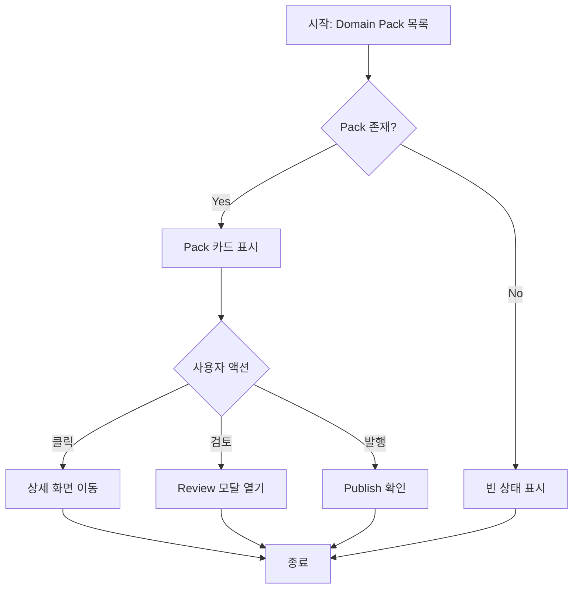

# Frontend FSD Spec Template

> 이 템플릿은 Vite+ 기반 프론트엔드 기능을 설계할 때 사용한다.
> FSD (Feature-Sliced Design) 아키텍처를 따른다.

---

## Goal

이 기능의 목적과 해결하려는 문제를 한 문장으로 정의한다.

**예시**: Domain Pack 목록을 표시하고 검토 상태를 시각화하는 화면을 구현한다.

---

## User Flow Chart



> Gate ON/OFF 분기가 있으면 서브그래프로 분리하여 표기

---

## Design Diff

### As-is vs To-be

| 영역 | As-is | To-be | 변경 내용 |
|------|-------|-------|----------|
| 데이터 로딩 | 페이지 로드 시 전체 로딩 | 무한 스크롤 | UX 개선 |
| 필터 | 서버 사이드 | 클라이언트 사이드 | 응답 속도 개선 |
| 상태 표시 | 텍스트만 | Badge 컴포넌트 | 가독성 향상 |

---

## Component Tree

```
DomainPackListPage
├─ DomainPackListHeader
│    ├─ SearchInput
│    └─ FilterDropdown
├─ DomainPackGrid
│    ├─ DomainPackCard
│    │    ├─ PackStatusBadge
│    │    ├─ PackInfo
│    │    └─ PackActions
│    │         ├─ ViewButton
│    │         ├─ ReviewButton
│    │         └─ PublishButton
│    └─ InfiniteScrollLoader
└─ EmptyState
     ├─ Illustration
     └─ CreatePackButton
```

---

## API Integration

### Endpoints

| Method | Path | Description |
|--------|------|-------------|
| GET | /api/v1/domain-packs | Pack 목록 조회 |
| GET | /api/v1/domain-packs/:id | Pack 상세 조회 |
| POST | /api/v1/domain-packs/:id/publish | Pack 발행 |

### Query Key Pattern

```typescript
// entities/domain-pack/api.ts
export const domainPackKeys = {
  all: ['domain-packs'] as const,
  lists: () => [...domainPackKeys.all, 'list'] as const,
  list: (filters: Filters) => [...domainPackKeys.lists(), filters] as const,
  details: () => [...domainPackKeys.all, 'detail'] as const,
  detail: (id: string) => [...domainPackKeys.details(), id] as const,
};

// features/domain-pack-list/api/useDomainPacks.ts
export function useDomainPacks(filters: Filters) {
  return useQuery({
    queryKey: domainPackKeys.list(filters),
    queryFn: () => fetchDomainPacks(filters),
  });
}
```

---

## Data Flow

```
┌─────────────────────────────────────────────────────────┐
│                     UI Layer                            │
│  ┌─────────────────────────────────────────────────┐   │
│  │ DomainPackCard                                  │   │
│  │  props: { pack: DomainPack }                    │   │
│  └─────────────────────────────────────────────────┘   │
└─────────────────────────────────────────────────────────┘
                           │
                           ▼
┌─────────────────────────────────────────────────────────┐
│                   Feature Layer                         │
│  ┌─────────────────────────────────────────────────┐   │
│  │ usePublishPack()                                │   │
│  │  - mutation                                     │   │
│  │  - invalidate cache                             │   │
│  │  - error handling                               │   │
│  └─────────────────────────────────────────────────┘   │
└─────────────────────────────────────────────────────────┘
                           │
                           ▼
┌─────────────────────────────────────────────────────────┐
│                   Entity Layer                          │
│  ┌─────────────────────────────────────────────────┐   │
│  │ DomainPack type, validation                     │   │
│  └─────────────────────────────────────────────────┘   │
└─────────────────────────────────────────────────────────┘
                           │
                           ▼
┌─────────────────────────────────────────────────────────┐
│                   Shared Layer                          │
│  ┌─────────────────────────────────────────────────┐   │
│  │ api client, tanstack query config               │   │
│  └─────────────────────────────────────────────────┘   │
└─────────────────────────────────────────────────────────┘
```

---

## 수정 대상 파일

| 파일 | 변경 유형 | 설명 |
|------|----------|------|
| `src/entities/domain-pack/model/types.ts` | new | DomainPack 타입 정의 |
| `src/entities/domain-pack/api/index.ts` | new | API 함수 및 query keys |
| `src/features/domain-pack-list/ui/index.tsx` | new | 목록 컴포넌트 |
| `src/features/publish-pack/model/index.ts` | new | 발행 mutation |
| `src/pages/domain-packs/ui/index.tsx` | new | 페이지 컴포넌트 |

---

## State Management

### Server State (TanStack Query)

```typescript
// entities/domain-pack/api/index.ts
export interface DomainPack {
  id: string;
  name: string;
  description: string;
  status: 'DRAFT' | 'IN_REVIEW' | 'PUBLISHED';
  createdAt: string;
  updatedAt: string;
}

export async function fetchDomainPacks(
  filters: DomainPackFilters
): Promise<DomainPack[]> {
  const response = await api.get('/api/v1/domain-packs', {
    params: filters,
  });
  return response.data;
}
```

### Client State (Zustand or Local State)

```typescript
// features/domain-pack-list/model/filters.ts
import { create } from 'zustand';

interface FiltersState {
  search: string;
  status: string | null;
  setSearch: (search: string) => void;
  setStatus: (status: string | null) => void;
  reset: () => void;
}

export const useFiltersStore = create<FiltersState>((set) => ({
  search: '',
  status: null,
  setSearch: (search) => set({ search }),
  setStatus: (status) => set({ status }),
  reset: () => set({ search: '', status: null }),
}));
```

---

## Tests

### Test Strategy

| 구분 | 방법 | 도구 | 비고 |
|------|------|------|------|
| 수동 테스트 | 브라우저 직접 확인 | Chrome DevTools | 주요 플로우 |
| 컴포넌트 테스트 | Storybook | `pnpm storybook` | UI 확인 |
| 통합 테스트 | Vitest | `pnpm test` | API mocking |
| E2E 테스트 | Playwright | `pnpm test:e2e` | 핵심 시나리오 |

### Test Environment & 사전 조건

| 항목 | 값 |
|------|---|
| 환경 | `pnpm dev` |
| API Mock | MSW (Mock Service Worker) |
| 사전 조건 | Domain Pack 데이터 3개 이상 존재 |

### Test Scenarios

#### Happy Path

| # | 시나리오 | 사전 조건 | 조작 | 기대 결과 | Figma |
|---|---------|---------|------|----------|-------|
| 1 | Pack 목록 조회 | 10개 Pack 존재 | 페이지 진입 | 10개 카드 표시 | [링크] |
| 2 | Pack 검색 | "CS" 포함 Pack 3개 | "CS" 입력 | 3개 필터링 표시 | [링크] |
| 3 | Pack 발행 | DRAFT 상태 Pack 1개 | 발행 버튼 클릭 | 성공 토스트, 상태 변경 | [링크] |

#### Error & Edge Cases

| # | 시나리오 | 조작 | 기대 결과 |
|---|---------|------|----------|
| 1 | 네트워크 오류 | WiFi 끊기 | 에러 토스트 표시 |
| 2 | 빈 검색 결과 | "xyz123" 입력 | 빈 상태 화면 표시 |
| 3 | 발행 권한 없음 | 발행 버튼 클릭 | 권한 에러 모달 |
| 4 | 이미 발행된 Pack | 발행 버튼 클릭 | 버튼 disabled |

#### 반응형 & 접근성

| # | 확인 항목 | 기대 결과 |
|---|---------|----------|
| 1 | 모바일 뷰포트 (375px) | 그리드 1열, 터치 타겟 44px 이상 |
| 2 | 태블릿 (768px) | 그리드 2열 |
| 3 | 데스크톱 (1440px) | 그리드 3열 |
| 4 | 키보드 탐색 | Tab 이동 + Enter 동작 |
| 5 | 스크린 리더 | aria-label 읽힘 |
| 6 | 다크 모드 | 색상 대비 4.5:1 이상 |

---

## Implementation Example

```typescript
// features/domain-pack-list/ui/DomainPackCard.tsx
import { DomainPack } from '@/entities/domain-pack';
import { PackStatusBadge } from '@/entities/domain-pack/ui/PackStatusBadge';
import { Card, Button } from '@/shared/ui';

interface DomainPackCardProps {
  pack: DomainPack;
  onPublish: (id: string) => void;
}

export function DomainPackCard({ pack, onPublish }: DomainPackCardProps) {
  return (
    <Card className="domain-pack-card">
      <Card.Header>
        <h3>{pack.name}</h3>
        <PackStatusBadge status={pack.status} />
      </Card.Header>
      <Card.Body>
        <p>{pack.description}</p>
      </Card.Body>
      <Card.Footer>
        <Button 
          variant="primary" 
          disabled={pack.status === 'PUBLISHED'}
          onClick={() => onPublish(pack.id)}
        >
          {pack.status === 'PUBLISHED' ? 'Published' : 'Publish'}
        </Button>
      </Card.Footer>
    </Card>
  );
}
```

---

## Performance Considerations

- 목록은 가상 스크롤(Virtual Scroll) 적용 고려
- 이미지는 lazy loading 적용
- API 응답은 TanStack Query 캐싱 활용
- 대용량 데이터는 pagination 적용
