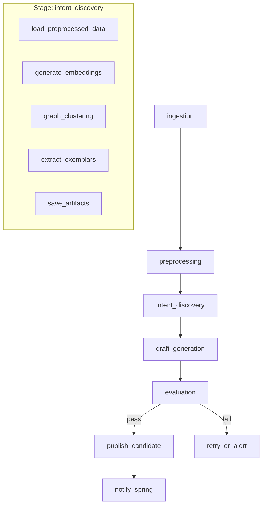

# ML Pipeline Spec Template

> 이 템플릿은 Airflow + Python 기반 ML 파이프라인 스테이지를 설계할 때 사용한다.
> DAG 기반 Task Orchestration, Artifact-driven Processing 패턴을 따른다.

---

## Goal

이 파이프라인 스테이지의 목적과 해결하려는 문제를 한 문장으로 정의한다.

**예시**: 상담 로그에서 의도(intent)를 클러스터링하고 draft domain pack을 생성한다.

---

## DAG Diagram



---

## Stage Interface

### Input

| 필드 | 타입 | 설명 | 예시 |
|------|------|------|------|
| input_dataset_path | str | 전처리된 데이터 경로 | "s3://bucket/preprocessed/v1/" |
| config | PipelineConfig | 파이프라인 설정 | embedding_model, cluster_params |
| previous_stage_artifacts | dict | 이전 스테이지 산출물 | {"canonical_texts": [...]} |

### Output

| 필드 | 타입 | 설명 | 예시 |
|------|------|------|------|
| output_artifact_uri | str | 산출물 저장 경로 | "s3://bucket/intents/v1/" |
| clusters | list[Cluster] | 클러스터 결과 | [{"id": 1, "size": 50, ...}] |
| exemplars | list[Exemplar] | 대표 예시 | [{"text": "...", "cluster_id": 1}] |
| metrics | dict | 스테이지 메트릭 | {"total_conversations": 1000} |
| next_stage_input | dict | 다음 스테이지 입력 | {"clusters_path": "..."} |

### Configuration

```python
from dataclasses import dataclass
from typing import Optional

@dataclass
class IntentDiscoveryConfig:
    """Intent Discovery 스테이지 설정"""
    embedding_model: str = "sentence-transformers/all-MiniLM-L6-v2"
    embedding_batch_size: int = 32
    min_cluster_size: int = 10
    min_samples: int = 5
    metric: str = "cosine"
    cluster_selection_method: str = "eom"
    
    # 평가 임계값
    min_silhouette_score: float = 0.3
    max_outlier_ratio: float = 0.2
```

---

## Stage Implementation

### 함수 시그니처

```python
from typing import Dict, Any
from dataclasses import dataclass

@dataclass
class StageInput:
    dataset_path: str
    config: IntentDiscoveryConfig
    workspace_id: int
    job_id: int

@dataclass
class StageOutput:
    artifact_uri: str
    metrics: Dict[str, Any]
    next_stage_input: Dict[str, Any]
    status: str  # "success" | "partial" | "failed"

def run_intent_discovery(
    input_data: StageInput,
    context: PipelineContext
) -> StageOutput:
    """
    상담 로그에서 의도를 클러스터링한다.
    
    Args:
        input_data: 스테이지 입력 데이터
        context: Airflow 컨텍스트 (task_instance, dag_run 등)
    
    Returns:
        StageOutput: 산출물 경로, 메트릭, 다음 스테이지 입력
    
    Raises:
        StageError: 처리 중 오류 발생 시
    """
    # 1. 데이터 로드
    conversations = load_conversations(input_data.dataset_path)
    
    # 2. 임베딩 생성
    embeddings = generate_embeddings(
        texts=[c.canonical_text for c in conversations],
        model=input_data.config.embedding_model,
        batch_size=input_data.config.embedding_batch_size
    )
    
    # 3. 클러스터링
    clusters = cluster_embeddings(
        embeddings=embeddings,
        min_cluster_size=input_data.config.min_cluster_size,
        min_samples=input_data.config.min_samples,
        metric=input_data.config.metric
    )
    
    # 4. 결과 저장
    artifact_uri = save_artifacts(
        clusters=clusters,
        workspace_id=input_data.workspace_id,
        job_id=input_data.job_id
    )
    
    # 5. 메트릭 계산
    metrics = calculate_metrics(clusters, conversations)
    
    return StageOutput(
        artifact_uri=artifact_uri,
        metrics=metrics,
        next_stage_input={"clusters_path": artifact_uri},
        status="success" if metrics["silhouette_score"] > 0.3 else "partial"
    )
```

### DAG Task 정의

```python
from airflow import DAG
from airflow.operators.python import PythonOperator
from datetime import datetime, timedelta

def create_intent_discovery_task(dag: DAG) -> PythonOperator:
    """
    Intent Discovery 태스크를 생성한다.
    
    Args:
        dag: 부모 DAG 객체
    
    Returns:
        PythonOperator: Airflow 태스크
    """
    def execute(**context):
        from ml.src.stages.intent_discovery import run_intent_discovery
        from ml.src.models.config import IntentDiscoveryConfig
        
        # XCom에서 이전 스테이지 결과 가져오기
        ti = context["task_instance"]
        preprocessing_output = ti.xcom_pull(task_ids="preprocessing")
        
        # 설정 로드
        config = IntentDiscoveryConfig(
            embedding_model=context["dag_run"].conf.get("embedding_model", "all-MiniLM-L6-v2")
        )
        
        # 입력 준비
        input_data = StageInput(
            dataset_path=preprocessing_output["artifact_uri"],
            config=config,
            workspace_id=context["dag_run"].conf["workspace_id"],
            job_id=context["dag_run"].conf["job_id"]
        )
        
        # 실행
        output = run_intent_discovery(input_data, context)
        
        # 결과를 XCom에 저장
        return {
            "artifact_uri": output.artifact_uri,
            "metrics": output.metrics,
            "next_stage_input": output.next_stage_input,
            "status": output.status
        }
    
    return PythonOperator(
        task_id="intent_discovery",
        python_callable=execute,
        dag=dag,
        retries=2,
        retry_delay=timedelta(minutes=5)
    )
```

---

## Metrics

### Stage-level Metrics

| 메트릭 | 단위 | 설명 | 기대값 |
|--------|------|------|--------|
| processing_time | seconds | 처리 시간 | < 300s |
| conversations_processed | count | 처리 대화 수 | > 0 |
| clusters_found | count | 발견된 클러스터 수 | 5-50 |
| avg_cluster_size | count | 평균 클러스터 크기 | > 10 |
| silhouette_score | 0-1 | 클러스터 품질 | > 0.3 |
| outlier_ratio | 0-1 | 이상치 비율 | < 0.2 |
| embedding_time | seconds | 임베딩 생성 시간 | < 60s |
| clustering_time | seconds | 클러스터링 시간 | < 30s |

### Pipeline-level Metrics

```python
@dataclass
class PipelineMetrics:
    """파이프라인 전체 메트릭"""
    total_stages: int
    completed_stages: int
    failed_stages: int
    total_processing_time: float
    artifact_size_bytes: int
    
    # 품질 메트릭
    mapping_rate: float  # 대화 -> 클러스터 매핑률
    outlier_rate: float  # 클러스터에 속하지 않는 대화 비율
    workflow_separability: float  # 워크플로우 구분 가능성
```

---

## Artifact Schema

### Output Structure

```
s3://bucket/workspace_{id}/job_{id}/
├── intent_discovery/
│   ├── metadata.json          # 스테이지 메타정보
│   ├── clusters.json          # 클러스터 결과
│   ├── exemplars.json         # 대표 예시
│   ├── embeddings/
│   │   └── embeddings.npy     # 임베딩 벡터
│   └── visualizations/
│       └── cluster_plot.png   # 클러스터 시각화
```

### Artifact Files

**metadata.json**

```json
{
  "stage": "intent_discovery",
  "version": "1.0.0",
  "created_at": "2025-04-03T10:00:00Z",
  "workspace_id": 123,
  "job_id": 456,
  "config": {
    "embedding_model": "sentence-transformers/all-MiniLM-L6-v2",
    "min_cluster_size": 10
  },
  "metrics": {
    "processing_time": 245.5,
    "conversations_processed": 1250,
    "clusters_found": 15
  }
}
```

**clusters.json**

```json
{
  "clusters": [
    {
      "id": 1,
      "label": "cluster_1",
      "size": 87,
      "exemplar_indices": [12, 45, 67],
      "avg_confidence": 0.85,
      "suggested_name": "배송 조회"
    }
  ],
  "outliers": [
    {
      "index": 123,
      "text": "...",
      "reason": "low_confidence"
    }
  ]
}
```

---

## Tests

### Unit Tests

```python
import pytest
from unittest.mock import Mock, patch
from ml.src.stages.intent_discovery import run_intent_discovery

class TestIntentDiscovery:
    """Intent Discovery 스테이지 단위 테스트"""
    
    def test_run_with_valid_input_returns_clusters(self):
        # given
        input_data = StageInput(
            dataset_path="test_data/",
            config=IntentDiscoveryConfig(min_cluster_size=5),
            workspace_id=1,
            job_id=1
        )
        context = Mock()
        
        with patch("ml.src.stages.intent_discovery.load_conversations") as mock_load:
            mock_load.return_value = [
                Mock(canonical_text="배송 언제 와요?"),
                Mock(canonical_text="주문 취소하고 싶어요")
            ]
            
            # when
            output = run_intent_discovery(input_data, context)
            
            # then
            assert output.status == "success"
            assert "artifact_uri" in output.metrics
    
    def test_run_with_empty_data_returns_failed(self):
        # given
        input_data = StageInput(
            dataset_path="empty_data/",
            config=IntentDiscoveryConfig(),
            workspace_id=1,
            job_id=1
        )
        context = Mock()
        
        with patch("ml.src.stages.intent_discovery.load_conversations") as mock_load:
            mock_load.return_value = []
            
            # when & then
            with pytest.raises(StageError, match="empty"):
                run_intent_discovery(input_data, context)
```

### Integration Tests

```python
@pytest.mark.integration
class TestIntentDiscoveryIntegration:
    """Intent Discovery 통합 테스트"""
    
    def test_end_to_end_pipeline_execution(self, test_dag):
        # given
        dag = test_dag
        task = create_intent_discovery_task(dag)
        
        # when
        result = task.execute(context={
            "dag_run": Mock(conf={
                "workspace_id": 1,
                "job_id": 1,
                "embedding_model": "all-MiniLM-L6-v2"
            })
        })
        
        # then
        assert result["status"] == "success"
        assert result["metrics"]["clusters_found"] > 0
```

### Test Checklist

- [ ] 정상 시나리오: 유효 입력 시 기대 산출물 생성
- [ ] 빈 데이터: 빈 데이터셋 처리
- [ ] 설정 검증: 잘못된 설정 시 적절한 에러
- [ ] 재시도: 일시적 오류 시 재시도 동작
- [ ] 메모리: 대용량 데이터 처리 시 메모리 효율
- [ ] 재현성: 동일 입력 시 동일 결과

---

## Error Handling

### Error Categories

| 에러 타입 | 설명 | 처리 전략 |
|----------|------|----------|
| ValidationError | 입력 검증 실패 | 즉시 실패, 상세 메시지 |
| DataError | 데이터 품질 문제 | 로그 기록, 부분 성공 |
| ResourceError | 리소스 부족 | 재시도, 알림 |
| TimeoutError | 처리 시간 초과 | 재시도, 타임아웃 조정 |
| UnknownError | 예상치 못한 오류 | 재시도, 알림 |

### Error Schema

```python
@dataclass
class StageError:
    error_type: str
    message: str
    details: Dict[str, Any]
    recoverable: bool
    suggested_action: str
```

---

## Monitoring

### Logging

```python
import structlog

logger = structlog.get_logger()

def run_intent_discovery(input_data: StageInput, context: PipelineContext):
    logger.info(
        "stage_started",
        stage="intent_discovery",
        job_id=input_data.job_id,
        input_count=len(input_data.conversations)
    )
    
    try:
        # ... processing ...
        logger.info(
            "stage_completed",
            stage="intent_discovery",
            duration_seconds=elapsed,
            output_metrics=metrics
        )
    except Exception as e:
        logger.error(
            "stage_failed",
            stage="intent_discovery",
            error=str(e),
            error_type=type(e).__name__
        )
        raise
```

### Metrics Export

```python
from prometheus_client import Counter, Histogram

stage_duration = Histogram(
    'pipeline_stage_duration_seconds',
    'Stage processing time',
    ['stage_name', 'status']
)

stage_conversations = Counter(
    'pipeline_stage_conversations_total',
    'Conversations processed',
    ['stage_name']
)
```

---

## Dependencies

```toml
# pyproject.toml
[project]
dependencies = [
    "apache-airflow>=2.10.0",
    "sentence-transformers>=2.2.0",
    "hdbscan>=0.8.33",
    "numpy>=1.24.0",
    "pandas>=2.0.0",
    "scikit-learn>=1.3.0",
    "psycopg2-binary>=2.9.0",
    "boto3>=1.28.0",
    "structlog>=23.0.0",
]

[project.optional-dependencies]
dev = [
    "pytest>=7.4.0",
    "pytest-mock>=3.11.0",
    "black>=23.7.0",
    "ruff>=0.0.280",
]
```
