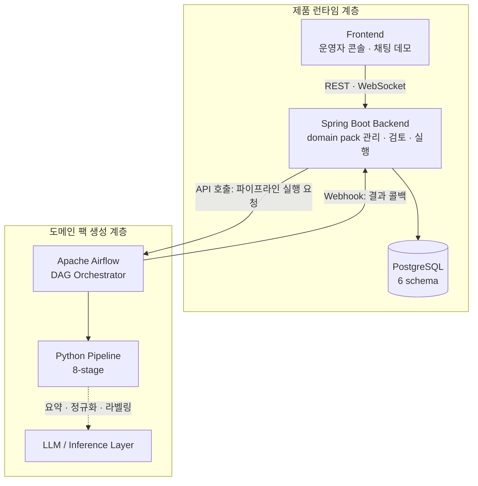
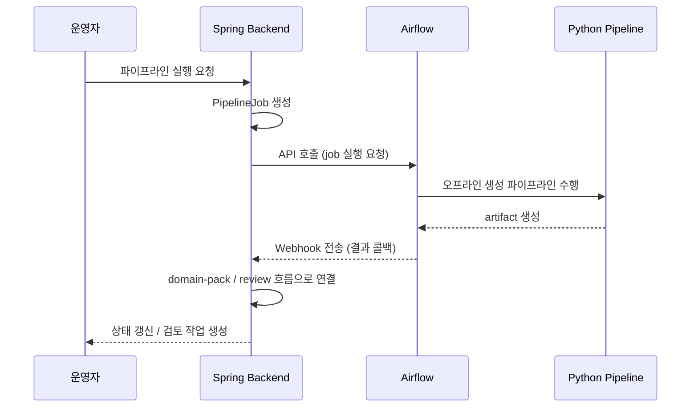
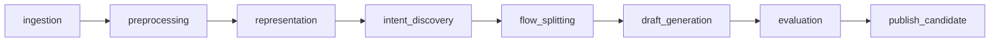

<div align="center">

# 상담 로그 기반 CS 워크플로우 생성 시스템

**상담 로그에서 운영 지식을 추출해 실행 가능한 Domain Pack으로 전환하는 고객지원 운영 워크스페이스**

[](https://sonarcloud.io/summary/new_code?id=ajou-2026-1-capstone-5_ostone_backend)
[](https://sonarcloud.io/summary/new_code?id=ajou-2026-1-capstone-5_ostone_frontend)
[](https://sonarcloud.io/summary/new_code?id=ajou-2026-1-capstone-5_ostone_ml)
[](LICENSE)

아주대학교 26학년도 1학기 'SW캡스톤프로젝트' 5조

<!-- 스크린샷: 운영자 콘솔 메인 화면 (추후 첨부) — Domain Pack 목록, 파이프라인 실행 상태, 검토 대기 큐가 한눈에 보이는 대시보드 -->

</div>

---

## 목차

- [서비스 개요](#서비스-개요)
- [핵심 기능](#핵심-기능)
- [데모 / 사용 흐름](#데모--사용-흐름)
- [시스템 아키텍처](#시스템-아키텍처)
- [기술 구현 하이라이트](#기술-구현-하이라이트)
- [기술 스택](#기술-스택)
- [Repository 구조](#repository-구조)
- [시작하기 (로컬 개발환경)](#시작하기-로컬-개발환경)
- [DevSecOps / CI·CD / 배포](#devsecops--cicd--배포)
- [개발 워크플로우 / 기여 규칙](#개발-워크플로우--기여-규칙)
- [팀원](#팀원)
- [라이선스](#라이선스)

---

## 서비스 개요

이 프로젝트의 핵심은 **고객응대 챗봇 자체를 만드는 것이 아니다.** 기존 상담 로그로부터 고객지원 도메인의 운영 지식을 추출해, 챗봇이 따라야 할 정책과 처리 흐름을 자동으로 만들어 내는 시스템이다.

즉, 실시간으로 답변을 잘하는 챗봇보다 **챗봇이 따라야 할 정책과 처리 흐름을 자동으로 만드는 시스템**에 가깝다. 상담 로그에서 추출한 운영 지식은 다음 5종 산출물을 묶은 **Domain Pack** 단위로 관리한다.

- **intent** — 고객 요청의 의도 분류
- **slot** — 요청 처리에 필요한 정보 항목
- **policy** — 응대 시 지켜야 할 정책/규칙
- **risk** — 주의가 필요한 위험 신호
- **workflow** — 상태 기반 graph로 표현된 처리 흐름

### 기존 방식 대비 차별점

- 단순 controller-service-repository 구조로는 domain pack·review·runtime·pipeline 경계가 섞이기 쉽다. 이 시스템은 **제품 런타임 계층**과 **도메인 팩 생성 계층**의 책임을 명확히 분리한다.
- AI가 생성한 초안을 바로 운영에 쓰지 않고, **사람 검토 루프(human-in-the-loop)**를 거쳐 확정한다.
- workflow를 발화 트리가 아니라 **상태 기반 graph**로 모델링한다.
- intent discovery는 semantic similarity뿐 아니라 **workflow equivalence**까지 고려한다.

> 차별점 서술은 [`.agent/docs/architecture.md`](.agent/docs/architecture.md) 2장을 근거로 한다.

### 타깃 사용자

고객지원 **운영자**. 운영자는 콘솔에서 Domain Pack을 조회·검토·승인하고, 생성 파이프라인을 실행하며, 채팅 데모로 동작을 확인한다.

### 범위 밖 (Non-goals)

- 실시간 고객 응대 챗봇 서비스 제공이 목표가 아니다.
- 채팅 데모(`chat-demo`)는 답변 생성기가 아니라 workflow runtime 동작을 **시각화하는 시연용 접점**이다.
- MSA가 아니라 단일 배포 단위의 **모듈형 모놀리스**를 채택한다.

---

## 핵심 기능

각 기능의 상세 요구사항·설계는 `.agent/specs/`의 SDD 스펙 문서로 관리한다. 아래는 기능별 대표 스펙이며, 전체 목록은 [`.agent/specs/`](.agent/specs/)를 참조한다.

### 1. 상담 로그 수집·구조화

원본 상담 로그(ZIP)를 업로드하면 객체 스토리지에 적재하고 conversation / turn 단위로 구조화·검증한다.

<!-- 스크린샷: 상담 로그 업로드 화면 (추후 첨부) — ZIP 업로드, 적재 진행 상태, 구조화 결과 요약 -->

> 스펙: [원본 로그 업로드 API](.agent/specs/121.md) · [Conversation/Turn 구조화](.agent/specs/122.md) · [ZIP-only 업로드 정책](.agent/specs/421.md)

### 2. Domain Pack 생성 파이프라인 (Intent Discovery)

업로드된 로그를 8단계 오프라인 파이프라인으로 처리해 intent를 발견하고 workflow graph 초안까지 생성한다. 완료 시 결과를 Spring Backend로 콜백한다.

<!-- 스크린샷: 파이프라인 실행 화면 (추후 첨부) — job 실행 요청, 단계별 진행 상태, 평가 리포트 -->

> 스펙: [Intent Discovery / Workflow Entry Point](.agent/specs/2-1-1.md) · [Workflow Graph 생성](.agent/specs/002218.md) · [publish_candidate → Backend 콜백](.agent/specs/218.md)

### 3. AI 초안 검토·승인 (Human-in-the-loop)

파이프라인이 만든 intent / slot / policy / risk / workflow 초안을 운영자가 콘솔에서 조회·수정·승인·반려하고, 승인된 Domain Pack을 활성화한다.

<!-- 스크린샷: AI 초안 검토 화면 (추후 첨부) — 초안 목록/상세, 수정·승인·반려 액션, 코멘트 이력 -->

> 스펙: [Domain Pack DRAFT 생성](.agent/specs/213.md) · [Intent 초안 화면](.agent/specs/214.md) · [Intent 승인/반려 API](.agent/specs/313.md) · [Domain Pack 활성화](.agent/specs/332.md)

### 4. 상태 기반 Workflow Runtime (LLM Tool calling)

활성화된 Domain Pack을 읽어 현재 대화 상태를 해석하고 다음 action을 결정하는 정책 기반 runtime 엔진. 외부 LLM이 호출하는 conversation state / slot / decision-log tool API를 제공한다.

<!-- 스크린샷: 워크플로우 그래프 뷰어 (추후 첨부) — 상태 노드/전이 edge, 현재 상태 하이라이트 -->

> 스펙: [Policy-Aware Runtime Engine & Tool API](.agent/specs/524.md) · [Workflow-Aware LLM Assistant](.agent/specs/5.2.6.md) · [Conversation State Tool](.agent/specs/522.md)

### 5. 채팅 데모 / 워크플로우 시각화

고객 발화에 따라 workflow가 상태를 전이하는 모습을 시연하는 접점. 채팅 타임라인과 workflow graph를 양방향으로 연결해 메시지별 매핑을 보여준다.

<!-- 스크린샷: 채팅 데모 화면 (추후 첨부) — 대화 타임라인, 메시지-그래프 양방향 강조, slot/policy/risk 추출 상태 -->

> 스펙: [채팅 타임라인·워크플로우 매핑](.agent/specs/4.1.7.md) · [워크플로우 그래프 뷰어](.agent/specs/4.1.8.md) · [메시지-그래프 양방향 강조](.agent/specs/4.1.10.md)

### 6. 실시간 상담사 콘솔

WebSocket(STOMP) 기반 실시간 상담 채널. 상담 대기열, 상담사 배정/해제, AI handoff(자동응답 ↔ 상담사 개입) 전환, 세션 관리·지표를 제공한다.

<!-- 스크린샷: 실시간 상담사 콘솔 (추후 첨부) — 대기열·필터, 배정/해제, 상담사 채팅, AI handoff 상태 -->

> 스펙: [STOMP WebSocket 채팅 인프라](.agent/specs/5.3.2.md) · [상담사 개입 기능](.agent/specs/5.3.4.md) · [AI handoff ↔ 대기열 연결](.agent/specs/356.md) · [상담사 대기열 실시간화](.agent/specs/298.md)

---

## 데모 / 사용 흐름

### 기능별 화면

<!-- 스크린샷: 운영자 콘솔 (추후 첨부) — Domain Pack 목록/상세, intent·slot·policy·risk·workflow 버전 확인 -->
<!-- 스크린샷: AI 초안 검토 화면 (추후 첨부) — review 작업 큐, 수정·승인·반려 액션, 코멘트 이력 -->
<!-- 스크린샷: 파이프라인 실행 화면 (추후 첨부) — pipeline job 실행 요청, 단계별 진행 상태, 평가 리포트 -->
<!-- 스크린샷: 채팅 데모 화면 (추후 첨부) — 상태 기반 workflow가 대화에 따라 전이되는 모습 -->

### 데모 시나리오 (튜토리얼)

1. `docker compose up -d`로 로컬 스택을 띄운다. `local` 프로필에서 **액티벤처 여행 상담**·**하나카드 카드 상담** 데모 Domain Pack과 데모 워크스페이스가 자동 시드된다.
2. 운영자 콘솔(http://localhost:5173)에 데모 계정으로 로그인한다.
3. Domain Pack 목록에서 시드된 팩을 열어 intent / slot / policy / risk / workflow 구조를 확인한다.
4. 채팅 데모 화면에서 고객 발화를 입력하면 workflow가 상태를 전이하며 진행되는 모습을 본다.
5. 새 상담 로그로 파이프라인을 실행하면 초안이 생성되고, 검토 화면에서 수정·승인 후 publish 한다.

> 데모 계정·시드 데이터의 정확한 활성화 조건은 [시작하기](#시작하기-로컬-개발환경)의 "데모 시드 데이터" 항목을 참조한다.

### 파이프라인 입력 → 출력 예시

| 입력 | 처리 | 출력 |
| --- | --- | --- |
| 원본 상담 로그 (conversation 단위) | 8단계 오프라인 파이프라인 | publish candidate artifact (Domain Pack 초안) |

### Domain Pack 예시 (구조 발췌)

아래는 `backend/src/main/resources/seed/hanacard-workflow-candidate.json`의 실제 구조에서 발췌·요약한 것이다. 최상위는 `domainPackDraft`, `intentDraft`, `workflowDraft`로 구성된다.

**intent 예시**

```json
{
  "intentCode": "lost_card_report_and_status",
  "name": "카드 분실 신고 및 정지/해제 상태 확인",
  "description": "카드 분실, 습득, 정지, 분실 신고 해제, 재발급 후 사용 가능 여부와 마지막 이용 내역을 확인하는 상담",
  "taxonomyLevel": 1,
  "entryConditionJson": "{\"requiredTerms\":[\"분실\",\"정지\",\"습득\",\"찾았\",\"해제\"], ...}"
}
```

**workflow 예시 (상태 기반 graph)** — `graphJson` 안에 `nodes`(START / ACTION / DECISION / HANDOFF / TERMINAL)와 `edges`가 정의된다.

```json
{
  "workflowCode": "lost_card_report_and_status_flow",
  "name": "카드 분실 신고 및 정지/해제 상태 확인 워크플로우",
  "intentCode": "lost_card_report_and_status",
  "isPrimary": true,
  "graphJson": "{ \"nodes\": [ {\"id\":\"start\",\"type\":\"START\"}, {\"id\":\"capture_request\",\"type\":\"ACTION\"}, {\"id\":\"decision\",\"type\":\"DECISION\"}, {\"id\":\"terminal\",\"type\":\"TERMINAL\"}, {\"id\":\"handoff\",\"type\":\"HANDOFF\"} ], \"edges\": [ ... ] }"
}
```

`workflowDraft`에는 위 외에도 `slots`(예: `customer_identity` 본인 확인 정보), `policies`, `risks`가 함께 담긴다.

---

## 시스템 아키텍처

시스템은 **제품 런타임 계층**(운영자 UI·검토/승인·채팅 데모·domain pack 관리)과 **도메인 팩 생성 계층**(상담 로그 기반 오프라인 파이프라인) 두 축으로 구성된다.

### 2계층 컴포넌트 구조



### Spring ↔ Airflow 연동 (API 호출 + 웹훅)



> 상세 아키텍처·설계 원칙·연동 규칙은 [`.agent/docs/architecture.md`](.agent/docs/architecture.md)를 참조한다.

---

## 기술 구현 하이라이트

### 8단계 생성 파이프라인



각 Stage는 독립적 DAG 태스크로 구현되며, Stage 간 데이터는 artifact(JSON/Parquet)로 전달한다.

### Intent Discovery 알고리듬

상담 로그를 의도 단위로 군집화하기 위해 다음을 결합한다.

- **dense embedding** 기반 semantic representation
- **HDBSCAN** density 기반 클러스터링
- **Leiden / graph community detection**
- semantic + flow signature를 함께 보는 **hybrid clustering**

산출물은 intent cluster candidate / exemplar set / outlier set이다.

### Workflow = 상태 기반 graph

workflow는 발화 트리가 아니라 **상태 기반 graph(state machine)**로 본다. START / ACTION / DECISION / HANDOFF / TERMINAL 노드와 전이 edge로 처리 흐름을 표현하며, runtime은 publish된 domain pack을 읽어 현재 대화 상태를 해석하고 다음 action을 결정한다.

### 평가 지표

생성 품질은 **mapping rate**(매핑률) · **outlier rate**(이상치 비율) · **workflow separability**(워크플로우 분리도)로 평가하고, review 우선순위를 제안한다.

> 알고리듬·평가 세부 정의는 [`.agent/docs/architecture.md`](.agent/docs/architecture.md)에 위임한다.

---

## 기술 스택

| 영역 | 기술 |
| --- | --- |
| **Backend** |    |
| **Frontend** |     |
| **ML / Pipeline** |    |
| **Database** |   |
| **Infra** |     |

---

## Repository 구조

```text
.
├── backend/        # Spring Boot DDD 모듈형 모놀리스 (제품 런타임 계층)
├── frontend/       # Vite + React FSD 웹 애플리케이션 (운영자 콘솔 · 채팅 데모)
├── ml/             # Python Pipeline (Airflow DAG 기반 도메인 팩 생성 계층)
├── infra/          # AWS 배포 인프라 (terraform · aws · postgres)
└── .agent/docs/    # architecture · schema · deployment 문서
```

| 모듈 | 설명 | README |
| --- | --- | --- |
| `backend` | domain pack 관리·검토·실행을 담당하는 Spring Boot 서버 | [`backend/README.md`](backend/README.md) |
| `frontend` | 운영자 콘솔·채팅 데모를 제공하는 React 앱 | [`frontend/README.md`](frontend/README.md) |
| `ml` | 상담 로그 기반 Domain Pack 초안 생성 파이프라인 | [`ml/README.md`](ml/README.md) |

<details>
<summary><b>8개 Bounded Context (backend)</b></summary>

| Context | 역할 |
| --- | --- |
| `auth` | 인증/인가, JWT 토큰 관리, 리프레시 토큰 |
| `workspace` | 워크스페이스 생성/조회/수정/보관, 멤버십 기반 접근 제어 |
| `domain-pack` | intent/slot/policy/risk/workflow 버전 관리 |
| `review` | AI 초안 검토, 수정, 승인, 반려 |
| `pipeline-job` | Airflow 파이프라인 실행 요청 및 상태 추적 |
| `workflow-runtime` | publish된 domain pack 실행 |
| `chat-demo` | 시연용 채팅 세션 |
| `shared / infra` | 공통 기술 요소 |

계층 구조: `presentation → application → domain ← infrastructure`

</details>

<details>
<summary><b>8개 Pipeline Stage (ml)</b></summary>

| Stage | 역할 |
| --- | --- |
| `ingestion` | 상담 로그 입력, conversation 단위 묶기 |
| `preprocessing` | boilerplate 제거, canonical text 생성, PII 제거 |
| `representation` | role-aware semantic representation, flow signature 생성 |
| `intent_discovery` | semantic embedding, graph clustering |
| `flow_splitting` | semantic cluster를 workflow entry point 단위로 분할 |
| `draft_generation` | slot/policy/risk/workflow 초안 생성 |
| `evaluation` | mapping rate, outlier rate, workflow separability 평가 |
| `publish_candidate` | 최종 draft artifact 생성 및 Spring 전달 |

</details>

<details>
<summary><b>6개 PostgreSQL Schema</b></summary>

| Schema | 목적 | 주요 테이블 |
| --- | --- | --- |
| `app` | 워크스페이스, 사용자 | workspace, app_user, workspace_member |
| `corpus` | 상담 로그 | dataset, conversation, conversation_turn |
| `pack` | Domain Pack | domain_pack, domain_pack_version, intent_definition, slot_definition, workflow_definition |
| `review` | 검토/승인 | review_session, review_task, review_decision |
| `pipeline` | 파이프라인 | pipeline_job, pipeline_artifact, evaluation_run |
| `runtime` | 실행 기록 | chat_session, workflow_execution, decision_log |

상세 DDL은 [`.agent/docs/schema.md`](.agent/docs/schema.md) 참조.

</details>

---

## 시작하기 (로컬 개발환경)

### 사전 요구사항

- **Java 21** (Backend)
- **Node.js 22.13.0 + pnpm 10.33.0** (Root / Frontend)
- **Python 3.13 + uv 0.11.19** (ML)
- **Docker / Docker Compose** (전체 스택)

개발 도구 버전은 루트 [`mise.toml`](mise.toml)에서 한 번에 확인한다. 루트 [`package.json`](package.json)과 [`frontend/package.json`](frontend/package.json)의 `packageManager`는 같은 pnpm 버전을 사용하며, Python 기준은 [`ml/.python-version`](ml/.python-version)과 일치한다. GitHub Actions의 Java / Node.js / pnpm / Python / uv setup도 이 루트 기준과 동일한 버전을 사용한다.

### 환경 변수 (`.env.example` 그룹)

`.env.example`은 다음 그룹으로 구성된다. 실제 값은 채우지 말고 용도만 참고한다.

| 그룹 | 변수 예 | 용도 |
| --- | --- | --- |
| DB | `DB_NAME`, `DB_USER`, `DB_PASSWORD` | PostgreSQL 연결 정보 |
| AI | `AI_CHAT_PROVIDER`, `AI_API_KEY` | LLM/임베딩 추론 provider 설정 |
| MinIO | `MINIO_ROOT_USER`, `MINIO_ROOT_PASSWORD` | 로컬 객체 스토리지(원본 상담 로그) |
| Airflow | `AIRFLOW_API_*`, `AIRFLOW_WEBHOOK_SECRET` | 파이프라인 API 연동·웹훅 |
| JWT | `JWT_SECRET`, `JWT_*_TOKEN_EXPIRATION` | 인증 토큰 서명·만료 |
| Pipeline | `PIPELINE_*` | 파이프라인 실행/클러스터링 파라미터 |
| Embedding | `EMBEDDING_MODEL_NAME`, `EMBEDDING_MAX_LENGTH` | 임베딩 모델·길이 |

> `.env.example`의 모든 비밀 값은 placeholder다. 실제 값은 절대 커밋하지 않는다. 운영 값은 GitHub Actions prod environment와 AWS Secrets Manager에서 관리한다.

### 패키지 매니저

루트와 `frontend/` Node.js 의존성은 모두 pnpm만 사용한다.

```bash
corepack enable
pnpm install
```

`package-lock.json`은 유지하지 않으며, 루트 `pnpm-lock.yaml`과 `frontend/pnpm-lock.yaml`을 각각 해당 디렉터리의 lockfile로 관리한다. 루트 Husky/lint-staged/format 명령도 `pnpm` 기준으로 실행한다.

### 실행

```bash
# 최초 1회 env 파일 준비
cp .env.example .env

# 전체 로컬 스택 실행 (frontend는 컨테이너 안에서 dev server 구동)
docker compose up -d
```

`docker compose up -d` 한 번으로 `postgres`, `backend`, `frontend`, Airflow 서비스(`airflow-init`, `airflow-apiserver`, `airflow-scheduler`, `airflow-dag-processor`)가 함께 기동된다. `backend` 이미지는 선행 `bootJar` 빌드를 전제하므로, 필요 시 아래를 먼저 수행한다.

```bash
(cd backend && ./gradlew bootJar)   # backend 컨테이너 사용 시 선행 빌드
(cd ml && uv sync)                  # ML 개발 의존성 동기화
```

### 접속 포인트

| 서비스 | URL |
| --- | --- |
| Frontend (운영자 콘솔) | http://localhost:5173 |
| Backend API | http://localhost:8080 |
| MinIO 콘솔 | http://localhost:9001 |
| Airflow | http://localhost:8081 |

### API 문서 (Swagger UI)

Backend는 `local` 프로필에서 springdoc 기반 OpenAPI 문서/Swagger UI를 제공한다(기본 경로 `/swagger-ui.html`). `prod` 프로필에서는 보안상 api-docs·swagger-ui가 비활성화된다(`application-prod.yml`).

### 데모 시드 데이터

`local`(또는 `dev`) 프로필로 backend를 기동하면 **액티벤처 여행 상담**·**하나카드 카드 상담** 데모 Domain Pack과 데모 워크스페이스가 자동 시드된다(`ActiveVentureDomainPackSeedRunner`, `@Profile({"local","dev"})`). 데모 계정은 `activeventure.demo@ostone.local`, `hanacard.demo@ostone.local`이다. 별도의 환불 요청 데모 워크플로우는 `demo` 프로필에서만 시드된다.

### 포트 충돌 대응

`5173`(Vite dev) / `8080`(Backend) / `9001`(MinIO) / `8081`(Airflow) 중 이미 점유된 포트가 있으면 해당 프로세스를 종료하거나 `docker-compose.yml`의 포트 매핑을 조정한다. `3000`은 production 이미지 내부 nginx 포트이므로 로컬에서 접근할 일은 없다.

### 모듈별 빌드 / 테스트

| 모듈 | 빌드 | 테스트 |
| --- | --- | --- |
| Backend | `(cd backend && ./gradlew build)` | H2: `(cd backend && ./gradlew test jacocoTestCoverageVerification)` / PostgreSQL: `(cd backend && ./gradlew testPg)` |
| Frontend | `(cd frontend && pnpm build)` | `(cd frontend && pnpm test -- --coverage --run)` |
| ML | `(cd ml && uv sync)` | `(cd ml && uv run pytest --cov=src --cov-report=term-missing)` |

전체 커맨드·프로필·Docker 세부 사항은 [`AGENTS.md`](AGENTS.md), 모듈별 상세는 각 모듈 README를 참조한다.

---

## DevSecOps / CI·CD / 배포

### CI

- **paths-filter**: 변경 파일에 따라 관련 모듈만 빌드/테스트한다.
  - `backend`: `./gradlew test jacocoTestCoverageVerification testPg build -x checkstyleMain -x checkstyleTest` (H2 coverage gate와 PostgreSQL/Liquibase 재현 테스트를 함께 실행)
  - `frontend`: `pnpm install --frozen-lockfile && pnpm test -- --coverage --run && pnpm build`
  - `ml`: `uv sync && uv run pytest --cov=src --cov-report=term-missing --cov-report=xml:coverage.xml`
- **spec-check**: `feature/*`, `fix/*`, `spec/*` 브랜치는 `.agent/specs/{이슈번호}.md` 스펙 파일을 필수 검증한다.
- **coverage baseline**: Backend line 90% / branch 70%, Frontend statements 80% / branches 70% / functions 75% / lines 80%, ML total 80%를 CI에서 강제한다. 장기 목표는 `.agent/rules/testing.md`의 70%+ 라인 커버리지와 새 코드 80% 기준이며, baseline은 coverage 개선 PR에서 점진적으로 상향한다. CI는 각 모듈의 coverage artifact를 업로드해 실패한 파일/영역을 확인할 수 있게 한다.
- Backend의 빠른 로컬 테스트(`./gradlew test` 또는 `./gradlew testH2`)는 H2 인메모리(`jdbc:h2:mem:testdb`)를 사용하고 Liquibase를 비활성화한다.
- Backend의 CI 재현 테스트(`./gradlew testPg`)는 PostgreSQL/pgvector DB에 연결하고 Liquibase를 활성화한 뒤 Hibernate `ddl-auto=validate`로 검증한다. 기본 로컬 연결값은 `jdbc:postgresql://localhost:5432/testdb`, `postgres/postgres`이며 `SPRING_DATASOURCE_URL`, `SPRING_DATASOURCE_USERNAME`, `SPRING_DATASOURCE_PASSWORD`로 덮어쓸 수 있다.

```bash
docker run --rm --name ostone-test-pg -e POSTGRES_USER=postgres -e POSTGRES_PASSWORD=postgres -e POSTGRES_DB=testdb -p 5432:5432 -d pgvector/pgvector:pg16
docker exec ostone-test-pg psql -U postgres -d testdb -c "CREATE EXTENSION IF NOT EXISTS vector;"
(cd backend && ./gradlew testPg)
```

### 정적 분석 / 품질 게이트

- **SonarCloud** 정적 분석을 backend / frontend / ml 모듈별로 운영한다(상단 배지).
- **husky + lint-staged** pre-commit hook: backend `spotlessCheck`, frontend `eslint` + `format`, ml `ruff check` + `ruff format` + `mypy`. commit-msg hook은 commitlint로 Conventional Commits를 강제한다.

### 보안

- 상담 로그의 **PII 제거는 preprocessing 단계에서 필수**로 수행한다.
- API는 **JWT 인증**으로 보호하며, CORS는 로컬 개발 오리진만 기본 허용한다.
- 운영 비밀은 AWS Secrets Manager에서 주입하고, 원본 상담 로그는 S3(public access 전면 차단, SSE 암호화, 버저닝)에 저장한다.

### 스키마 마이그레이션

- **Liquibase**로 PostgreSQL 스키마를 버전 관리한다(`db.changelog-master.sql`).

### 배포 (CD)

`main` 브랜치 머지 시 GitHub Actions CI를 통과하면 **AWS ECS / S3 / CloudFront** 운영 환경에 배포된다. 인프라는 Terraform으로 구성한다.

> 배포 절차·secret/variable 목록·트러블슈팅은 [`.agent/docs/deployment.md`](.agent/docs/deployment.md)를 참조한다.

---

## 개발 워크플로우 / 기여 규칙

### SDD 워크플로우

1. GitHub Issue에서 이슈 생성
2. `spec/{이슈번호}` 브랜치에서 스펙 작성 → PR
3. `feature/{이슈번호}-{설명}` 브랜치에서 구현 → PR

### 브랜치 규칙

| 패턴 | 용도 | 스펙 필요 |
| --- | --- | --- |
| `spec/{번호}` | 스펙 작성 | 아니오 |
| `feature/{번호}-{설명}` | 기능 구현 | 예 |
| `fix/{번호}-{설명}` | 버그 수정 | 예 |
| `chore/{설명}` | 인프라/잡일 | 아니오 |
| `docs/{설명}` | 문서 | 아니오 |
| `main` | 보호 (직접 push 금지) | — |

### 커밋 (Conventional Commits + SemVer)

`type(scope): subject` 형식을 사용한다 (예: `feat(domain-pack): add publish endpoint`).

| type | SemVer |
| --- | --- |
| `feat` | minor |
| `fix`, `perf` | patch |
| `feat!` | major |
| `docs`, `style`, `refactor`, `test`, `chore` | 변화 없음 |

> 상세 규칙은 [`AGENTS.md`](AGENTS.md), [`.agent/rules/git.md`](.agent/rules/git.md), [`.agent/rules/`](.agent/rules/)를 참조한다.

---

## 팀원

| 아바타 | 이름 | 학번 | 이메일 | GitHub |
| :---: | --- | --- | --- | --- |
|  | 강희원 | 201920717 | kangheewon@ajou.ac.kr | [@kang-heewon](https://github.com/kang-heewon) |
|  | 강준현 | 202126906 | jhkang0516@ajou.ac.kr | [@jhkang0516](https://github.com/jhkang0516) |
|  | 배성연 (**팀장**) | 202020776 | bsy309@ajou.ac.kr | [@syeobnn](https://github.com/syeobnn) |
|  | 하장한 | 202126852 | egnever4434@gmail.com | [@devjhan](https://github.com/devjhan) |

---

## 라이선스

이 프로젝트는 [MIT License](LICENSE) 하에 배포된다.
